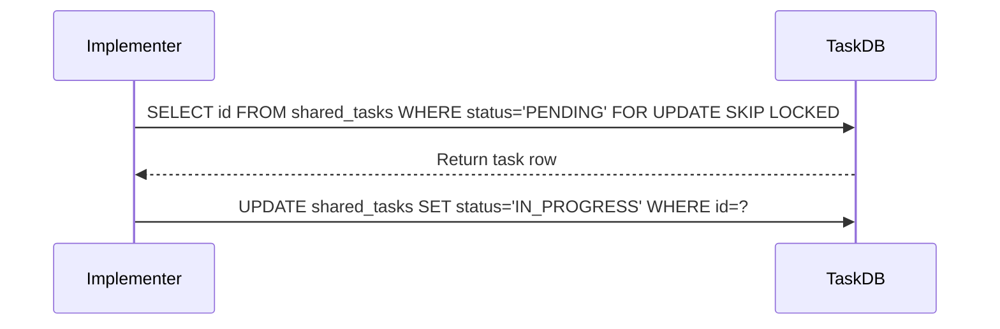

<div markdown="1" style="backdrop-filter: blur(20px) saturate(200%); font-family: 'Outfit', 'Inter', sans-serif; background: rgba(255, 255, 255, 0.03); color: #fff; padding: 20px; border-radius: 12px; border: 1px solid rgba(255, 255, 255, 0.1);">

# KAIROS AI OS IMPLEMENTATION MASTER V2
**Author:** Principal Product Architect & KAIROS Orchestrator (L7)

## Executive Summary
The KAIROS Orchestrator decomposes complex feature requests into a shared task list for the agent team to execute. This master plan defines the database architectures, orchestration meshes, and long-term memory consolidation systems that enable Absolute Autonomy and Hybrid Consistency.

## Phase 1: Shared Task List Database
### PostgreSQL (Cloud-Native)
```sql
CREATE TABLE IF NOT EXISTS shared_tasks (
    id UUID PRIMARY KEY DEFAULT gen_random_uuid(),
    organization_id VARCHAR NOT NULL,
    title VARCHAR NOT NULL,
    description TEXT,
    status VARCHAR NOT NULL DEFAULT 'PENDING',
    agent_id VARCHAR,
    priority VARCHAR NOT NULL DEFAULT 'P2',
    payload JSONB,
    parent_plan_id TEXT,
    dependencies JSONB NOT NULL DEFAULT '[]',
    created_at TIMESTAMP WITH TIME ZONE DEFAULT CURRENT_TIMESTAMP,
    updated_at TIMESTAMP WITH TIME ZONE DEFAULT CURRENT_TIMESTAMP
);
```

### Task Claiming Sequence


## Phase 2: Realtime Teammate Mesh APIs
Realtime communication via `LocalTeammateMesh` component over `mesh:tasks` and `mesh:coordination` channels. Gracefully degrades to in-memory channels in Standalone mode, or Redis Pub/Sub in Cloud-Native mode.

## Phase 3: autoDream Memory Consolidation Pipeline
### Database Schema (pgvector)
```sql
CREATE TABLE consolidated_memory (
    id UUID PRIMARY KEY,
    embedding vector(1536),
    metadata JSONB,
    created_at TIMESTAMP
);
```
</div>
