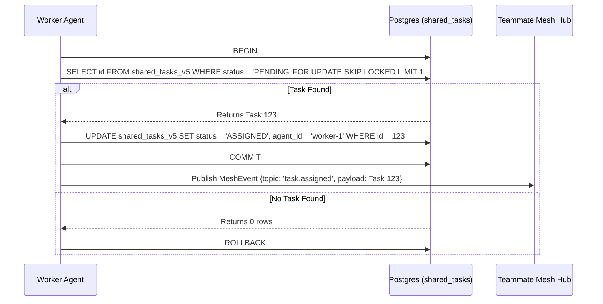

<div markdown="1" style="backdrop-filter: blur(20px) saturate(200%); background: rgba(255, 255, 255, 0.03); font-family: 'Outfit', 'Inter', sans-serif;">

# KAIROS AI OS: Premium Hybrid Orchestration Architecture

## Phase 1: Shared Task List (UltraPlan/Decomposition)
The Shared Task List serves as the central Nervous System for KAIROS, enabling the decomposition of high-level missions into executable directives. We implement a distributed state machine to prevent race conditions during task claiming.

### Database Schema (PostgreSQL):
```sql
CREATE TABLE IF NOT EXISTS shared_tasks_v5 (
    id UUID PRIMARY KEY DEFAULT gen_random_uuid(),
    organization_id VARCHAR NOT NULL,
    title VARCHAR NOT NULL,
    description TEXT,
    status VARCHAR NOT NULL DEFAULT 'PENDING',
    agent_id VARCHAR,
    priority VARCHAR NOT NULL DEFAULT 'P2',
    payload JSONB,
    parent_plan_id TEXT,
    dependencies JSONB NOT NULL DEFAULT '[]',
    locked_until TIMESTAMP,
    created_at TIMESTAMP WITH TIME ZONE DEFAULT CURRENT_TIMESTAMP,
    updated_at TIMESTAMP WITH TIME ZONE DEFAULT CURRENT_TIMESTAMP
);
```

### Shared Task Claiming Workflow


## Phase 2: Teammate Mesh APIs (Orchestration)
The Realtime Teammate Mesh APIs allow agents to communicate efficiently in production, degrading gracefully to in-memory channels in Standalone Mode.

**Broadcast API Contract (`POST /api/v2/mesh/broadcast`)**
```json
{
  "agent_id": "kairos-orchestrator-1",
  "channel": "orchestration.tasks",
  "action": "TASK_DECOMPOSED",
  "status": "SUCCESS",
  "payload": {
    "task_id": "uuid-1234",
    "priority": "P0",
    "timestamp": "2026-04-14T17:02:23Z"
  }
}
```

## Phase 3: autoDream (Memory Consolidation Pipeline)
To continuously evolve the AI OS, the AutoDream system vectorizes architectural decisions and agent memories into pgvector. Background workers consolidate `agent_session_data` and memory files to embeddings stored in PostgreSQL.

### pgvector Schema Definition
```sql
CREATE EXTENSION IF NOT EXISTS vector;

CREATE TABLE IF NOT EXISTS autodream_memories_v2 (
    id UUID PRIMARY KEY DEFAULT gen_random_uuid(),
    task_id UUID REFERENCES shared_tasks_v5(id),
    memory_type VARCHAR NOT NULL,
    content TEXT NOT NULL,
    embedding vector(1536),
    created_at TIMESTAMP WITH TIME ZONE DEFAULT CURRENT_TIMESTAMP
);

CREATE INDEX idx_autodream_memories ON autodream_memories_v2 USING ivfflat (embedding vector_cosine_ops) WITH (lists = 100);
```
</div>
