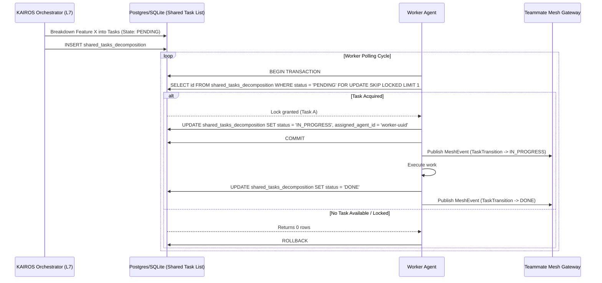

<div markdown="1" style="backdrop-filter: blur(20px) saturate(200%); font-family: 'Outfit', 'Inter', sans-serif; background: rgba(255, 255, 255, 0.03); color: #fff; padding: 20px; border-radius: 12px; border: 1px solid rgba(255, 255, 255, 0.1);">

# KAIROS Orchestration: Master Design Document

## 1. Vision
The One Human Corp (OHC) AI OS is powered by the **KAIROS Orchestrator**, a distributed system designed to manage complex agent swarms with zero friction. KAIROS ensures that a single human can orchestrate vast AI teams by providing a unified, aesthetics-first interface for task decomposition, real-time coordination, and long-term memory consolidation.

## 2. Phase 1: Shared Task List (Decomposition)
The Shared Task List relies on database-backed state machines to prevent race conditions during task claiming.

### Database Schema (Cloud Native - PostgreSQL / SQLite Compatible):
```sql
CREATE TABLE IF NOT EXISTS shared_tasks_decomposition (
    id UUID PRIMARY KEY DEFAULT gen_random_uuid(),
    organization_id VARCHAR NOT NULL,
    title VARCHAR NOT NULL,
    description TEXT,
    status VARCHAR NOT NULL DEFAULT 'PENDING',
    assigned_agent_id VARCHAR,
    priority VARCHAR NOT NULL DEFAULT 'P2',
    payload JSONB,
    parent_plan_id TEXT,
    dependencies JSONB NOT NULL DEFAULT '[]',
    locked_until TIMESTAMP,
    created_at TIMESTAMP WITH TIME ZONE DEFAULT CURRENT_TIMESTAMP,
    updated_at TIMESTAMP WITH TIME ZONE DEFAULT CURRENT_TIMESTAMP
);
```

### Shared Task Execution Sequence


## 3. Phase 2: Teammate Mesh APIs
Agents coordinate via the following Redis channels to ensure real-time synchronization:
- `mesh:events:task_created` - Emitted when a new task is added.
- `mesh:events:status_update` - Emitted on transition (e.g., IN_PROGRESS to DONE).
- `mesh:locks:acquire` - Distributed locking for file/resource access.

## 4. Phase 3: AutoDream Memory vector architecture (pgvector)
Completed missions and memory synopses are vectorized for Swarm Intelligence:

```sql
CREATE TABLE IF NOT EXISTS autodream_memories (
    id UUID PRIMARY KEY DEFAULT gen_random_uuid(),
    task_id UUID REFERENCES shared_tasks_decomposition(id),
    content TEXT NOT NULL,
    embedding vector(1536),
    created_at TIMESTAMP WITH TIME ZONE DEFAULT CURRENT_TIMESTAMP
);
```

---
*Authored by: Principal Product Architect & KAIROS Orchestrator (L7)*
*Identity: One Human Corp*

</div>
