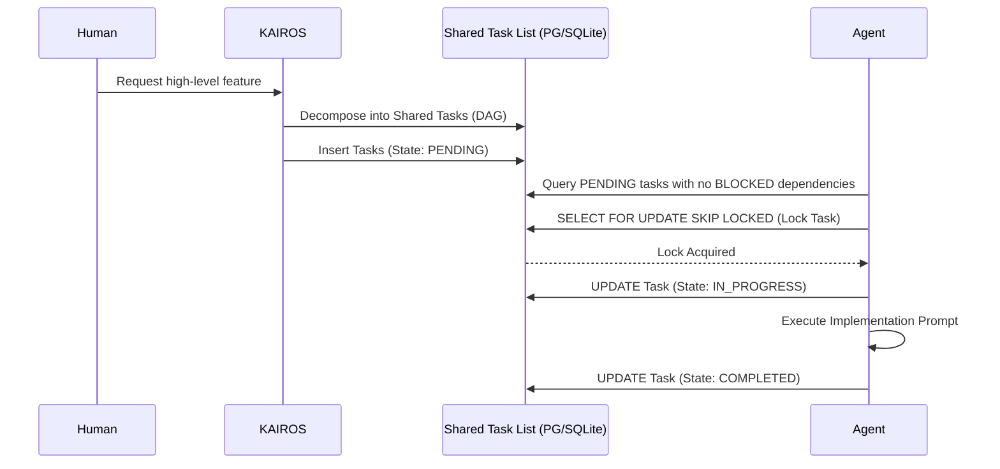

# KAIROS Orchestrator: Hybrid Agentic OS Master Plan

## 1. Vision
The One Human Corp (OHC) Swarm requires the **KAIROS Orchestrator** to define the structural and aesthetic vision for the OHC "Hybrid Agentic OS". KAIROS orchestrates the agent team by decomposing high-level feature requests into actionable tasks within a distributed **Shared Task List**.

## 2. Shared Task List & Distributed State Machine
- **Goal:** Robustly track the decomposition of human goals into tasks that can be claimed by Swarm Agents without race conditions.
- **Architecture:**
  - `shared_tasks` and `shared_task_dependencies` tables to model the Directed Acyclic Graph (DAG) of tasks.
  - A distributed State Machine (PENDING -> IN_PROGRESS -> COMPLETED/FAILED/BLOCKED) leveraging `SELECT ... FOR UPDATE SKIP LOCKED` to safely handle concurrent task claiming.

## 3. Teammate Mesh & Sub-Agent Orchestration
- **Goal:** Sub-millisecond realtime communication and background queuing.
- **Architecture:**
  - Realtime coordination via Redis Pub/Sub in Cloud-Native Mode.
  - Mocked runtime-memory logging under `.ohc/runtime/memory/mesh_mock.log` for Standalone Mode.
  - Sub-Agent Queue to continuously monitor the Shared Task List DAG and distribute actionable tasks.

## 4. AutoDream Data Pipeline
- **Goal:** Long-term memory consolidation of episodic experiences into vectors.
- **Architecture:**
  - Vectorizing coordination sessions and completed tasks using `VECTOR(1536)` and pgvector.
  - Inserting consolidated RAG contexts into the `autodream_memories` table, allowing the Swarm to query and learn from past architectures.

