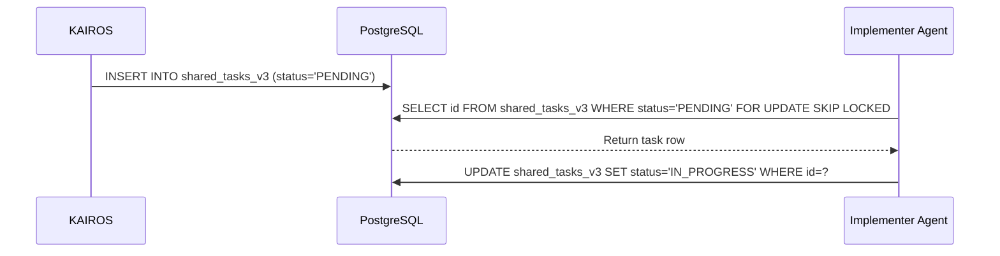

# OHC Master Design Doc: KAIROS Hybrid Agentic OS
**Author:** Principal Product Architect & KAIROS Orchestrator (L7)

## Overview
KAIROS acts as the central orchestrator, decomposing complex feature requests into a shared task list for the OHC Swarm.

## Phase 1: Shared Task List (Decomposition)
The `shared_tasks` PostgreSQL table coordinates tasks.

### Sequence Diagram

## Phase 2: Orchestration (Teammate Mesh Architecture)
Agents communicate over `mesh:tasks` and `mesh:coordination` Redis channels.

## Phase 3: autoDream (Memory Consolidation)
pgvector pipelines consolidate swarm memory into the `consolidated_memory` database.

## Phase 4: Sub-Agent Orchestration Queue
Robust execution tracking via a Distributed State Machine.

