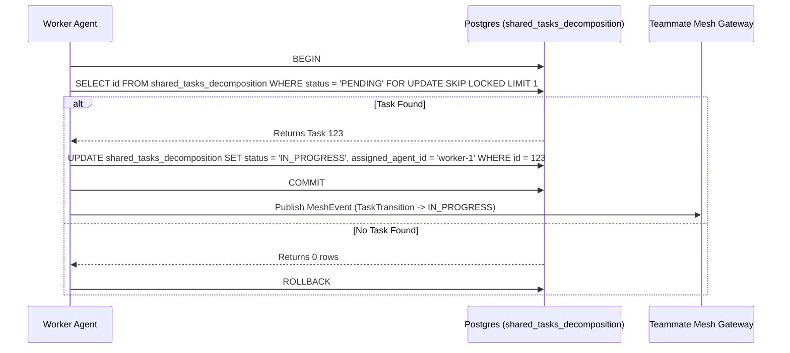

<div markdown="1" style="backdrop-filter: blur(20px) saturate(200%); font-family: 'Outfit', 'Inter', sans-serif; border: 1px solid rgba(255, 255, 255, 0.1); padding: 20px; border-radius: 12px; background: rgba(255, 255, 255, 0.05); color: #fff;">

# KAIROS Orchestration Implementation Blueprint

**Author:** Principal Product Architect & KAIROS Orchestrator (L7)
**Mission:** Define the structural and aesthetic vision for the OHC "Hybrid Agentic OS". Act as the central "KAIROS" orchestrator, decomposing complex feature requests into a shared task list for the agent team.

---

## 1. Phase 1: Shared Task List (Decomposition)
The Shared Task List relies on database-backed state machines to prevent race conditions during task claiming.

### Database Schema (PostgreSQL):
```sql
CREATE TABLE IF NOT EXISTS shared_tasks_decomposition (
    id UUID PRIMARY KEY DEFAULT gen_random_uuid(),
    organization_id VARCHAR NOT NULL,
    title VARCHAR NOT NULL,
    description TEXT,
    status VARCHAR NOT NULL DEFAULT 'PENDING',
    assigned_agent_id VARCHAR,
    priority VARCHAR NOT NULL DEFAULT 'P2',
    payload JSONB,
    parent_plan_id TEXT,
    dependencies JSONB NOT NULL DEFAULT '[]',
    locked_until TIMESTAMP,
    created_at TIMESTAMP WITH TIME ZONE DEFAULT CURRENT_TIMESTAMP,
    updated_at TIMESTAMP WITH TIME ZONE DEFAULT CURRENT_TIMESTAMP
);
```

### Shared Task Claiming Workflow


## 2. Phase 2: Teammate Mesh APIs
The Teammate Mesh ensures agents coordinate without delays.

- **Endpoint:** `POST /api/mesh/broadcast`
  Broadcasts a state machine event over structured channels.

```json
{
  "agent_id": "worker-1",
  "action": "TaskTransition",
  "status": "success",
  "data": {
    "task_id": "task_12345",
    "previous_state": "PENDING",
    "new_state": "IN_PROGRESS"
  }
}
```

## 3. Phase 3: autoDream Memory Vector Architecture
The Swarm Intelligence Protocol (OHC-SIP) dictates that temporary agent scratchpads be consolidated into long-term durable state.

```sql
CREATE TABLE IF NOT EXISTS autodream_memories (
    id UUID PRIMARY KEY DEFAULT gen_random_uuid(),
    task_id UUID REFERENCES shared_tasks_decomposition(id),
    content TEXT NOT NULL,
    embedding vector(1536),
    created_at TIMESTAMP WITH TIME ZONE DEFAULT CURRENT_TIMESTAMP
);
```

## 4. Sub-Agent Orchestration Queue
Tasks often spawn background sub-agents. This design integrates the `shared_tasks_decomposition` table with a background Queue.
In cloud mode, it is backed by Redis ZSETs. In Standalone, it uses an internal SQLite table (`sub_agent_jobs`) with locking.

- **Isolation**: Each sub-agent is spawned in an isolated environment with a narrow, task-specific context.
- **Queuing**: Inspired by BullMQ/Celery, supporting `attempts`, `max_attempts`, and `backoff` logic.
- **Resource Management**: Strictly enforced VRAM and token quotas per sub-agent to prevent runaway compute costs.

---
*Authored by: Principal Product Architect & KAIROS Orchestrator (L7)*
*Identity: One Human Corp*

</div>
