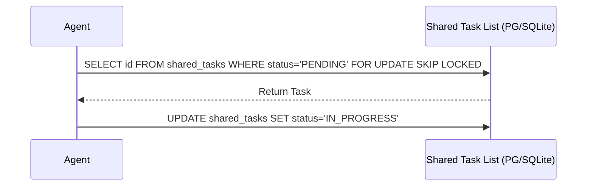

<div markdown="1" style="backdrop-filter: blur(20px) saturate(200%); font-family: 'Outfit', 'Inter', sans-serif; background: rgba(255, 255, 255, 0.03); color: #fff; padding: 20px; border-radius: 12px; border: 1px solid rgba(255, 255, 255, 0.1);">

# KAIROS Orchestration Master Design Doc
**Author:** Principal Product Architect & KAIROS Orchestrator (L7)
**Status:** Approved

## 1. Overview
The KAIROS Orchestrator defines the unified architecture for the OHC Hybrid Agentic OS. This document outlines the Phase 1-3 deliverables: Shared Task List, Teammate Mesh APIs, and AutoDream pipelines.

## 2. Phase 1: Shared Task List & Decomposition
The backbone of the swarm is a distributed DAG state machine tracking complex tasks.

### Database Schema
```sql
CREATE TABLE IF NOT EXISTS shared_tasks (
    id UUID PRIMARY KEY DEFAULT gen_random_uuid(),
    organization_id VARCHAR NOT NULL,
    title VARCHAR NOT NULL,
    description TEXT,
    status VARCHAR NOT NULL DEFAULT 'PENDING',
    agent_id VARCHAR,
    priority VARCHAR NOT NULL DEFAULT 'P2',
    payload JSONB,
    parent_plan_id TEXT,
    dependencies JSONB NOT NULL DEFAULT '[]',
    created_at TIMESTAMP WITH TIME ZONE DEFAULT CURRENT_TIMESTAMP,
    updated_at TIMESTAMP WITH TIME ZONE DEFAULT CURRENT_TIMESTAMP
);
```

### Sequence Diagram


## 3. Phase 2: Teammate Mesh APIs
Provides sub-millisecond Pub/Sub capabilities using Redis Pub/Sub (Cloud-Native) or Go channels (Standalone).

### API Contracts
- `POST /api/v1/mesh/publish`
  - Payload: `{ "topic": "task.update", "message": { "task_id": "uuid", "status": "COMPLETED" } }`
  - Response: `{ "success": true, "timestamp": "ISO8601" }`
- `GET /api/v1/mesh/subscribe?topic=task.update`
  - Returns a WebSocket connection stream (or SSE) pushing real-time events.

### Payload Schema
```json
{
  "type": "MeshEvent",
  "topic": "string",
  "payload": "any",
  "timestamp": "ISO8601"
}
```

## 4. Phase 3: AutoDream Data Pipeline
A background process that captures completed tasks, generates LLM embeddings, and persists them into the `consolidated_memory` table using `pgvector` for exact semantic retrieval by the swarm.

### Vector DB Schema
```sql
CREATE TABLE IF NOT EXISTS consolidated_memory (
    id UUID PRIMARY KEY DEFAULT gen_random_uuid(),
    task_id UUID REFERENCES shared_tasks(id),
    content TEXT NOT NULL,
    embedding vector(1536),
    created_at TIMESTAMP WITH TIME ZONE DEFAULT CURRENT_TIMESTAMP
);
```

### AutoDream Daemon Contract
- Runs as a cron or background queue processor.
- Scans `shared_tasks` where `status = 'COMPLETED'` and memory is not yet consolidated.
- Calls LLM API to summarize task payload into `content`.
- Calls LLM Embedding API to generate a 1536-dimensional vector.
- Inserts into `consolidated_memory`.

</div>
