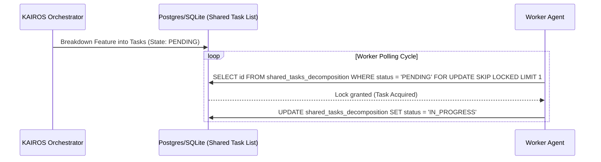

<div markdown="1" style="backdrop-filter: blur(20px) saturate(200%); font-family: 'Outfit', 'Inter', sans-serif; background: rgba(255, 255, 255, 0.03); color: #fff; padding: 20px; border-radius: 12px; border: 1px solid rgba(255, 255, 255, 0.1);">

# KAIROS Phase 4: AI OS Final Implementation Design

**Author:** Principal Product Architect & KAIROS Orchestrator (L7)
**Status:** Approved for Implementation

## Executive Summary
This design doc finalizes the KAIROS Orchestration plan for the OHC Hybrid AI OS. It outlines the blueprints for Task Decomposition, Teammate Mesh APIs, and AutoDream Vector Pipelines to enable swarm autonomy across both Cloud-Native and Standalone modes.

## 1. Phase 1: Shared Task List (Decomposition)
The Shared Task List handles the DAG-based decomposition of features, utilizing PostgreSQL `FOR UPDATE SKIP LOCKED` for secure task claiming.

### Database Schema
```sql
CREATE TABLE IF NOT EXISTS shared_tasks_decomposition (
    id UUID PRIMARY KEY DEFAULT gen_random_uuid(),
    organization_id VARCHAR NOT NULL,
    title VARCHAR NOT NULL,
    description TEXT,
    status VARCHAR NOT NULL DEFAULT 'PENDING',
    assigned_agent_id VARCHAR,
    priority VARCHAR NOT NULL DEFAULT 'P2',
    payload JSONB,
    parent_plan_id TEXT,
    dependencies JSONB NOT NULL DEFAULT '[]',
    locked_until TIMESTAMP,
    created_at TIMESTAMP WITH TIME ZONE DEFAULT CURRENT_TIMESTAMP,
    updated_at TIMESTAMP WITH TIME ZONE DEFAULT CURRENT_TIMESTAMP
);
```

### Sequence Diagram


## 2. Phase 2: Teammate Mesh APIs (Orchestration)
The Teammate Mesh acts as the nervous system, allowing sub-millisecond coordination via Centrifuge and Redis Pub/Sub.

- **HTTP API Contract:** `POST /api/mesh/broadcast`
- **Transport:** Redis Pub/Sub (Cloud) or Go Channels (Standalone).

```json
{
    "agent_id": "kairos-orchestrator-1",
    "channel": "mesh:tasks",
    "event_type": "TASK_TRANSITION",
    "data": {
        "task_id": "uuid-1234",
        "previous_state": "PENDING",
        "new_state": "IN_PROGRESS"
    }
}
```

## 3. Phase 3: AutoDream Vector Memory Architecture
To support OHC-SIP (Swarm Intelligence Protocol), completed tasks and ephemeral data are consolidated into a pgvector-powered long-term memory layer.

### pgvector Schema
```sql
CREATE EXTENSION IF NOT EXISTS vector;

CREATE TABLE IF NOT EXISTS autodream_memories (
    id TEXT PRIMARY KEY,
    organization_id VARCHAR NOT NULL,
    task_id TEXT REFERENCES shared_tasks_decomposition(id),
    content TEXT NOT NULL,
    embedding vector(1536),
    metadata JSONB,
    created_at TIMESTAMP WITH TIME ZONE DEFAULT CURRENT_TIMESTAMP
);
```

## 4. Sub-Agent Orchestration Queue
An asynchronous worker queue for executing scoped tasks, providing reliable background isolation in production.

```sql
CREATE TABLE IF NOT EXISTS sub_agent_queue (
    id TEXT PRIMARY KEY,
    organization_id TEXT NOT NULL,
    parent_task_id TEXT NOT NULL,
    payload JSONB,
    status TEXT NOT NULL DEFAULT 'QUEUED',
    worker_id TEXT,
    created_at TIMESTAMPTZ DEFAULT CURRENT_TIMESTAMP,
    updated_at TIMESTAMPTZ DEFAULT CURRENT_TIMESTAMP
);
```

</div>
