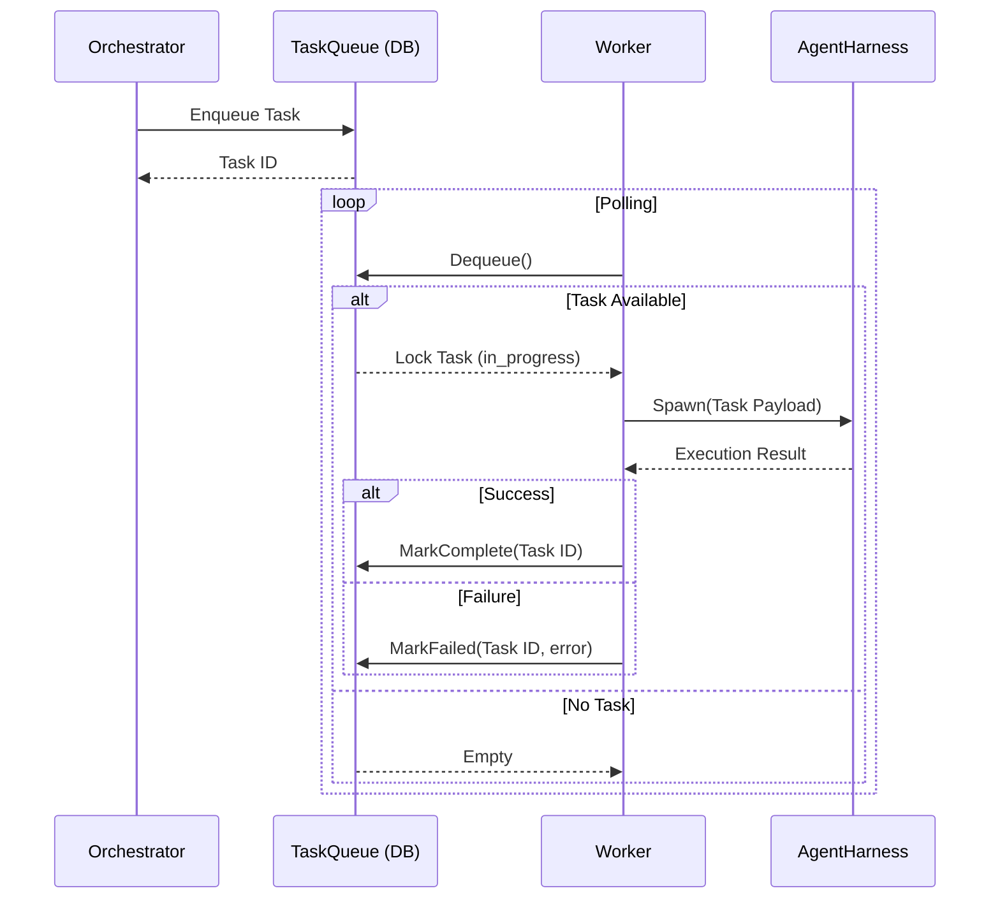

# KAIROS Universal Shared Task List and Sub-Agent Queue

## 1. Introduction
This design document serves as the architectural blueprint for the Universal Shared Task List (Phase 1) and Sub-Agent Queue (Phase 4) of the KAIROS migration. By unifying these phases, we establish a cohesive strategy connecting data persistence (the task list) with worker execution (the queue), ensuring seamless multi-agent orchestration within the One Human Corp (OHC) Swarm.

## 2. Database Schema
To support both Cloud-Native (PostgreSQL) and Standalone Desktop (SQLite) modes, the task list must be durable and transactional.

### `tasks` Table
Stores the canonical state of all units of work.
* `id` (UUID): Primary key.
* `parent_epic_id` (UUID): Reference to an overarching epic (nullable).
* `title` (String): Human-readable task name.
* `status` (Enum): `pending`, `queued`, `in_progress`, `completed`, `failed`.
* `payload` (JSONB/Text): Context or parameters required for task execution.
* `created_at` (Timestamp): Creation time.
* `updated_at` (Timestamp): Last modification time.

### `task_dependencies` Table
Models a Directed Acyclic Graph (DAG) for execution ordering.
* `task_id` (UUID): The dependent task.
* `depends_on_task_id` (UUID): The prerequisite task.
* Primary Key: `(task_id, depends_on_task_id)`.

## 3. Queue Architecture
The orchestrator interfaces with the persistence layer via a unified `TaskQueue` interface, obscuring the underlying database nuances.

```go
type TaskQueue interface {
    // Enqueue adds a new task.
    Enqueue(ctx context.Context, task Task) error
    // Dequeue claims the next available task based on priority and dependencies.
    Dequeue(ctx context.Context, workerID string) (*Task, error)
    // MarkComplete signals successful execution.
    MarkComplete(ctx context.Context, taskID string) error
    // MarkFailed signals execution failure and logs the error.
    MarkFailed(ctx context.Context, taskID string, err error) error
}
```

Implementation Strategy:
- **Cloud-Native**: `Dequeue` leverages PostgreSQL `SELECT FOR UPDATE SKIP LOCKED` or Redis for high-throughput locking.
- **Standalone Desktop**: `Dequeue` uses SQLite transactions.

## 4. Worker Pool Design
The Master Orchestrator maintains a pool of worker goroutines.
1. Each worker continuously polls the `TaskQueue` (or listens for pub/sub notifications where available).
2. Upon claiming a task, the worker spawns an isolated `AgentHarness` instance.
3. The `AgentHarness` executes the assigned task with necessary permissions.
4. The worker awaits the harness execution result and updates the `TaskQueue`.

## 5. State Machine & Locking
Preventing double-execution is paramount in a multi-node Swarm.
* **State Machine**: Tasks strictly flow `pending` -> `queued` -> `in_progress` -> `completed` | `failed`.
* **Locking**:
  - In Redis-enabled environments, distributed locks prevent race conditions during `Dequeue`.
  - The database row lock serves as the ultimate source of truth.

## 6. Sequence Diagrams


