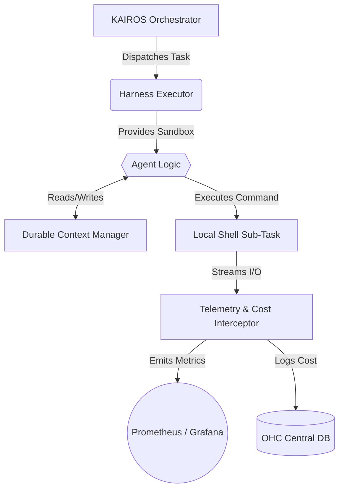

# Claude-Class Agent Harness Architecture

## Problem Statement
Based on the Universal Core Design Protocols, One Human Corp (OHC) aims to match and exceed the architectural capabilities of state-of-the-art agent systems like Claude Code. Our current agent harness lacks the robust process isolation, fine-grained telemetry, state preservation, and safety mechanisms present in leading solutions. We need to implement a 'Claude-Class' agent harness that provides a secure, observable, and resilient execution environment for OHC agents.

## Research Report
### Competitive Analysis: Claude Code (Leaked v2.1.88)
A deep dive into the leaked Claude Code source (`/src/tasks/` and `/src/services/`) reveals a highly structured Agent Harness architecture:
1.  **Task Isolation & Execution (`LocalShellTask`, `LocalAgentTask`)**: Execution is strictly bounded within task classes that manage their own lifecycle, stdin/stdout/stderr routing, and robust termination (e.g., `killShellTasks.ts`).
2.  **State & Context Management (`history.ts`, `context.ts`)**: The harness meticulously records intermediate states, reasoning histories, and contextual changes, enabling seamless resumption and "AutoDream" consolidation.
3.  **Cost & Telemetry Tracking (`cost-tracker.ts`, `costHook.ts`)**: Token usage, execution duration, and resource consumption are tracked at the individual task and session levels, providing high-fidelity metrics.
4.  **Tool Execution Environment (`/src/tools/`)**: Tools operate within constrained environments with explicit input validation and output parsing.

### Feature Gap: OHC vs. Market
Currently, OHC lacks:
- Standardized, secure shell execution sandboxing (akin to `LocalShellTask`).
- Unified context preservation across task boundaries within the harness layer.
- Comprehensive cost and execution duration tracking per agent task.

## Design Doc
### Architecture: KAIROS Harness Implementation
1.  **Harness Executor (`srcs/server/harness/executor.go`)**: Create a centralized execution engine that wraps agent tasks, providing isolation, timeouts, and standardized I/O routing.
2.  **Telemetry & Cost Interceptor**: Integrate OpenTelemetry (as requested in #5280) directly into the harness to automatically record metrics (`ohc_harness_command_duration_seconds`, `ohc_harness_io_bytes_total`) and proxy token costs.
3.  **Durable Context Manager**: Implement a state preservation mechanism that periodically flushes harness state (history, intermediate outputs) to the OHC Central Database or Vector DB (AutoDream, #5279) for resilience.
4.  **Safe Termination Protocol**: Port concepts from `killShellTasks.ts` to ensure orphaned processes and long-running shell commands are aggressively cleaned up upon task cancellation or failure.

### Visual Excellence

