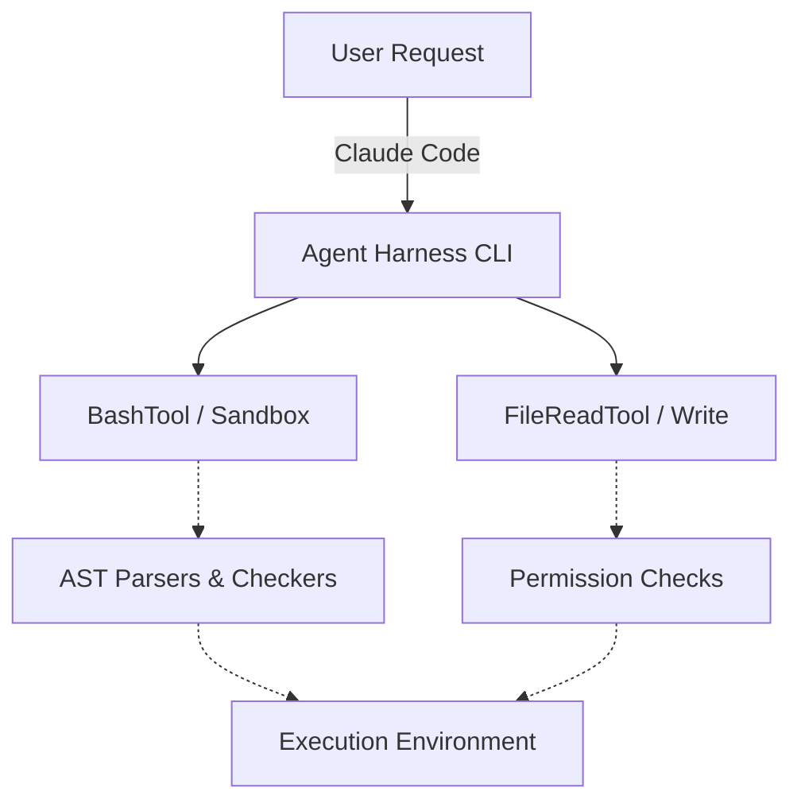

# Research Report: Claude Code Agent Harness & Implementation Gaps

## 1. Executive Summary
This document analyzes the Agent Harness environment within Claude Code to extract architectural and operational capabilities, contrasting them against OHC Hybrid Architecture (OHC-HA).

## 2. Architecture Comparison

### Harness Telemetry & State Management

| Feature | Claude Code Harness | OHC-HA |
| --- | --- | --- |
| **Telemetry** | `AnalyticsMetadata`, specific background trackers, manual event logging. | OpenTelemetry & Prometheus mandatory everywhere. |
| **State Sharing** | File-based memory directory (`memdir.ts`), localized event history. | Centralized OHC-SIP (PostgreSQL/SQLite vector DBs). |
| **Permissions** | Granular bash/file permissions (`bashPermissions.ts`, `filesystem.ts`), regex rule enforcement. | SPIFFE/SPIRE for auth, Git-Lock coordinate. |

### Component Flow

## 3. Implementation Targets
We need to implement robust AST parsing and strict local directory write locks based on `bashPermissions.ts`, `filesystem.ts` context, and isolated background execution models mirroring `parseForSecurityFromAst` processes.

