# 🔬 Research Report: Claude Code Sandbox Manager Audit

## 1. Executive Summary

This report details the architectural findings from analyzing the leaked Claude Code execution harness, specifically focusing on its **SandboxManager** integration and execution restrictions. Claude Code relies on a dedicated `@anthropic-ai/sandbox-runtime` dependency, heavily wrapping it in a local adapter (`sandbox-adapter.ts`). This establishes a critical isolation boundary for agent-driven shell commands. For the One Human Corp (OHC) Standalone Desktop Mode, adopting a similar adapter pattern will dramatically enhance security by explicitly separating the agent's internal reasoning loop from raw system operations.

## 2. Competitive Architectural Breakdown: Sandbox Adapter Layer

Claude Code isolates its shell execution capabilities using a robust **SandboxManager** pattern. The key components extracted from `sandbox-adapter.ts` are:

-   **Adapter Indirection**: Commands are not executed directly using `child_process`. They are routed through `SandboxManager`, which abstracts away the OS-level sandboxing (like `bwrap` or similar Linux/macOS primitives) via an SDK.
-   **Configurable Restrictions**: It employs `FsReadRestrictionConfig`, `FsWriteRestrictionConfig`, and `NetworkRestrictionConfig` to create an ephemeral execution context that explicitly denies unapproved actions.
-   **Violation Telemetry**: When an agent attempts an unauthorized command (e.g., modifying system files), the `SandboxViolationEvent` captures it, sending it to a telemetry stream. This is critical for preventing run-away agents.
-   **Ask Callback (`SandboxAskCallback`)**: The most critical feature: When the sandbox is unsure or a policy is violated, it pauses the execution and triggers a callback to ask the human for permission, gracefully preventing failures.

## 3. OHC System Architecture vs Claude Code

```mermaid
graph TD;
    subgraph "Claude Code (Leaked)"
        Agent[LLM Agent] --> BashTool[Bash Tool]
        BashTool --> Adapter[Sandbox Adapter]
        Adapter -- "Validation & Policy" --> BaseSandbox[Sandbox Runtime SDK]
        BaseSandbox -- "Execution" --> HostOS[Host OS Environment]
        BaseSandbox -. "Violation" .-> Telemetry[Telemetry & Callback]
    end

    subgraph "OHC Current State (Gap)"
        OHCAgent[OHC Internal Agent] --> Exec[exec.Command]
        Exec -- "Unrestricted" --> OHCHost[Host Machine]
    end

    subgraph "OHC Target Architecture (Proposed)"
        OHCAgentTarget[OHC Internal Agent] --> Harness[Agent Harness I/O]
        Harness --> OHCSandbox[OHC Sandbox Manager]
        OHCSandbox -- "Restricted Execution" --> OHCHostTarget[Host Machine via Bwrap/Namespace]
        OHCSandbox -. "Event" .-> OHCState[KAIROS State Machine]
    end
```

## 4. Feature Gap & Market Opportunity

OHC's current `Standalone Desktop Mode` lacks a formal sandbox adapter. Agents execute commands directly on the user's host OS, which is a major security risk compared to Claude Code.

**Gap:**
-   No intermediate validation layer before `exec.Command`.
-   No programmatic way to pause execution and ask the user for permission when a risky command is detected.

**Opportunity:**
Implementing an `OHCSandboxManager` (in Go) that intercepts all agent shell commands. It will parse the command, apply security profiles, and optionally use a Linux namespace wrapper (like `bwrap`) or macOS Sandbox profile to restrict the process. This directly feeds into our **Full-Spectrum Observability** mandate by emitting events when a process violates policies.

## 5. Required Actions

We must immediately initiate the design and implementation of an `OHCSandboxManager` for the `Standalone Desktop Mode`. This will bridge the gap between our current unrestricted execution and Claude Code's highly restricted, auditable sandbox.

