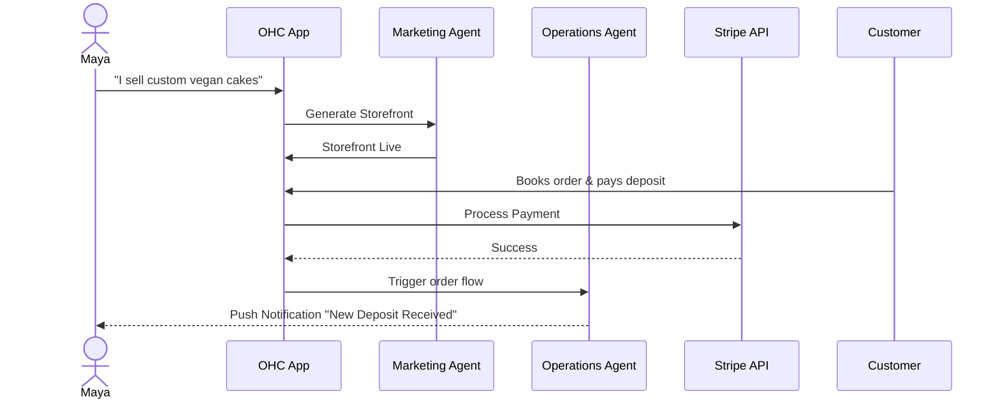
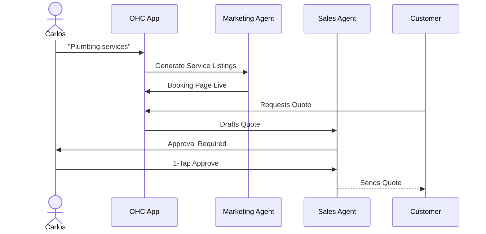
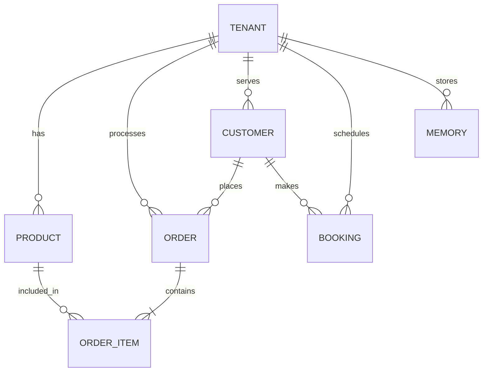
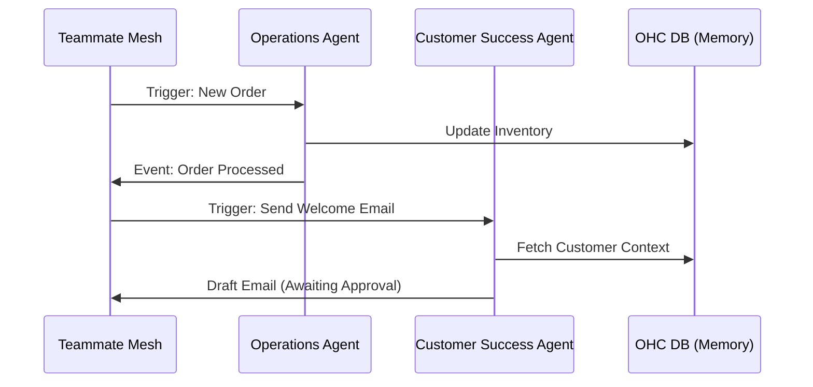
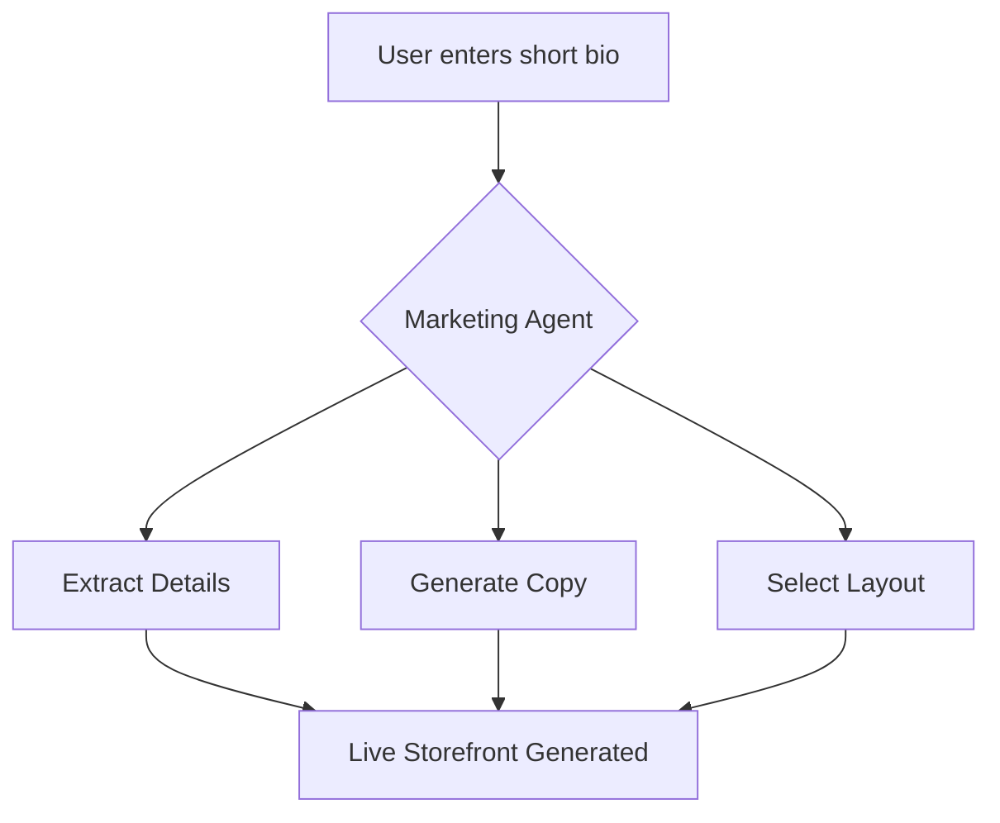

# Issue Brief: Complete Architecture Design Suite for OHC Core Systems

This report consolidates the required architecture design tasks into a single comprehensive output, addressing Business Journeys, Data Models, AI Agent Departments, Website Builder, Mobile-First constraints, and SaaS Tiers.

---

## 1. Business Journey Architecture

### Title
End-to-End Business Journey Mapping for OHC Personas

### Problem Statement
The OHC platform must serve diverse small business owners (Maya, Carlos, Priya, Leo, Fatima) seamlessly. The current journeys lack a unified architectural view, risking friction during critical phases (Onboarding, Activation, Retention). We must map these journeys to guarantee a sub-10-minute "time-to-live" experience.

### Research Report
- **Personas**: Needs range from simple pre-orders (Fatima) to omnichannel sync (Priya) and subscription management (Leo).
- **Stages**:
  - **Acquisition**: Landing page CTA must promise 10-minute setup.
  - **Onboarding**: Must be progressive, deferring complex settings (custom domains, full bank details).
  - **Activation**: The Day 1 "Aha!" moment (first product added, first booking made).
  - **Retention**: Driven by actionable notifications and AI insights, not complex dashboards.
  - **Revenue/Referral**: Contextual upgrade prompts and built-in sharing mechanisms.

### Design Doc

**Key Decisions**:
- **Progressive Profiling**: Minimal initial input; AI generates the rest.
- **AI-First Setup**: "The Promoter" agent builds the initial storefront based on basic inputs.

**Architecture Diagrams**:

*(Maya: Custom Cake Orders)*

*(Carlos: Handyman Booking)*

### Implementation Prompt
Implement the progressive onboarding flow. Create the mobile-first (375px) UI wizard that collects minimal business data, passes it to the AI Marketing agent, and instantly generates a functional Storefront/Booking page. Ensure optimistic UI updates for all inputs.

### Priority: P0 | Scope: Large

---

## 2. Data Model Architecture

### Title
Multi-Tenant Data Model and Isolation Guarantees

### Problem Statement
The data model must support diverse business types while guaranteeing strict row-level isolation between tenants to protect sensitive customer and business data.

### Research Report
- **Multi-Tenancy**: Must rely on PostgreSQL RLS with a `tenant_id` column on all tenant-specific tables.
- **Entities**: Business (Tenant), Product, Order, Customer, Agent, Page, Booking, Memory (pgvector).

### Design Doc

**Entity-Relationship Diagram**:

**Key Invariants**:
- All tenant queries MUST include the `tenant_id` context.
- AI agents MUST be scoped to the `tenant_id` they operate under.

### Implementation Prompt
Update the Go backend schema and repository layer to enforce `tenant_id` presence on all core entities. Configure PostgreSQL Row Level Security (RLS) policies for these tables. Add E2E tests proving cross-tenant data access is blocked.

### Priority: P0 | Scope: Medium

---

## 3. AI Agent Department Architecture

### Title
Autonomous AI Departments and Coordination Workflow

### Problem Statement
AI agents must be organized into understandable functional "departments" that can operate autonomously in the background while maintaining user trust through appropriate approval workflows.

### Research Report
- **Departments**: Operations, Marketing, Sales, Customer Success, Finance, Legal, Advisory.
- **Workflow**: Agents need shared memory (`pgvector`) and a mechanism to coordinate tasks (Teammate Mesh).

### Design Doc

**Coordination Workflow**:

**Approval Levels**:
- **Auto-Execute**: Low risk (internal tags, analytics).
- **Draft-for-Review**: High risk (external communication, refunds). Requires 1-tap mobile approval.

### Implementation Prompt
Implement the "Draft-for-Review" workflow in the KAIROS Orchestrator. Create a pending actions queue in the database and a mobile UI feed for the business owner to review and approve/reject drafted agent actions with a single tap.

### Priority: P1 | Scope: Large

---

## 4. Website & Storefront Builder Architecture

### Title
Instant AI-Driven Storefront Builder

### Problem Statement
Traditional drag-and-drop builders are too complex for non-technical users. OHC needs a system where the AI generates the initial site based on conversational input, which the user can then easily tweak.

### Research Report
- **Goal**: Sub-60-second generation time for a functional storefront.
- **Methodology**: Replace complex wizards with a "Tell us about your business" prompt.

### Design Doc

**Generation Flow**:

**Key Features**:
- **Content Blocks**: Hero, Product Grid, Testimonials, Contact Form.
- **Publishing**: Instant draft creation, 1-tap publish.
- **SEO**: Auto-generated meta tags and structured data.

### Implementation Prompt
Implement the "Instant Build" mode. Accept a single text prompt, utilize the Marketing Agent to structure the data (layout, copy, initial products), and render a live preview. Ensure the output utilizes OHC design tokens (Glassmorphism, correct typography).

### Priority: P1 | Scope: Medium

---

## 5. Mobile-First Architecture Review

### Title
Mobile-First Constraints and Performance Targets

### Problem Statement
OHC promises full business management from a mobile device. We must formalize the architectural constraints required to deliver a native-feeling, resilient mobile experience.

### Research Report
- **Baseline**: 375px viewport width.
- **Resilience**: Must handle flaky networks (offline/optimistic UI).

### Design Doc

**Key Constraints**:
- **Touch Targets**: Minimum 44x44px.
- **Keyboards**: Strict enforcement of native input types (numeric, email).
- **Offline Capabilities**: Critical reads (dashboard summary) must be cached locally; critical writes (approving agent actions) must use a local retry queue.

### Implementation Prompt
Audit and update the core Tauri UI components. Ensure all touch targets meet the 44px minimum. Implement a local caching layer for the main dashboard view and a retry mechanism for critical mutations when offline.

### Priority: P0 | Scope: Medium

---

## 6. Multi-Tenant SaaS Tier Architecture

### Title
SaaS Tier Enforcement and Upgrade Paths

### Problem Statement
A clear, transparent pricing tier system is required to monetize the platform while providing a genuinely useful free tier. The system must gracefully handle limit enforcement.

### Research Report
- **Tiers**: Free ($0), Starter ($9), Pro ($29), Business ($79).
- **Limits**: Product counts, AI actions per month, Storage limits, Custom Domain access.

### Design Doc

**Enforcement Strategy**:
- `TierService` middleware intercepts API requests.
- When a limit is hit, the API returns a structured "Limit Reached" response, not a 500 error.
- The UI intercepts this response and displays a contextual, plain-language upgrade prompt (e.g., "You've reached your 10 product limit. Upgrade to Starter to add unlimited products!").

### Implementation Prompt
Implement the `TierService` middleware in the Go backend to track and enforce tier limits (e.g., product count, AI action count). Integrate Stripe webhooks to synchronize tier status. Implement the frontend interceptors to display user-friendly upgrade prompts when limits are encountered.

### Priority: P1 | Scope: Medium
