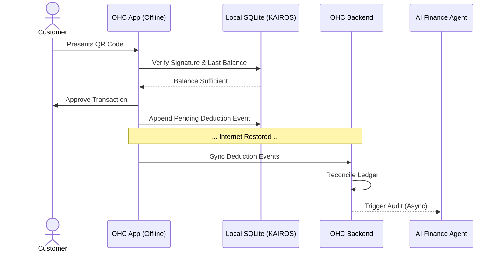

# Architectural Design: Offline-First Gift Card & Store Credit Engine

**Role:** Principal Architecture Strategist
**Status:** Proposed
**Focus:** Autonomous, unified, offline-first gift card and store credit engine

## 1. Executive Summary

Small business owners need a reliable, omni-channel way to issue, track, and redeem gift cards and store credit. Current market solutions are often fragmented between online and in-store POS, rely heavily on constant internet connectivity, and require manual reconciliation. This document outlines the architectural design for a unified, offline-first gift card engine integrated directly with OHC's AI Agent departments.

The engine provides a "Grandmother-approved" frictionless experience: an owner can issue a gift card via tap on their phone, and a customer can redeem it in-store even if the internet connection is temporarily down.

## 2. Problem Statement & Competitive Landscape

### 2.1 The Core Problem
- **Connectivity:** In-store redemptions (e.g., at a farmer's market or food cart) often occur in areas with spotty cellular service. If the POS cannot verify the gift card balance online, the transaction fails or relies on risky trust-based IOUs.
- **Fragmentation:** Businesses often use different systems for online gift cards (Shopify) and in-store credit (Square), leading to confusing customer experiences and accounting nightmares.
- **Complexity:** Setting up gift card programs requires understanding liability accounting, expiration laws, and multi-channel redemption rules.

### 2.2 Competitive Landscape
| Platform | Offline Redemption | Unified Online/In-Store | AI Integration |
| :--- | :--- | :--- | :--- |
| **Square** | ⚠️ Partial (Payment only, not GC) | ✅ Yes | ❌ No |
| **Shopify** | ❌ No | ✅ Yes (with Shopify POS) | ❌ No |
| **Toast** | ❌ No | ⚠️ Clunky online integration | ❌ No |
| **OHC (Proposed)** | ✅ **Yes (CRDT/KAIROS)** | ✅ **Yes (Native)** | ✅ **Yes (Finance/Advisor Agents)** |

## 3. UI/UX Flow (The "Grandmother Test")

### 3.1 Issuing a Gift Card (In-Store or Online)
1. **Trigger:** The business owner opens the OHC app and taps "Issue Gift Card".
2. **Input:** They enter the amount using the native numeric keypad and optionally the recipient's phone number.
3. **Action:** The customer pays via tap-to-pay or cash.
4. **Result:** A unique QR code is generated instantly on the screen for the customer to take a photo of, and an SMS is sent to the recipient.

### 3.2 Redeeming a Gift Card (Offline Scenario)
1. **Trigger:** Customer presents their QR code at the food cart.
2. **Action:** The owner scans the QR code with the OHC app camera.
3. **Offline Resolution:** The app uses local KAIROS state to verify the cryptographically signed QR code and checks the last known balance. It deducts the amount locally.
4. **Result:** The transaction is approved instantly. The app queues the state change to sync with the central database once connectivity is restored.

## 4. System Architecture

### 4.1 Core Components
*   **Gift Card Ledger (PostgreSQL):** The central source of truth, utilizing row-level tenant isolation. Tracks issuance, redemptions, balances, and expiration.
*   **Offline-First Edge Node (Mobile/PWA):** Local SQLite database using KAIROS for distributed state syncing.
*   **Cryptographic QR Engine:** Generates signed payloads containing `card_id`, `tenant_id`, and `last_known_hash`.

### 4.2 Offline Redemption Protocol (CRDT-based)
To prevent double-spending while supporting offline mode, we implement a constrained Conflict-free Replicated Data Type (CRDT) for store credit:
1. **Issuance:** Backend generates a private/public keypair for the gift card. The QR code contains the card ID and a signature.
2. **Local Cache:** The mobile app proactively caches active gift card hashes for the tenant.
3. **Offline Deduction:** When scanned offline, the app validates the cryptographic signature. It records a local "Pending Deduction" event.
4. **Reconciliation:** Upon reconnection, the app pushes the deduction event to the backend. If a double-spend occurred across multiple devices while offline, the AI Finance Agent flags the anomaly for the owner to review, prioritizing the in-store customer experience over strict real-time locking.

### 4.3 Diagram: Offline Redemption Flow

## 5. Integration with AI Agent Departments

*   **Finance & Payments ("The Accountant"):** Automatically categorizes unredeemed gift cards as deferred revenue liabilities to ensure correct tax reporting.
*   **Customer Success ("The Ambassador"):** Monitors card balances and sends automated "You have $15 left, come use it!" SMS reminders 30 days before expiration (where legal) or to re-engage dormant customers.
*   **Marketing & Advertising ("The Promoter"):** Suggests promotional campaigns: "Offer a $50 gift card for $40 to boost cash flow this holiday season."
*   **Operations ("The Manager"):** Handles bulk issuance for corporate clients or refunds to store credit.

## 6. Implementation Milestones

*   **Phase 1:** Core Ledger & Online Issuance/Redemption. (Backend + Basic UI)
*   **Phase 2:** Cryptographic QR Code generation and basic scanning.
*   **Phase 3:** KAIROS integration for local SQLite caching and offline constraint logic.
*   **Phase 4:** AI Agent hooks for deferred revenue accounting and automated SMS campaigns.
