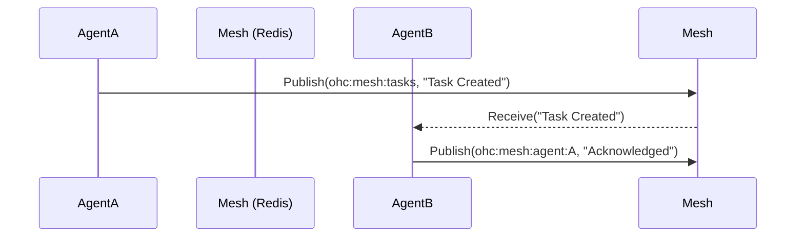

# Teammate Mesh & AutoDream Architecture

## Overview
The OHC Hybrid Architecture requires robust backend systems for agent coordination. The **Teammate Mesh** provides real-time messaging, and **AutoDream** powers long-term memory consolidation via vector databases.

## 1. Shared Task List
A distributed state machine for decomposing and tracking complex features.
- **Cloud-Native:** PostgreSQL table (`shared_tasks`)
- **Standalone:** SQLite table (`shared_tasks`)

## 2. Teammate Mesh
A highly available real-time communication layer.
- **Protocol:** Redis Pub/Sub (`rueidis`) in Cloud Mode; In-memory channels in Standalone Mode.
- **Channels:** `ohc:mesh:tasks`, `ohc:mesh:agent:{id}`

## 3. AutoDream Data Pipelines
Background worker that vectorizes agent memories.
- **Trigger:** Completing a task or receiving a periodic tick.
- **Process:** Reads `.agent-task/memory/*.yml` -> `MinimaxClient.GenerateEmbedding` -> Inserts into `agent_memories` table.
- **Vector DB:** pgvector in PostgreSQL, direct blob storage in SQLite.

## Visual Excellence
This architecture adheres to the OHC Premium Feel. Agents orchestrate autonomously while data is persisted gracefully.

