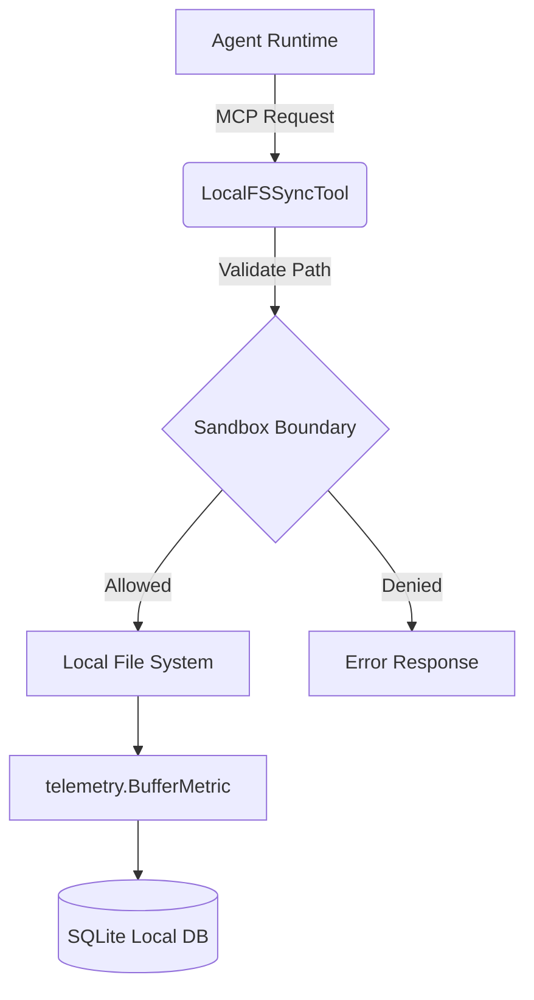

# 🔬 [research] Architect Local File System Sync MCP Tool

## Problem Statement
In the OHC Hybrid OS Architecture, agents frequently need to securely read and write configuration files or logs in a stand-alone desktop environment without relying on external cloud storage. A structured Model Context Protocol (MCP) tool is required to manage and synchronize local file system access across agent runtimes while respecting single-user permission boundaries in `OHC_STANDALONE` mode.

## Research Report
Local OS environments require safe and atomic file I/O operations. Directly mapping Cloud-native storage protocols (e.g., S3) onto local deployments is resource-heavy and slow. A dedicated local filesystem synchronization tool provides agents with a low-latency I/O channel that automatically proxies reads and writes to the correct OS-level paths (like `.agent-task/`), which is essential when agents operate without internet or in headless instances. This tool must maintain compatibility with the broader OHC-SIP state sharing protocol.

### Competitive Analysis
- Traditional cloud-sync tools (e.g., Dropbox, Google Drive) are too heavyweight and require external authentication.
- Git-based syncing requires complex state management and is prone to conflicts for frequent, small state updates.
- A dedicated MCP tool integrated with OHC-SIP provides the perfect balance of low latency, security (via sandboxing), and seamless telemetry integration.

## Design Doc

### Architecture

### Components

1. **Tool Definition:** Create a new MCP tool named `LocalFSSyncTool`.
2. **Parameters:**
   - `Action`: String (`read`, `write`, `sync`).
   - `Path`: Target file path within allowed sandbox boundaries.
   - `Content`: Data payload (for write operations).
3. **Execution Logic:**
   - Validate that the target path does not escape sandbox limits (e.g., ensuring paths start with `.agent-task/`).
   - Execute the action using standard `os` or `ioutil` operations.
   - Buffer telemetry metadata in the local SQLite db via `telemetry.BufferMetric()`.

### Data Flow Table

| Operation | Input | Output | Telemetry |
| :--- | :--- | :--- | :--- |
| `read` | Path | File Content | Bytes Read, Latency |
| `write` | Path, Content | Success/Failure | Bytes Written, Latency |
| `sync` | Path | Sync Status | Sync Latency, Status |

## Implementation Prompt
You are an Implementer. Your mission is to:
1. Update `srcs/server/agents/mcp/client.go` to add `LocalFSSyncTool` struct.
2. Implement `Execute` on `LocalFSSyncTool` to read/write files and push telemetry using `telemetry.BufferMetric`.
3. Ensure 100% test coverage by adding `TestLocalFSSyncTool` in `srcs/server/agents/mcp/client_test.go`.

## Priority
P1

## Estimated Scope
Small

