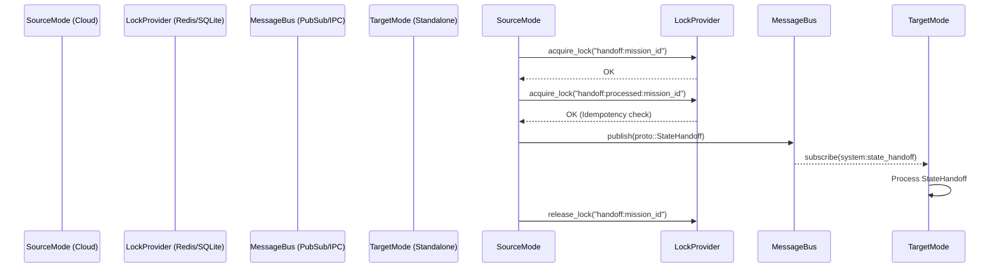
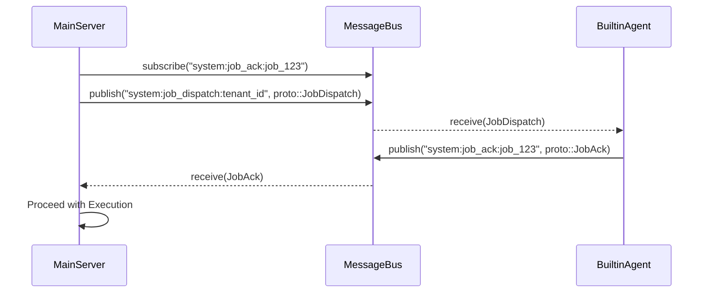
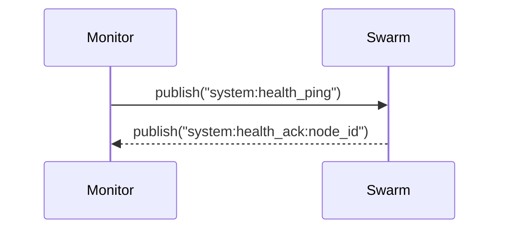

# OHC Interoperability Architecture

## Protocol Design

The `InteropProtocol` guarantees that Cloud and Standalone modes communicate reliably using `protobuf` over an agnostic `Bus`.

### State Handoff

State handoff ensures mission idempotency across deployment modes.

### Job Dispatch

Job dispatches include exponential backoff and timeout logic.

### Health Monitoring

Cross-mode health monitoring uses a ping-ack protocol.

## Distributed Locking

Locks behave consistently across modes:
- **Cloud Mode**: `RedisBus` uses `Redlock` Lua scripts to prevent TOCTOU.
- **Standalone Mode**: `IpcBus` uses an advisory table `bus_locks` in SQLite with `ON CONFLICT` and `expires_at` checks to prevent stale locks.
- **In-Memory**: `MemoryBus` uses standard Tokio Mutex and Instant checks.
