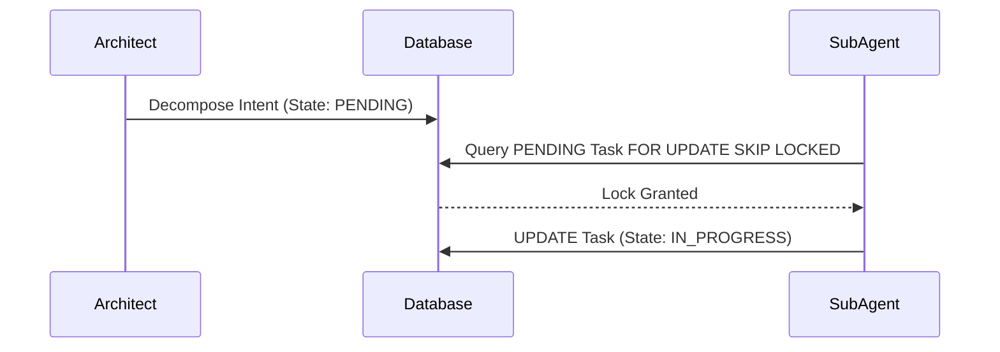

<div markdown="1" style="backdrop-filter: blur(20px) saturate(200%); font-family: 'Outfit', 'Inter', sans-serif; background: rgba(255, 255, 255, 0.03); color: #fff; padding: 20px; border-radius: 12px; border: 1px solid rgba(255, 255, 255, 0.1);">

# KAIROS Orchestrator: Master Design Document

## 1. Shared Task List (Decomposition)
KAIROS acts as the central brain for the Swarm, decomposing high-level intents into actionable Shared Tasks. The DB relies on PostgreSQL (`FOR UPDATE SKIP LOCKED`) and SQLite (Explicit Transactions).

### Database Schema (PostgreSQL):
```sql
CREATE TABLE IF NOT EXISTS shared_tasks_decomposition (
    id UUID PRIMARY KEY DEFAULT gen_random_uuid(),
    organization_id VARCHAR NOT NULL,
    title VARCHAR NOT NULL,
    description TEXT,
    status VARCHAR NOT NULL DEFAULT 'PENDING',
    assigned_agent_id VARCHAR,
    priority VARCHAR NOT NULL DEFAULT 'P2',
    payload JSONB,
    parent_plan_id TEXT,
    dependencies JSONB NOT NULL DEFAULT '[]',
    locked_until TIMESTAMP,
    created_at TIMESTAMP WITH TIME ZONE DEFAULT CURRENT_TIMESTAMP,
    updated_at TIMESTAMP WITH TIME ZONE DEFAULT CURRENT_TIMESTAMP
);
```



## 2. Teammate Mesh Architecture
Teammate Mesh ensures agents communicate seamlessly across hybrid deployments.
- **Cloud:** Uses Redis Pub/Sub.
- **Standalone:** Uses local Go memory channels.

## 3. AutoDream Data Pipelines
AutoDream sweeps ephemeral runtime memory from `OHC_MEMORY_DIR` and embeds it into `pgvector` enabled tables for long term queryability.

## 4. Sub-Agent Orchestration Queue
Manages asynchronous task routing, job retries, and exponential backoff.

</div>
