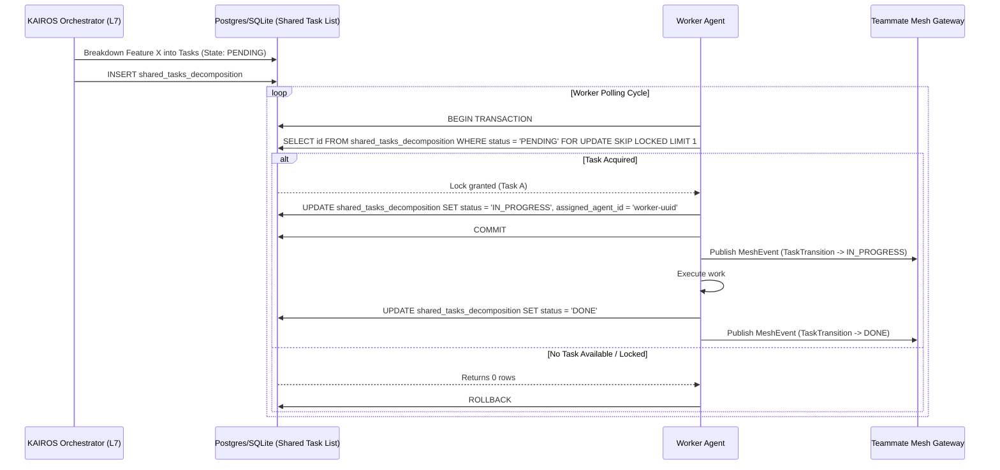
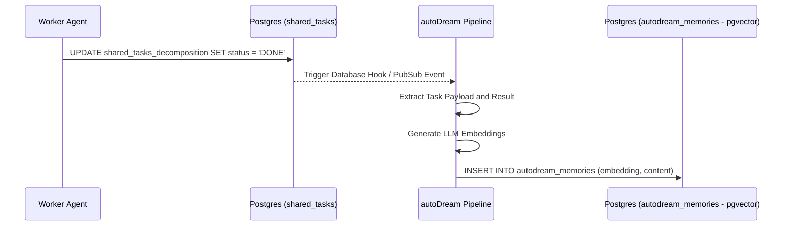

<div markdown="1" style="backdrop-filter: blur(20px) saturate(200%); font-family: 'Outfit', 'Inter', sans-serif; background: rgba(255, 255, 255, 0.03); color: #fff; padding: 20px; border-radius: 12px; border: 1px solid rgba(255, 255, 255, 0.1);">

# KAIROS Orchestration: Shared Task List Decomposition Design

## 1. Vision
As part of the OHC AI OS, KAIROS must orchestrate vast swarms of AI agents. A critical capability is decomposing high-level feature requests into a granular **Shared Task List**. This architecture enables hybrid scalability across standalone desktop environments (SQLite) and multi-tenant Cloud environments (PostgreSQL).

## 2. Distributed State Machine (Shared Task List)
The core component is the database-backed Shared Task state machine, which ensures safe, deadlock-free orchestration across agent teams.

### 2.1 Database Schema Definition (PostgreSQL)
For our Cloud-Native infrastructure, KAIROS relies heavily on `pg_crypto` and specific JSONB structures to define dependencies and task boundaries.

```sql
CREATE TABLE IF NOT EXISTS shared_tasks_decomposition (
    id UUID PRIMARY KEY DEFAULT gen_random_uuid(),
    organization_id VARCHAR NOT NULL,
    title VARCHAR NOT NULL,
    description TEXT,
    status VARCHAR NOT NULL DEFAULT 'PENDING',
    assigned_agent_id VARCHAR,
    priority VARCHAR NOT NULL DEFAULT 'P2',
    payload JSONB,
    parent_plan_id TEXT,
    dependencies JSONB NOT NULL DEFAULT '[]',
    locked_until TIMESTAMP,
    created_at TIMESTAMP WITH TIME ZONE DEFAULT CURRENT_TIMESTAMP,
    updated_at TIMESTAMP WITH TIME ZONE DEFAULT CURRENT_TIMESTAMP
);
```

### 2.2 Shared Task Execution Sequence
To prevent race conditions during distributed task execution, worker agents rely on a specific concurrency pattern based on DB locking models:
- **Cloud (Postgres):** `FOR UPDATE SKIP LOCKED`
- **Standalone (SQLite):** Explicit transactions and code-level Mutexes.



## 3. Sub-Agent Orchestration Integration
Tasks often spawn background sub-agents. This design tightly integrates the `shared_tasks_decomposition` table with a background Queue.

1.  **State Machine Hooks**: When a parent task enters the `EXECUTE` state, the middleware dynamically drops jobs into `sub_agent_jobs`.
2.  **Teammate Mesh Alerts**: Status transitions stream over `POST /api/mesh/broadcast` so remote UIs render the agent's progress continuously in real-time.

---
*Authored by: Principal Product Architect & KAIROS Orchestrator (L7)*
*Identity: One Human Corp*

</div>

## 4. Phase 3: autoDream Memory Vector Architecture
The Swarm Intelligence Protocol (OHC-SIP) dictates that temporary agent scratchpads and completed task results be consolidated into long-term durable state. KAIROS hooks into task completion events to pipeline this data into the memory architecture.

### 4.1 Data Pipeline for Consolidation


### 4.2 Durable Vector Storage Schema
```sql
CREATE TABLE IF NOT EXISTS autodream_memories (
    id UUID PRIMARY KEY DEFAULT gen_random_uuid(),
    task_id UUID REFERENCES shared_tasks_decomposition(id),
    content TEXT NOT NULL,
    embedding vector(1536),
    created_at TIMESTAMP WITH TIME ZONE DEFAULT CURRENT_TIMESTAMP
);
```
