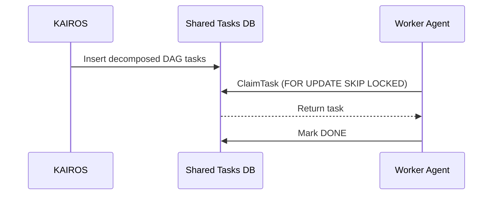

# Master Design Doc: KAIROS AI OS Orchestration

This document serves as the final premium design doc synthesizing the OHC Hybrid AI OS Orchestration layer.

## 1. The Shared Task List (The Brain)
The Shared Task List handles task decomposition into a DAG (Directed Acyclic Graph) and avoids worker collisions.

### Database Schema
**Table:** `shared_tasks`
- `id` (TEXT, Primary Key)
- `organization_id` (TEXT)
- `parent_plan_id` (TEXT)
- `title` (TEXT)
- `description` (TEXT)
- `status` (TEXT): 'PENDING', 'ASSIGNED', 'IN_PROGRESS', 'DONE', 'BLOCKED'
- `agent_id` (TEXT, Nullable)
- `dependencies` (TEXT / JSON)
- `created_at` (TIMESTAMP)
- `updated_at` (TIMESTAMP)

**Degradation Strategy:**
- **Cloud-Native (PostgreSQL):** Uses `SELECT ... FOR UPDATE SKIP LOCKED` to allow highly concurrent, pod-level orchestration.
- **Standalone (SQLite):** Degrades to application-level `sync.Mutex` and basic `UPDATE` transactions.

### Sequence Diagram

## 2. Teammate Mesh (The Nerves)
The Teammate Mesh facilitates real-time coordination without delays.

### API Contracts
**Channels:** `mesh:tasks`, `mesh:coordination`, `mesh:capabilities`

**Degradation Strategy:**
- **Cloud-Native:** Uses `rueidis` (Redis Pub/Sub) and `CentrifugeNode` for broad network event distribution.
- **Standalone:** Uses Go channels for fast, local IPC.

## 3. autoDream (The Memory)
The autoDream pipeline consolidates ephemeral task data into long-term vector embeddings.

### Pipeline Architecture
1. **Extract:** Sweep `DONE` tasks from `shared_tasks`.
2. **Synthesize:** Compress task logs using Minimax/LLM.
3. **Embed:** Upsert to `consolidated_memory`.

### Database Schema
**Table:** `consolidated_memory`
- `id` (TEXT, Primary Key)
- `organization_id` (TEXT)
- `agent_id` (TEXT)
- `content` (TEXT)
- `embedding` (VECTOR(1536) / BLOB)
- `source_type` (TEXT)
- `created_at` (TIMESTAMPTZ)

**Degradation Strategy:**
- **Cloud-Native:** `pgvector` with HNSW index for `vector_cosine_ops`.
- **Standalone:** Embeddings serialized as BLOBs; cosine similarity performed in-memory via application logic.

