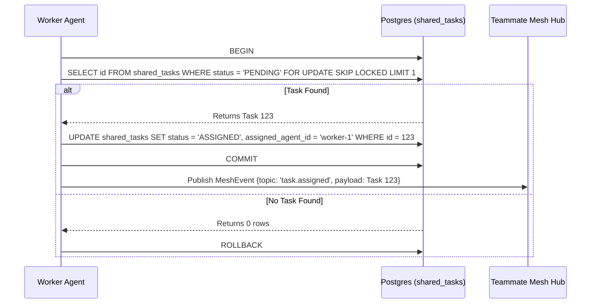

# KAIROS Orchestration Design

## Overview
The KAIROS Orchestrator provides absolute autonomy for the OHC Swarm. It requires a distributed state machine mapped to both Cloud-Native and Standalone Desktop environments.

## Phase 1: Shared Task List (The Brain)
A durable distributed state machine for swarm tasks (`swarm_tasks` and `shared_tasks`).
- **Cloud Mode (PostgreSQL):** Uses `FOR UPDATE SKIP LOCKED` inside explicit transactions (`tx.Begin()`) to ensure horizontal pod concurrency.
- **Standalone Mode (SQLite):** Degrades gracefully utilizing explicit `UPDATE ... RETURNING` (or select-then-update) combined with application-level semaphores via `pool.IsSQLite()` checks.
- **Dependencies:** DAG dependencies enforced via `task_dependencies` and `swarm_task_dependencies` join tables to prevent sequence race conditions.

## Phase 2: Teammate Mesh (The Nerves)
A high-throughput realtime event bus for intent broadcast and memory coordination.
- **Cloud Mode:** Agents publish to production Redis Pub/Sub channels (`mesh:tasks`, `mesh:coordination`). Centrifuge Node handles downstream WebSockets.
- **Standalone Mode:** Fallbacks to in-memory Go channels for offline functionality.
- **Security:** Zero Secrets architecture relying entirely on SPIFFE/SPIRE mTLS identities.

## Phase 3: AutoDream (The Memory)
The long-term persistence layer embedding ephemeral context.
- Uses `pgvector` in PostgreSQL for exact Nearest Neighbor search of `autodream_memories`.
- Consolidates episodic worker history via Minimax LLMs.
- SQLite fallback maps vectors to local blobs or uses recency-based search.

## Aesthetic Core
Any UI built around this architecture must enforce the Visual Excellence Mandate:

## Sequence Diagram (Shared Task Claiming)

