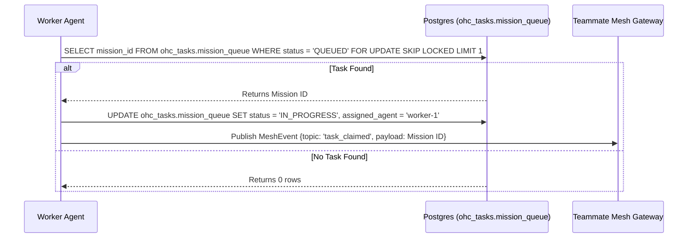

<div markdown="1" style="backdrop-filter: blur(20px) saturate(200%); background: rgba(255, 255, 255, 0.03); font-family: 'Outfit', 'Inter', sans-serif; padding: 20px; border-radius: 12px; border: 1px solid rgba(255, 255, 255, 0.1);">

# KAIROS AI OS Core Features Architecture

## 1. Phase 1: Shared Task List (Decomposition)

Database-backed state machine for task claiming to orchestrate the swarm.

### Database Schema (PostgreSQL)
```sql
CREATE TABLE ohc_tasks.mission_queue (
    mission_id UUID PRIMARY KEY DEFAULT gen_random_uuid(),
    title VARCHAR(255) NOT NULL,
    status VARCHAR(50) NOT NULL DEFAULT 'QUEUED', -- QUEUED, IN_PROGRESS, BLOCKED, DONE
    assigned_agent VARCHAR(100),
    priority VARCHAR(10) NOT NULL,
    payload JSONB NOT NULL,
    created_at TIMESTAMPTZ DEFAULT NOW(),
    updated_at TIMESTAMPTZ DEFAULT NOW()
);
```

### Task Claiming Sequence Diagram


## 2. Phase 2: Teammate Mesh APIs (Orchestration)

The Teammate Mesh ensures agents coordinate without delays using Redis Pub/Sub.

### Broadcast API Contract
- **Endpoint:** `POST /api/mesh/broadcast`
- **Payload:**
```json
{
  "agent_id": "worker-1",
  "channel": "mesh:tasks",
  "event_type": "TASK_TRANSITION",
  "data": {
    "task_id": "uuid-1234",
    "previous_state": "QUEUED",
    "new_state": "IN_PROGRESS"
  }
}
```

## 3. Phase 3: autoDream Vector Memory Architecture

Long-term durable state vector database for continuous learning using `pgvector`.

### Database Schema (PostgreSQL with pgvector)
```sql
CREATE TABLE ohc_memory.autodream_vectors (
    id UUID PRIMARY KEY DEFAULT gen_random_uuid(),
    task_id UUID REFERENCES ohc_tasks.mission_queue(mission_id),
    content TEXT NOT NULL,
    embedding vector(1536),
    metadata JSONB,
    created_at TIMESTAMPTZ DEFAULT NOW()
);
```

## 4. Phase 4: Sub-Agent Orchestration Queue

A background worker system polls the internal state machine queue.

### Sub-Agent Queue Schema
```sql
CREATE TABLE ohc_tasks.sub_agent_queue (
    id UUID PRIMARY KEY DEFAULT gen_random_uuid(),
    parent_task_id UUID NOT NULL,
    payload JSONB,
    status TEXT NOT NULL DEFAULT 'QUEUED',
    worker_id TEXT,
    created_at TIMESTAMPTZ DEFAULT NOW(),
    updated_at TIMESTAMPTZ DEFAULT NOW()
);
```

</div>
