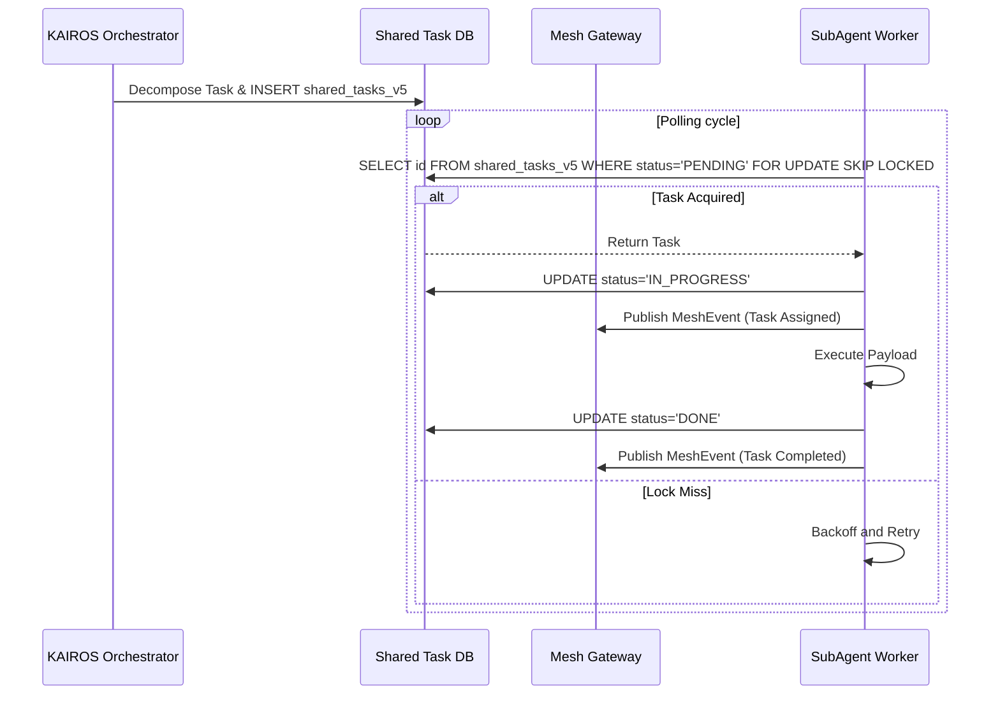

<div markdown="1" style="backdrop-filter: blur(20px) saturate(200%); background: rgba(255, 255, 255, 0.03); font-family: 'Outfit', 'Inter', sans-serif;">

# KAIROS AI OS Hybrid Orchestration V5

## 1. Vision
To build the world's most autonomous, aesthetically superior, and market-aware Agentic Operating System. One Human Corp (OHC) empowers a single human to orchestrate a vast swarm of AI agents with zero friction and maximum visual delight.

## 2. Phase 1: Shared Task List Decomposition
The Shared Task List ensures complex feature requests are broken down and executed robustly across Hybrid environments.

### Database Schema (Cloud-Native Postgres & Standalone SQLite)
```sql
CREATE TABLE IF NOT EXISTS shared_tasks_v5 (
    id UUID PRIMARY KEY DEFAULT gen_random_uuid(),
    organization_id VARCHAR NOT NULL,
    title VARCHAR NOT NULL,
    description TEXT,
    status VARCHAR NOT NULL DEFAULT 'PENDING',
    assigned_agent_id VARCHAR,
    priority VARCHAR NOT NULL DEFAULT 'P2',
    payload JSONB,
    parent_plan_id TEXT,
    dependencies JSONB NOT NULL DEFAULT '[]',
    locked_until TIMESTAMP,
    created_at TIMESTAMP WITH TIME ZONE DEFAULT CURRENT_TIMESTAMP,
    updated_at TIMESTAMP WITH TIME ZONE DEFAULT CURRENT_TIMESTAMP
);
```

### Shared Task Execution Sequence


## 3. Phase 2: Teammate Mesh APIs
The Realtime Teammate Mesh APIs allow agents to communicate efficiently in production.

### Realtime Coordination API Contracts
- **`POST /api/mesh/v5/broadcast`**: Agents publish messages to the mesh.
  - **Payload:** `{"agent_id": "worker-1", "action": "TaskCompleted", "status": "success", "channel": "mesh:tasks", "data": {}}`

- **Transport Mechanism:**
  - **Cloud:** `rueidis` Redis Pub/Sub integration.
  - **Standalone:** Local sharded Go channels.

## 4. Phase 3: autoDream Memory Consolidation Pipelines
The Swarm Intelligence Protocol dictates that temporary agent scratchpads be consolidated into long-term durable state.

### Vector Memory Storage
```sql
CREATE TABLE IF NOT EXISTS autodream_memories_v5 (
    id UUID PRIMARY KEY DEFAULT gen_random_uuid(),
    task_id UUID REFERENCES shared_tasks_v5(id),
    content TEXT NOT NULL,
    embedding vector(1536),
    created_at TIMESTAMP WITH TIME ZONE DEFAULT CURRENT_TIMESTAMP
);
```

### Pipeline Flow
1. **Trigger:** Task completion event from Teammate Mesh.
2. **Embed:** LLM generates vector embeddings for episodic memory.
3. **Store:** Inserted into `autodream_memories_v5`.

## 5. Phase 4: Sub-Agent Queue Orchestration
A distributed state machine back by database locks to track dependencies. Background queues manage `sub_agent_jobs`.

</div>
