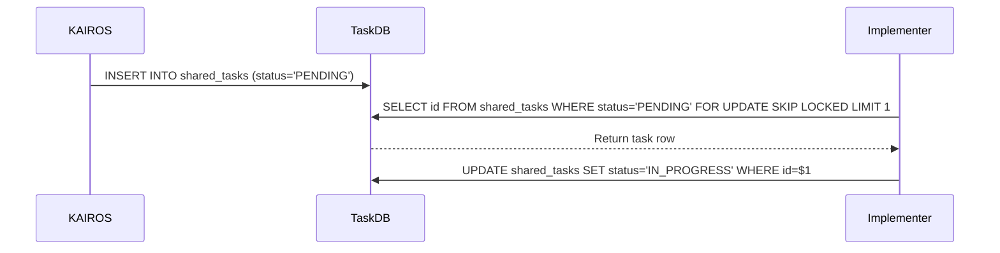

<div markdown="1" style="backdrop-filter: blur(20px) saturate(200%); background: rgba(255, 255, 255, 0.03); font-family: 'Outfit', 'Inter', sans-serif; padding: 24px; border-radius: 12px; border: 1px solid rgba(255, 255, 255, 0.1);">

# KAIROS AI OS Hybrid Orchestration

## 1. Phase 1: Shared Task List (Decomposition)
The Shared Task List tracks complex feature decomposition into actionable, sequenced `shared_tasks`.

**Database Schema (PostgreSQL):**
```sql
CREATE TABLE IF NOT EXISTS shared_tasks (
    id UUID PRIMARY KEY DEFAULT gen_random_uuid(),
    organization_id VARCHAR NOT NULL,
    title VARCHAR NOT NULL,
    description TEXT,
    status VARCHAR NOT NULL DEFAULT 'PENDING',
    agent_id VARCHAR,
    priority VARCHAR NOT NULL DEFAULT 'P2',
    payload JSONB,
    parent_plan_id TEXT,
    dependencies JSONB NOT NULL DEFAULT '[]',
    locked_until TIMESTAMP,
    created_at TIMESTAMP WITH TIME ZONE DEFAULT CURRENT_TIMESTAMP,
    updated_at TIMESTAMP WITH TIME ZONE DEFAULT CURRENT_TIMESTAMP
);
```

**Sequence Diagram:**


## 2. Phase 2: Teammate Mesh APIs (Orchestration)
The Teammate Mesh ensures agents coordinate without delays.
- **Endpoint:** `POST /api/mesh/v2/broadcast`
Broadcasts a state machine event over structured channels.

## 3. Phase 3: AutoDream Data Pipelines (Memory)
The Swarm Intelligence Protocol (OHC-SIP) dictates that temporary agent scratchpads be consolidated into long-term durable state using `pgvector`.

## 4. Phase 4: Sub-Agent Orchestration Queue
A background queue for managing sub-agent lifecycles securely in isolated production pods.

</div>
