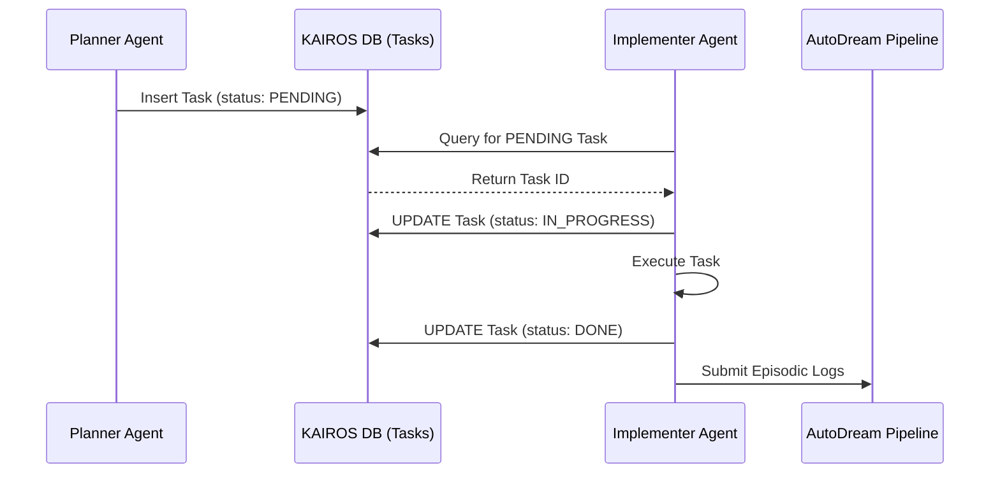
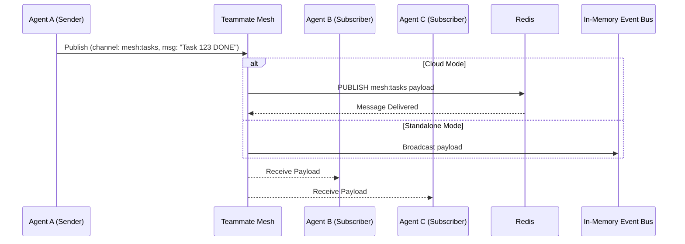

# KAIROS: Hybrid Agentic OS Master Architecture

## Executive Summary
The KAIROS Orchestrator acts as the central intelligence engine for the One Human Corp (OHC) Swarm. It empowers a single human to orchestrate a vast array of AI agents with zero friction and maximum visual delight. KAIROS achieves this by decomposing complex intents into a shared state machine, facilitating realtime communication via a teammate mesh, and consolidating long-term memories via the autoDream pipeline.

Crucially, KAIROS is designed with a **Hybrid Architecture (OHC-HA)**:
*   **Cloud-Native Mode**: Leverages Kubernetes, PostgreSQL (with pgvector), and Redis for multi-tenant horizontal scaling and strict tenant isolation.
*   **Standalone Desktop Mode**: Degrades gracefully to local SQLite (with BLOB vector serialization) and in-memory syncing for host-machine efficiency and privacy.

---

## Phase 1: Shared Task List
The Shared Task List provides a durable database schema and state machine for orchestrating multi-agent DAG flows securely. It ensures agents do not duplicate work and complete tasks sequentially.

### Schema Details
*   **Table Name**: `shared_tasks`
*   **Columns**: `id`, `organization_id`, `title`, `description`, `status` (PENDING, IN_PROGRESS, DONE, BLOCKED), `assigned_agent`, `dependencies` (JSONB), `created_at`, `updated_at`.
*   **Hybrid Implementation**:
    *   **PostgreSQL**: Uses row-level locking (`SELECT FOR UPDATE SKIP LOCKED`) to prevent worker collisions when claiming tasks. Uses `NOW()` for timestamps.
    *   **SQLite**: Uses `SELECT ...` instead of `SELECT FOR UPDATE` to avoid SQLite locking issues, relying on application-level semaphores for task claiming. Uses `datetime('now')` for timestamps.

### Shared Task Assignment Flow


---

## Phase 2: Teammate Mesh
Agents require a reliable API for realtime coordination and communication. The Teammate Mesh facilitates this inter-agent broadcast system.

### Realtime Pub/Sub Architecture
*   **Channels**: Standardized channels such as `mesh:tasks` (task creation, claiming, completion) and `mesh:coordination` (general message broadcasting).
*   **Cloud Implementation**: Backed by **Redis Pub/Sub** (via `rueidis`), providing a robust and distributed event mesh across the cluster.
*   **Standalone Implementation**: Backed by a Go `sync.Cond` and standard channels. This in-memory event bus ensures the application continues to function perfectly when Redis is absent.

### Teammate Mesh Flow


---

## Phase 3: AutoDream Memory
The Swarm requires long-term semantic memory. As agents complete tasks, their episodic context is swept, embedded, and stored, allowing the swarm to accumulate intelligence over time.

### Vector DB Strategy & Consolidation Pipeline
*   **AutoDream Worker**: A background daemon that sweeps `DONE` tasks.
*   **Minimax Embedding**: Uses LLMs to summarize and generate dense vector representations of task execution context.
*   **Cloud Storage**: Vectors are stored in `pgvector` indexed columns (`vector(1536)`) within the `autodream_memories` table, offering highly efficient cosine similarity searches.
*   **Standalone Storage**: Because SQLite doesn't natively support vectors without extensions, OHC serializes vector arrays to `BLOB`s for storage and performs brute-force cosine distance in-memory for the desktop app.

---

## Hybrid Architecture Degradation Strategy

The core tenet of OHC-HA is graceful degradation. The application must never fail abruptly if enterprise dependencies are missing.

1.  **PostgreSQL -> SQLite**:
    *   PostgreSQL features like `FOR UPDATE SKIP LOCKED` must be bypassed in SQLite environments.
    *   Functions like `gen_random_uuid()` are handled at the application layer to ensure compatibility.
2.  **Redis -> In-Memory**:
    *   Distributed locks fall back to local `sync.Mutex`.
    *   Pub/Sub meshes fall back to Go channels and `sync.Cond` broadcast systems.
3.  **pgvector -> BLOB**:
    *   Semantic search degrades from indexed database queries to application-side, brute-force vector comparisons.

---

## UI Integration & Aesthetics

Every interface and artifact in OHC must feel "Premium." The orchestration dashboards visualizing KAIROS data must adhere to the OHC Stylistic Intent Profile (OHC-SIP).

### The Glassmorphism Mandate
Any web or desktop UI element displaying Shared Tasks, Teammate Mesh activity, or AutoDream metrics MUST incorporate Glassmorphism:

```css
.kairos-dashboard-panel {
    background: rgba(255, 255, 255, 0.03); /* Subtle white tint */
    backdrop-filter: blur(20px); /* The crucial 20px blur */
    -webkit-backdrop-filter: blur(20px);
    border: 1px solid rgba(255, 255, 255, 0.1);
    border-radius: 16px;
    box-shadow: 0 4px 30px rgba(0, 0, 0, 0.1);
}
```

### Typography
The dashboards must strictly use the **Outfit** or **Inter** font families for maximum legibility and modern aesthetic appeal.

```css
.kairos-typography {
    font-family: 'Outfit', 'Inter', sans-serif;
    color: #ffffff;
    letter-spacing: -0.02em;
}
```
