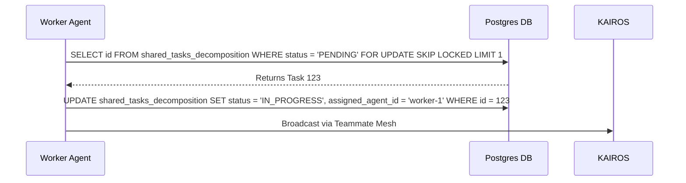

<div markdown="1" style="backdrop-filter: blur(20px) saturate(200%); font-family: 'Outfit', 'Inter', sans-serif; background: rgba(255, 255, 255, 0.03); color: #fff; padding: 20px; border-radius: 12px; border: 1px solid rgba(255, 255, 255, 0.1);">

# OHC KAIROS Hybrid Agentic OS Master Architecture

**Author:** Principal Product Architect & KAIROS Orchestrator (L7)

## 1. Phase 1: Shared Task List (Task Decomposition)
The Shared Task List relies on database-backed state machines to prevent race conditions during task claiming.

**Database Schema:**
```sql
CREATE TABLE IF NOT EXISTS shared_tasks_decomposition (
    id UUID PRIMARY KEY DEFAULT gen_random_uuid(),
    organization_id VARCHAR NOT NULL,
    title VARCHAR NOT NULL,
    description TEXT,
    status VARCHAR NOT NULL DEFAULT 'PENDING',
    assigned_agent_id VARCHAR,
    priority VARCHAR NOT NULL DEFAULT 'P2',
    payload JSONB,
    parent_plan_id TEXT,
    dependencies JSONB NOT NULL DEFAULT '[]',
    locked_until TIMESTAMP,
    created_at TIMESTAMP WITH TIME ZONE DEFAULT CURRENT_TIMESTAMP,
    updated_at TIMESTAMP WITH TIME ZONE DEFAULT CURRENT_TIMESTAMP
);
```

**Task Claiming Sequence (PostgreSQL):**


## 2. Phase 2: Realtime Teammate Mesh APIs
The Teammate Mesh ensures agents coordinate without delays via Redis Pub/Sub channels.

**Endpoint:** `POST /api/mesh/v2/broadcast`
```json
{
    "channel": "mesh:tasks",
    "event_type": "TASK_TRANSITION",
    "data": {
        "task_id": "uuid-1234",
        "previous_state": "PENDING",
        "new_state": "IN_PROGRESS"
    }
}
```

## 3. Phase 3: autoDream Vector Memory Architecture
The Swarm Intelligence Protocol dictates consolidating temporary scratchpads into long-term durable state using `pgvector`.

**Database Schema:**
```sql
CREATE TABLE IF NOT EXISTS autodream_memories (
    id TEXT PRIMARY KEY,
    organization_id VARCHAR NOT NULL,
    task_id TEXT REFERENCES shared_tasks_decomposition(id),
    content TEXT NOT NULL,
    embedding vector(1536),
    metadata JSONB,
    created_at TIMESTAMP WITH TIME ZONE DEFAULT CURRENT_TIMESTAMP
);
```

## 4. Phase 4: Sub-Agent Orchestration Queue
KAIROS missions spawn isolated sub-agents managed via a distributed queue.

</div>
