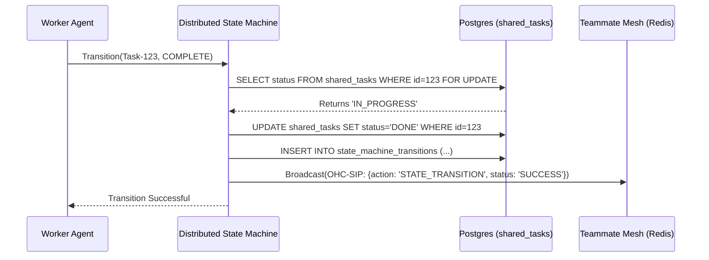

<div markdown="1" style="backdrop-filter: blur(20px) saturate(200%); font-family: 'Outfit', 'Inter', sans-serif; background: rgba(255, 255, 255, 0.03); color: #fff; padding: 20px; border-radius: 12px; border: 1px solid rgba(255, 255, 255, 0.1);">

# OHC AI OS Orchestration: KAIROS Hybrid Agentic OS Master Design

## 1. Executive Summary
The One Human Corp (OHC) Swarm requires the **KAIROS Orchestrator** to define the structural and aesthetic vision for the OHC "Hybrid Agentic OS". KAIROS orchestrates the agent team by decomposing high-level feature requests into actionable tasks within a distributed **Shared Task List**. This architecture relies on four primary pillars: a distributed state machine for tasks, a low-latency Teammate Mesh for communication, an isolated sub-agent orchestration queue, and the autoDream pipeline for long-term vector memory consolidation.

## 2. Shared Task List & Distributed State Machine
The Shared Task List relies on database-backed state machines to prevent race conditions during task claiming and transition.

### 2.1 Schema Design
```sql
-- Core Shared Task Storage
CREATE TABLE IF NOT EXISTS shared_tasks (
    id UUID PRIMARY KEY DEFAULT gen_random_uuid(),
    organization_id VARCHAR NOT NULL,
    title VARCHAR NOT NULL,
    description TEXT,
    status VARCHAR NOT NULL DEFAULT 'PENDING',
    agent_id VARCHAR,
    priority VARCHAR NOT NULL DEFAULT 'P2',
    payload JSONB,
    parent_plan_id TEXT,
    dependencies JSONB NOT NULL DEFAULT '[]',
    created_at TIMESTAMP WITH TIME ZONE DEFAULT CURRENT_TIMESTAMP,
    updated_at TIMESTAMP WITH TIME ZONE DEFAULT CURRENT_TIMESTAMP
);

-- Distributed Audit Trail
CREATE TABLE IF NOT EXISTS state_machine_transitions (
    id UUID PRIMARY KEY DEFAULT gen_random_uuid(),
    entity_id UUID NOT NULL,
    entity_type VARCHAR NOT NULL, -- 'TASK' or 'ULTRAPLAN'
    from_state VARCHAR NOT NULL,
    to_state VARCHAR NOT NULL,
    agent_id VARCHAR,
    reason TEXT,
    occurred_at TIMESTAMP WITH TIME ZONE DEFAULT CURRENT_TIMESTAMP
);
```

### 2.2 Transition Workflow


## 3. Teammate Mesh (OHC-SIP Compliance)
The Teammate Mesh ensures agents coordinate without delays. All messages MUST follow the OHC Swarm Intelligence Protocol (OHC-SIP).

### 3.1 SIP Message Schema
```json
{
  "agent_id": "orchestrator-01",
  "action": "TASK_BROADCAST",
  "status": "PENDING",
  "timestamp": "2026-04-13T08:00:00Z",
  "payload": {
    "task_id": "task_12345",
    "required_skills": ["golang", "postgres"]
  }
}
```

## 4. Sub-Agent Orchestration Queue (Phase 4)
Scalable execution via isolated worker spawning.

| Component | Responsibility | Isolation Logic |
| :--- | :--- | :--- |
| **Manager** | Polls `shared_tasks` | Singleton in Standalone, Multi-pod in Cloud |
| **Spawner** | Executes isolated workers | `os/exec` (Local) / K8s Jobs (Cloud) |
| **Watchdog** | Monitors agent health | Heartbeat check in `.agent-task/status/` |

## 5. autoDream Memory Consolidation (Phase 3)
The Swarm Intelligence Protocol dictates that temporary context be consolidated into long-term durable state.

- **Extraction**: Efficient sweep of `DONE` tasks.
- **Synthesis**: Semantic compression via LLM (Minimax/Anthropic).
- **Embedding**: High-dimensional vector generation (pgvector).

## 6. Hybrid Architecture Degradation Strategy
Designed to degrade gracefully based on environment context.

| Feature Area | Cloud-Native Mode | Standalone Desktop Mode |
| :--- | :--- | :--- |
| **Distributed Locking** | Redis (rueidis Redlock) | SQLite Transactions + App Mutex |
| **Task Queue** | Redis Lists / BullMQ | SQLite `local_queue_jobs` Table |
| **Teammate Mesh** | Redis Pub/Sub + Centrifuge | In-Memory Channels + Sharding |
| **Vector Storage** | pgvector / Cloud RAG | SQLite BLOB + App-level Similarity |

## 7. Visual Excellence Mandate
All KAIROS dashboards and visualization interfaces MUST apply the OHC "Premium Feel".

```css
<style>
.ohc-glass {
  backdrop-filter: blur(20px) saturate(200%);
  background: rgba(255, 255, 255, 0.03);
  font-family: 'Outfit', 'Inter', sans-serif;
  border: 1px solid rgba(255, 255, 255, 0.1);
  border-radius: 12px;
}
</style>
```

</div>
