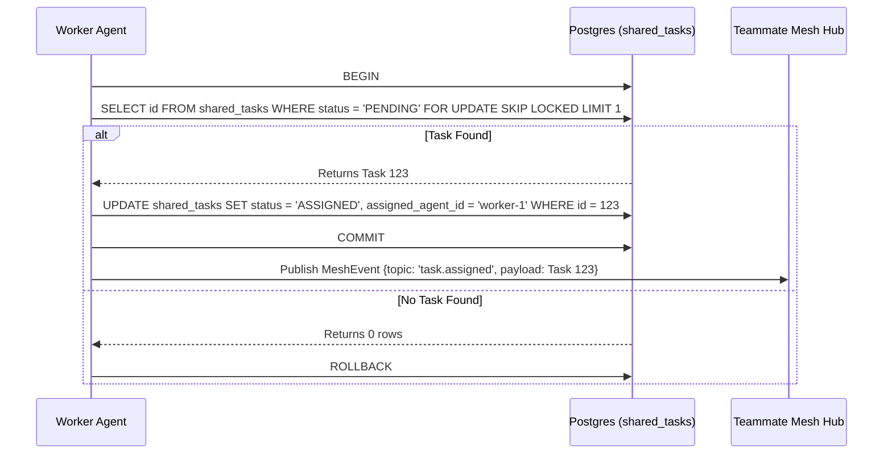

<div markdown="1" style="backdrop-filter: blur(20px) saturate(200%); font-family: 'Outfit', 'Inter', sans-serif; background: rgba(255, 255, 255, 0.03); color: #fff; padding: 20px; border-radius: 12px; border: 1px solid rgba(255, 255, 255, 0.1);">

# OHC AI OS Orchestration: KAIROS Hybrid Agentic OS Master Design

## 1. Executive Summary
The One Human Corp (OHC) Swarm requires the **KAIROS Orchestrator** to define the structural and aesthetic vision for the OHC "Hybrid Agentic OS". KAIROS orchestrates the agent team by decomposing high-level feature requests into actionable tasks within a distributed **Shared Task List**. This architecture relies on three primary pillars: a distributed state machine for tasks, a low-latency Teammate Mesh for communication, and the autoDream pipeline for long-term vector memory consolidation.

## 2. Shared Task List & DAG Schema
The Shared Task List relies on database-backed state machines to prevent race conditions during task claiming. Tasks are represented as nodes in a Directed Acyclic Graph (DAG) using a JSONB `dependencies` array.

```sql
CREATE TABLE IF NOT EXISTS shared_tasks (
    id UUID PRIMARY KEY DEFAULT gen_random_uuid(),
    organization_id VARCHAR NOT NULL,
    title VARCHAR NOT NULL,
    description TEXT,
    status VARCHAR NOT NULL DEFAULT 'PENDING',
    agent_id VARCHAR,
    priority VARCHAR NOT NULL DEFAULT 'P2',
    payload JSONB,
    parent_plan_id TEXT,
    dependencies JSONB NOT NULL DEFAULT '[]',
    created_at TIMESTAMP WITH TIME ZONE DEFAULT CURRENT_TIMESTAMP,
    updated_at TIMESTAMP WITH TIME ZONE DEFAULT CURRENT_TIMESTAMP
);
```

#### Shared Task Claiming Workflow


## 3. Teammate Mesh APIs
The Teammate Mesh ensures agents coordinate without delays.

- **Endpoint:** `POST /api/mesh/v2/broadcast`
  Broadcasts a state machine event over structured channels.

```json
{
  "channel": "mesh:tasks",
  "event_type": "TASK_TRANSITION",
  "data": {
    "task_id": "task_12345",
    "previous_state": "PENDING",
    "new_state": "IN_PROGRESS"
  }
}
```

## 4. autoDream Memory Vector Architecture
The Swarm Intelligence Protocol (OHC-SIP) dictates that temporary agent scratchpads be consolidated into long-term durable state.

```sql
CREATE TABLE IF NOT EXISTS consolidated_memory (
    id UUID PRIMARY KEY DEFAULT gen_random_uuid(),
    task_id UUID REFERENCES shared_tasks(id),
    content TEXT NOT NULL,
    embedding vector(1536),
    created_at TIMESTAMP WITH TIME ZONE DEFAULT CURRENT_TIMESTAMP
);
```

```mermaid
graph TD
    Agent[Agent Shared Memory] -->|Writes to OHC_MEMORY_DIR| FS[Runtime Memory Directory]
    FS -->|Watched by| AutoDream[AutoDream Pipeline Worker]
    AutoDream --> Chunk[Chunk & Tokenize]
    Chunk --> Embed[Minimax/Cohere Embedding API]
    Embed --> VectorDB[(pgvector / Local SQLite)]
    VectorDB -->|RAG Sync| API[KAIROS Orchestration API]

    classDef premium fill:rgba(255,255,255,0.03),stroke:rgba(255,255,255,0.08),stroke-width:1px,color:#fff,backdrop-filter:blur(20px) saturate(200%);
    class Agent,FS,AutoDream,Chunk,Embed,VectorDB,API premium;
```

## 5. Hybrid Architecture Degradation Matrix
The system is designed to degrade gracefully based on environment context.

| Feature Area | Cloud-Native Mode | Standalone Desktop Mode |
| :--- | :--- | :--- |
| **Shared Task Locking** | PostgreSQL `FOR UPDATE SKIP LOCKED` | Local SQLite Transactions & Go Mutexes |
| **Teammate Mesh** | Redis Pub/Sub (Centrifuge WebSocket hubs) | In-Memory Go channel broadcast |
| **Memory Vector Store** | pgvector / Pinecone | Local SQLite FTS/Vector extensions |

## 6. Visual Excellence Mandate
All associated UI components must represent the OHC "Premium Feel". The application of these styles is mandatory for all KAIROS dashboards and visualization interfaces.

```css
<style>
body {
  backdrop-filter: blur(20px) saturate(200%);
  background: rgba(255, 255, 255, 0.03);
  font-family: 'Outfit', 'Inter', sans-serif;
  color: #fff;
}
.glass-panel {
  border: 1px solid rgba(255, 255, 255, 0.1);
  border-radius: 12px;
  padding: 20px;
}
</style>
```

</div>
