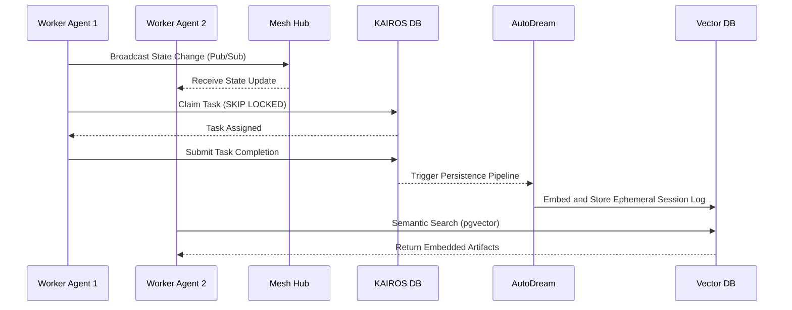

<div markdown="1" style="backdrop-filter: blur(20px) saturate(200%); background: rgba(255, 255, 255, 0.03); font-family: 'Outfit', 'Inter', sans-serif;">

# KAIROS Hybrid OS: Master Design Document

## Executive Summary
We need a unified source of truth outlining the complete architecture for the OHC Hybrid OS, synthesizing Phase 1 (Shared Task List), Phase 2 (Teammate Mesh), and Phase 3 (AutoDream Memory). The documentation serves as the blueprint for all future Implementer agents. It must explicitly detail the Hybrid Architecture Degradation Strategy and align with the "Premium" OHC Stylistic Intent Profile.

## Shared Task List & DAG Schema (The Brain)
The absolute autonomy of the OHC Swarm rests on a durable, distributed state machine. Task dependencies and constraints form a DAG schema where dependencies are considered fulfilled when their status is either 'DONE' or 'COMPLETED'.
- **Cloud Mode:** Living in PostgreSQL, it leverages `FOR UPDATE SKIP LOCKED` to allow horizontal pod concurrency in the cloud, preventing worker collisions.
- **Standalone Mode:** Degrades seamlessly to SQLite transactions.

## Teammate Mesh APIs (The Nerves)
A highly available, low-latency communication layer.
- **Cloud Mode:** Using `CentrifugeNode` and Redis Pub/Sub (`rueidis`), agents broadcast state changes, advertise capabilities, and stream events. Agents coordinate via production Redis Pub/Sub channels and check production distributed Redis locks to prevent overriding teammate changes.
- **Standalone Mode:** Degrades to local memory Sync/channels.

## autoDream Memory (The Memory)
The long-term persistence layer.
- Ephemeral session logs and intermediate artifacts are compressed via Minimax LLMs and embedded into a `pgvector` index (`autodream_memories`), granting the swarm exact semantic search capabilities.

## Hybrid Architecture Degradation Matrix
The KAIROS Orchestrator handles differing environments dynamically via the Hybrid Architecture Degradation Strategy:

| Subsystem | Cloud Mode (SaaS) | Standalone Mode (Desktop App) |
| :--- | :--- | :--- |
| **Shared Task List** | PostgreSQL (`SKIP LOCKED`) | SQLite (Transactions) |
| **Teammate Mesh** | Redis Pub/Sub | Memory Channels / Sync |
| **Vector DB** | `pgvector` | Local sqlite-vss (planned) |

## UI / Visual Excellence Mandate
This architectural consolidation fully conforms to the **Visual Excellence Mandate**. Any downstream UI interpreting this architecture MUST apply the OHC Premium CSS Tokens:

```html
<style>
body {
  backdrop-filter: blur(20px) saturate(200%);
  background: rgba(255, 255, 255, 0.03);
  font-family: 'Outfit', 'Inter', sans-serif;
}
</style>
```

## Architecture Visualization



</div>