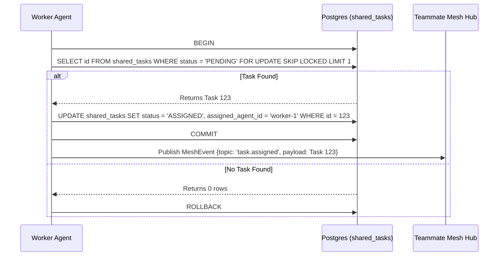

<div markdown="1" style="backdrop-filter: blur(20px) saturate(200%); font-family: 'Outfit', 'Inter', sans-serif; background: rgba(255, 255, 255, 0.03); padding: 20px; border-radius: 12px; border: 1px solid rgba(255, 255, 255, 0.1);">

# KAIROS Orchestration & Hybrid AI OS Design Blueprint
**Author:** Principal Product Architect & KAIROS Orchestrator (L7)

## Overview
This document defines the structural and aesthetic vision for the OHC "Hybrid Agentic OS". Act as the central "KAIROS" orchestrator, decomposing complex feature requests into a shared task list for the agent team.

## Phase 1: Shared Task List Decomposition
The Shared Task List relies on a robust database schema to track complex feature decomposition into actionable, sequenced `shared_tasks`, using locking to prevent race conditions during task claiming.

### Database Schema (PostgreSQL):
```sql
CREATE TABLE IF NOT EXISTS shared_tasks (
    id UUID PRIMARY KEY DEFAULT gen_random_uuid(),
    organization_id VARCHAR NOT NULL,
    title VARCHAR NOT NULL,
    description TEXT,
    status VARCHAR NOT NULL DEFAULT 'PENDING',
    agent_id VARCHAR,
    priority VARCHAR NOT NULL DEFAULT 'P2',
    payload JSONB,
    parent_plan_id TEXT,
    dependencies JSONB NOT NULL DEFAULT '[]',
    locked_until TIMESTAMP,
    created_at TIMESTAMP WITH TIME ZONE DEFAULT CURRENT_TIMESTAMP,
    updated_at TIMESTAMP WITH TIME ZONE DEFAULT CURRENT_TIMESTAMP
);
```

### Shared Task Claiming Workflow


## Phase 2: Teammate Mesh APIs (Orchestration)
The Teammate Mesh ensures agents coordinate without delays, degrading gracefully based on the OHC mode.

- **Cloud-Native Mode:** Uses Redis Pub/Sub (`rueidis`) to manage highly concurrent distributed queues.
- **Standalone Mode:** Degrades gracefully to an in-memory Go channel broadcast to ensure low-latency IPC.

### API Contract (HTTP Webhooks):
- **Endpoint:** `POST /api/mesh/v2/broadcast`
  Broadcasts a state machine event over structured channels.

```json
{
  "channel": "mesh:tasks",
  "event_type": "TASK_TRANSITION",
  "data": {
    "task_id": "task_12345",
    "previous_state": "PENDING",
    "new_state": "IN_PROGRESS"
  }
}
```

## Phase 3: autoDream Vector Memory Consolidation
The Swarm Intelligence Protocol (OHC-SIP) dictates that temporary agent scratchpads be consolidated into long-term durable state.

Background workers consolidate `agent_session_data` and optional `OHC_MEMORY_DIR/*.yml` runtime memory files to embeddings stored in PostgreSQL with `pgvector`, into the `autodream_memories` table, granting the swarm exact semantic search capabilities.

```sql
CREATE TABLE IF NOT EXISTS autodream_memories (
    id UUID PRIMARY KEY DEFAULT gen_random_uuid(),
    task_id UUID REFERENCES shared_tasks(id),
    content TEXT NOT NULL,
    embedding vector(1536),
    created_at TIMESTAMP WITH TIME ZONE DEFAULT CURRENT_TIMESTAMP
);
```

## Phase 4: Sub-Agent Orchestration Queue
Background worker system (`srcs/server/orchestration/queue/queue.go`) with Redis or SQLite implementations for spawning isolated sub-agents.

Sub-agents can be spawned by pushing a payload to the queue (e.g. BullMQ/Celery equivalents). A master loop manages a worker pool that polls the queue and isolates execution to the sub-agent environment.

</div>
