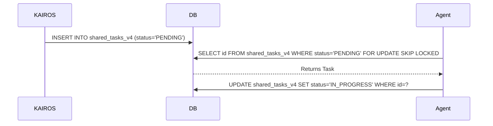

<div markdown="1" style="backdrop-filter: blur(20px) saturate(200%); font-family: 'Outfit', 'Inter', sans-serif; background: rgba(255, 255, 255, 0.03); color: #fff; padding: 20px; border-radius: 12px; border: 1px solid rgba(255, 255, 255, 0.1);">

# KAIROS Orchestration: Shared Task List, Teammate Mesh, and autoDream

## 1. Executive Summary
The OHC Hybrid Architecture requires a robust orchestration engine to distribute tasks, coordinate in realtime, and consolidate long-term memory.

## 2. Shared Task List (Decomposition)
**Database Schema (PostgreSQL/SQLite Compatible):**
```sql
CREATE TABLE IF NOT EXISTS shared_tasks_v4 (
    id VARCHAR PRIMARY KEY,
    organization_id VARCHAR NOT NULL,
    title VARCHAR NOT NULL,
    status VARCHAR NOT NULL DEFAULT 'PENDING',
    dependencies TEXT NOT NULL DEFAULT '[]'
);
```

**Sequence Diagram:**


## 3. Teammate Mesh APIs
Realtime communication using `mesh:tasks`, `mesh:coordination`, and `mesh:capabilities`.

## 4. autoDream Pipeline
Consolidates `.agent-task/memory/*.yml` into embeddings stored in `consolidated_memory` using `pgvector`.

</div>
