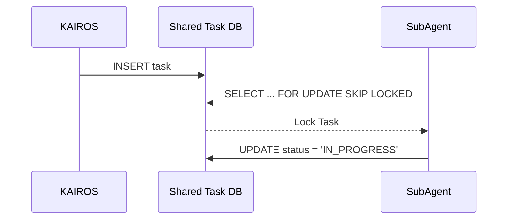
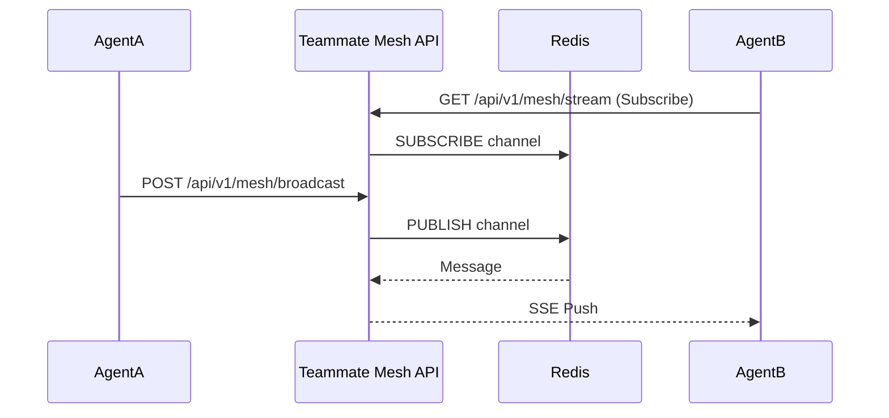

<div markdown="1" style="backdrop-filter: blur(20px) saturate(200%); font-family: 'Outfit', 'Inter', sans-serif; background: rgba(255, 255, 255, 0.03); color: #fff; padding: 20px; border-radius: 12px; border: 1px solid rgba(255, 255, 255, 0.1);">

# KAIROS Master Orchestration Design
**Author:** Principal Product Architect & KAIROS Orchestrator (L7)

## Phase 1: Shared Task List (Decomposition)
To manage deep-deliberation cycles, we need a robust database schema for task decomposition.

**PostgreSQL Schema:**
```sql
CREATE TABLE IF NOT EXISTS shared_tasks_v5 (
    id UUID PRIMARY KEY,
    epic_id UUID NOT NULL,
    title VARCHAR(255) NOT NULL,
    status VARCHAR(50) DEFAULT 'PENDING',
    assigned_agent_id UUID,
    payload JSONB,
    created_at TIMESTAMP DEFAULT CURRENT_TIMESTAMP
);
-- Worker claim using FOR UPDATE SKIP LOCKED
```

**Sequence Diagram:**


## Phase 2: Orchestration (Teammate Mesh API)
Agents coordinate using a highly available realtime communication layer.

- **Transport:** Redis Pub/Sub channels scoped by tenant.
- **Protocol:** `POST /api/v1/mesh/broadcast` and SSE stream `GET /api/v1/mesh/stream`.

**Sequence Diagram:**


## Phase 3: autoDream (Memory Consolidation)
Data pipelines converting episodic memory to long-term vector embeddings.

**pgvector Schema:**
```sql
CREATE EXTENSION IF NOT EXISTS vector;
CREATE TABLE IF NOT EXISTS autodream_findings (
    id UUID PRIMARY KEY,
    timestamp TIMESTAMP,
    content TEXT,
    embedding VECTOR(1536)
);
```

## Phase 4: Sub-Agent Queue
Scalable background queuing logic for spawning isolated agents.

**Payload:**
```json
{
  "queue": "implementer_pool",
  "job": "execute_task_123",
  "timeout": 3600
}
```

</div>