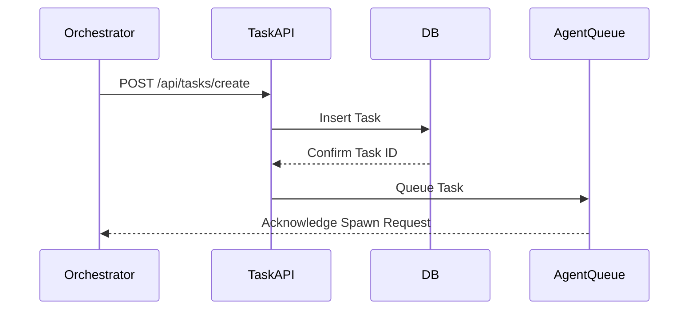

# KAIROS Orchestration & AutoDream Foundation: Phase 1 & 2 & 3 & 4

## Overview
This document serves as the Master Blueprint for the KAIROS Orchestration system within the OHC Hybrid OS. It outlines the architectural phases required to build a fully autonomous, scalable, and aesthetically premium Swarm Intelligence.

## Core Mandates
- **Visual Excellence**: Premium Glassmorphism UI tokens.
- **Hybrid Architecture**: Graceful degradation from Cloud-Native (K8s, PG, Redis) to Standalone (SQLite).
- **Absolute Autonomy**: Agents operate autonomously based on Swarm State.

## Phase 1: Shared Task List (Decomposition)
- **Database Architecture**: Unified Postgres Schema `tasks` with robust indexing.
- **Microservices Mapping**: REST/gRPC endpoints under `api/tasks/`.
- **Schema Key**:
  - `id` (UUID)
  - `epic_id` (UUID, nullable)
  - `title`, `description`, `priority`, `status`
  - `assigned_agent_id`
  - `created_at`, `updated_at`

### Sequence Diagram

### State Machine Tracking
We will implement a distributed state machine backed by Redis distributed locks for Cloud-Native environments, and SQLite database locks for Local Standalone.
State Transitions:
`PENDING` -> `ASSIGNED` -> `IN_PROGRESS` -> `REVIEW` -> `COMPLETED` | `FAILED`

## Phase 2: Teammate Mesh APIs (Orchestration)
- **Realtime Layer**: Redis Pub/Sub channels (`ohc.mesh.agent.*`).
- **Graceful Degradation**: Fallback to long-polling via SQLite if Redis is absent in Standalone mode.
- **API Contracts**:
  - `POST /api/mesh/broadcast`
  - `GET /api/mesh/sync`

## Phase 3: AutoDream Vector Pipelines (Consolidation)
- **Vector DB**: `pgvector` for Cloud, SQLite VSS for Local.
- **Pipeline Strategy**:
  - Nightly extraction of completed Swarm tasks.
  - LLM Embedding generation (OpenAI/Local models).
  - Storage in `autodream_memories` table.
- **Schema Key**:
  - `id` (UUID)
  - `source_mission_id`
  - `vector_embedding` (1536 dim)
  - `content_summary`

## Phase 4: Sub-Agent Orchestration Queue
- **Queue System**: BullMQ over Redis.
- **Isolated Spawning**: Worker pods in K8s, background processes in Standalone.

