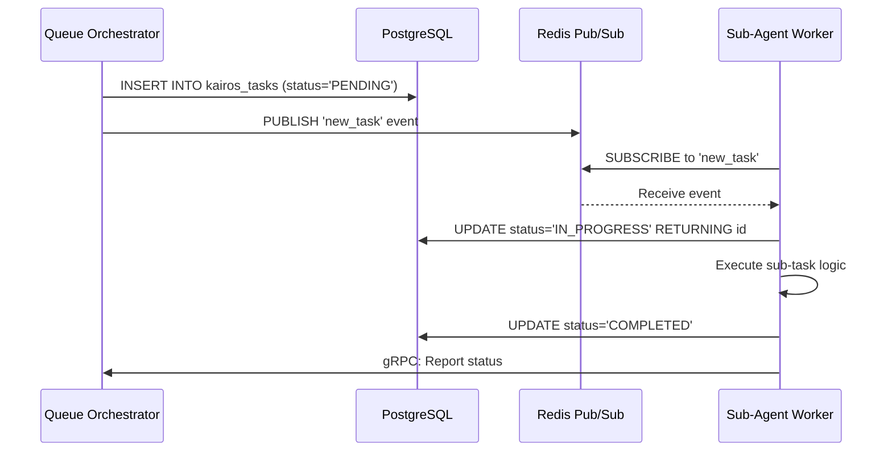

<div markdown="1" style="backdrop-filter: blur(20px) saturate(200%); background: rgba(255, 255, 255, 0.03); font-family: 'Outfit', 'Inter', sans-serif; padding: 20px; border-radius: 12px; color: #fff;">

# OHC: KAIROS Orchestration & AutoDream Foundation Architecture

## Executive Summary

This document defines the structural and aesthetic vision for the OHC "Hybrid Agentic OS" KAIROS Orchestration layer. As the central "KAIROS" orchestrator, this architecture details the decomposition of complex feature requests into a shared task list for the agent team, establishes the realtime communication mesh, and lays the groundwork for the AutoDream state consolidation pipelines.

---

## Phase 1: Shared Task List & Sub-Agent Queues (UltraPlan/Decomposition)

### Objective
Provide a distributed, stateful queueing mechanism for delegating complex tasks to Sub-Agents across the OHC Swarm.

### Database Design (PostgreSQL)
We will introduce a new `kairos_tasks` schema with state machine tracking for robust, distributed execution.

```sql
CREATE TABLE kairos_tasks (
    id UUID PRIMARY KEY,
    parent_epic_id UUID,
    status VARCHAR(50) NOT NULL, -- PENDING, IN_PROGRESS, COMPLETED, FAILED
    payload JSONB NOT NULL,
    created_at TIMESTAMP DEFAULT CURRENT_TIMESTAMP,
    updated_at TIMESTAMP DEFAULT CURRENT_TIMESTAMP
);
```

### Sequence Diagram


### Microservices Mapping
- **Queue Orchestrator (`api/mesh/queue.go`)**: A Golang-based background queue orchestrator backed by Redis (for fast Pub/Sub and locking) and PostgreSQL (for durable state).
- **Sub-Agent Workers**: Isolated instances that pull tasks from the queue and report status back to the orchestrator.

---

## Phase 2: Realtime Teammate Mesh APIs (Orchestration)

### Objective
Architect a highly available realtime communication layer for agent coordination and UI updates.

### Architecture
- **Backend (Redis Pub/Sub)**: Utilize Redis Pub/Sub channels for low-latency agent-to-agent communication (Mailbox).
- **Frontend (WebSockets)**: Expose WebSockets from the backend to stream real-time task statuses and agent coordination events to the UI.

### Implementation Details
- Target files: `api/mesh/mesh.go`
- Agents check their designated mailbox channel at the start of execution and post coordination sessions to teammates using Redis Pub/Sub.
- We will rely entirely on SPIFFE/SPIRE for identity and auth when establishing these connections.

---

## Phase 3: AutoDream Vector Data Pipelines (AutoDream)

### Objective
Architect the data pipelines for OHC's long-term state consolidation system, allowing agents to remember architectural decisions via vector embeddings.

### Cloud-Native vs. Standalone Mode
- **Cloud-Native Mode**: Utilize PostgreSQL with `pgvector` for scalable, high-concurrency vector similarity search.
- **Standalone Mode**: Gracefully degrade to SQLite using the `sqlite-vss` extension for local, host-efficient search.

### Database Schema considerations
Ensure usage of the `source_mission_id` column in the `autodream_memories` table to track the origin of the memory.

```sql
CREATE TABLE autodream_memories (
    id UUID PRIMARY KEY,
    source_mission_id UUID NOT NULL,
    embedding VECTOR(1536), -- Assuming OpenAI dimension
    content TEXT NOT NULL
);
```

### Synchronization & Locking
- Implement fallback mechanisms for PostgreSQL's `FOR UPDATE SKIP LOCKED`. For SQLite, use a single atomic `UPDATE ... RETURNING` query with a `SELECT ... LIMIT 1` subquery instead of separate SELECT and UPDATE statements to prevent race conditions.
- Target files: `api/mesh/mesh.go`

</div>
