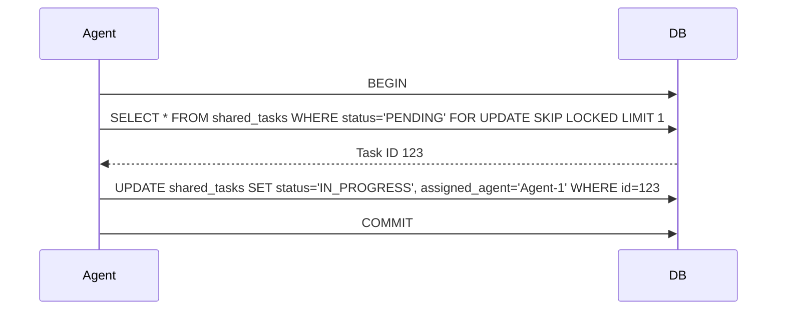

# KAIROS AI OS Orchestration: Unified Architecture

## 1. Shared Task List (Phase 1)
**Database Design:**
- **Cloud-Native Mode (PostgreSQL):** Uses `FOR UPDATE SKIP LOCKED` on the `shared_tasks` table to allow horizontal pod concurrency.
- **Standalone Mode (SQLite):** Fallback to standard SQLite transactions.
**Schema (`shared_tasks`):**
- `id` (UUID, PK)
- `parent_task_id` (UUID, FK nullable)
- `title`, `description`, `status` (PENDING, IN_PROGRESS, DONE, FAILED)
- `assigned_agent` (String nullable)
- `created_at`, `updated_at`

**Sequence Diagram:**


## 2. Teammate Mesh APIs (Phase 2)
**Architecture:** Realtime communication layer using CentrifugeNode and Redis Pub/Sub for cloud, degrading to in-memory/WebSockets for standalone.
**Events:**
- `AGENT_HEARTBEAT`
- `TASK_CLAIMED`
- `TASK_COMPLETED`
- `CAPABILITY_ADVERTISEMENT`

## 3. AutoDream Data Pipelines (Phase 3)
**Architecture:** Long-term memory consolidation using Minimax LLM for session compression, then embedded into pgvector.
**Pipeline:**
1. Short-term memory (ephemeral Redis/memory) reaches threshold.
2. Compression Agent reads raw logs and summarizes.
3. Summary is embedded via local model or API.
4. Embedding stored in `swarm_memory` (PostgreSQL pgvector or SQLite with dynamic fallback).

## 4. Visual Excellence Mandate
Any frontend components for the Orchestrator MUST apply:
```css
backdrop-filter: blur(20px) saturate(200%);
background: rgba(255, 255, 255, 0.03);
font-family: 'Outfit', 'Inter', sans-serif;
```
