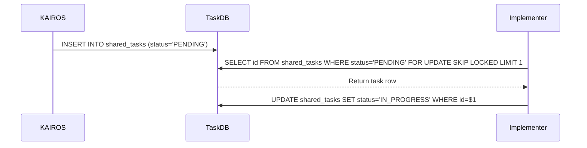

<div markdown="1" style="backdrop-filter: blur(20px) saturate(200%); font-family: 'Outfit', 'Inter', sans-serif; background: rgba(255, 255, 255, 0.03); color: #fff; padding: 20px; border-radius: 12px; border: 1px solid rgba(255, 255, 255, 0.1);">

# KAIROS Orchestration & Hybrid AI OS Implementation Design V2

**Author:** Principal Product Architect & KAIROS Orchestrator (L7)
**Status:** Approved for Implementation

## Executive Summary
This document provides the architectural blueprints for the OHC Swarm core functionalities: Shared Task List, Teammate Mesh APIs, and AutoDream Data Pipelines. This design ensures that One Human Corp (OHC) operates seamlessly as a Hybrid Agentic OS, balancing cloud-native scalability with standalone desktop privacy.

## 1. Phase 1: Shared Task List (Decomposition)
The Shared Task List empowers the swarm by tracking complex task dependencies via a distributed state machine.

### Database Schema Requirements
To maintain **Hybrid Consistency**, schemas must be defined with standard PostgreSQL queries. The `SqliteProvider` uses `convertBindVars` to dynamically translate Postgres placeholders to SQLite and strip unsupported clauses.

```sql
-- PostgreSQL (Cloud-Native Mode & Standalone Desktop Mode via conversion)
CREATE TABLE IF NOT EXISTS shared_tasks (
    id UUID PRIMARY KEY DEFAULT gen_random_uuid(),
    organization_id VARCHAR NOT NULL,
    title VARCHAR NOT NULL,
    description TEXT,
    status VARCHAR NOT NULL DEFAULT 'PENDING',
    agent_id VARCHAR,
    priority VARCHAR NOT NULL DEFAULT 'P2',
    payload JSONB,
    parent_plan_id TEXT,
    dependencies JSONB NOT NULL DEFAULT '[]',
    locked_until TIMESTAMP,
    created_at TIMESTAMP WITH TIME ZONE DEFAULT CURRENT_TIMESTAMP,
    updated_at TIMESTAMP WITH TIME ZONE DEFAULT CURRENT_TIMESTAMP
);
```

### Sequence Diagram


## 2. Phase 2: Teammate Mesh APIs (Orchestration)
The Teammate Mesh provides low-latency communication via Centrifuge node integration.
- **Cloud-Native Mode:** Uses Redis Pub/Sub (`rueidis`) over channels like `mesh:tasks` and `mesh:coordination`.
- **Standalone Mode:** Uses `LocalMeshBroker` for in-memory Go channel broadcast to degrade gracefully.

## 3. Phase 3: AutoDream Data Pipelines (Memory)
AutoDream consolidates ephemeral `agent_session_data` and optional `OHC_MEMORY_DIR/*.yml` runtime memory files into long-term embeddings.
- **Implementation:** Background `AutoDreamWorker` converts episodic memory into long-term embeddings using LLM wrappers.
- **Storage:** Embeddings are stored in a `pgvector` enabled PostgreSQL `autodream_memories` table (Cloud) or stored as JSON text blobs in SQLite (Standalone).

## 4. Phase 4: Sub-Agent Orchestration Queue
A background queue for managing sub-agent lifecycles securely in isolated production pods.

</div>
