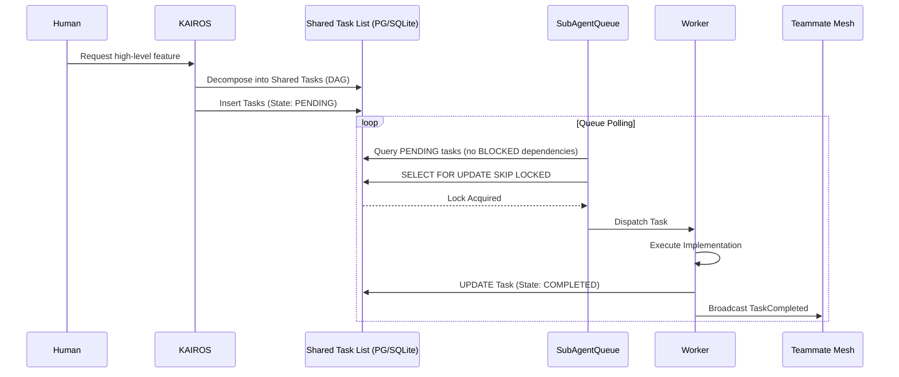

<div markdown="1" style="backdrop-filter: blur(20px) saturate(200%); font-family: 'Outfit', 'Inter', sans-serif; background: rgba(255, 255, 255, 0.03); color: #fff; padding: 20px; border-radius: 12px; border: 1px solid rgba(255, 255, 255, 0.1);">

# KAIROS Orchestration: Master Design Document (v3.0)

## 1. Vision
The One Human Corp (OHC) AI OS is powered by the **KAIROS Orchestrator**, a distributed system designed to manage complex agent swarms with zero friction. KAIROS ensures that a single human can orchestrate vast AI teams by providing a unified, aesthetics-first interface for task decomposition, real-time coordination, and long-term memory consolidation.

## 2. Architectural Pillars

### I. Distributed State Machine (Shared Task List)
KAIROS utilizes a database-backed state machine to manage the lifecycle of `shared_tasks`.
- **Hybrid Locking:** PostgreSQL uses `FOR UPDATE SKIP LOCKED` for high-concurrency cloud environments. Standalone mode utilizes SQLite with Go-level Mutexes and explicit transactions to prevent TOCTOU (Time-of-Check to Time-of-Use) vulnerabilities.
- **UltraPlan Integration:** Tasks move through specialized deliberation phases (`PROPOSE`, `CRITIQUE`, `REVISE`, `APPROVED`, `EXECUTE`) before being claimed by worker agents.
- **DAG Support:** Tasks can have multiple dependencies, forming a Directed Acyclic Graph. KAIROS enforces circular dependency checks at the middleware layer.

**Shared Task List Schema (PostgreSQL/SQLite):**
```sql
CREATE TABLE IF NOT EXISTS shared_tasks (
    id UUID PRIMARY KEY DEFAULT gen_random_uuid(),
    organization_id VARCHAR NOT NULL,
    title VARCHAR NOT NULL,
    description TEXT,
    status VARCHAR NOT NULL DEFAULT 'PENDING',
    agent_id VARCHAR,
    priority VARCHAR NOT NULL DEFAULT 'P2',
    payload JSONB,
    parent_plan_id TEXT,
    dependencies JSONB NOT NULL DEFAULT '[]',
    created_at TIMESTAMP WITH TIME ZONE DEFAULT CURRENT_TIMESTAMP,
    updated_at TIMESTAMP WITH TIME ZONE DEFAULT CURRENT_TIMESTAMP
);
```

### II. Teammate Mesh (Real-time Transport)
The Teammate Mesh provides low-latency communication across the swarm.
- **Unified API:** A single gateway (`POST /api/mesh/broadcast`) handles event routing.
- **OHC-SIP Compliance:** All messages MUST include `agent_id`, `action`, and `status` at the JSON root to ensure compatibility across different agent roles and versions.
- **Hybrid Transport:**
    - **Cloud:** Powered by Redis Pub/Sub connected to Centrifuge hubs for WebSocket propagation to thin clients and sub-agents. Messages flow via channels like `mesh:tasks`, `mesh:coordination`.
    - **Standalone:** Powered by a sharded in-memory Go transport for maximum host-machine efficiency.

### III. autoDream Pipeline (Omni-Context Memory)
The autoDream system consolidates episodic agent memory into a durable vector store.
- **Continuous Sync:** Local SQLite vector embeddings are automatically synced to Cloud pgvector instances. Intermediate worker outputs and session logs are compressed by a background pipeline.
- **Durable Storage:** The pipeline utilizes embeddings, storing them directly in a `pgvector` enabled table (`autodream_memories`) for exact semantic match recall.
- **Observability:** Every consolidation event is recorded via OpenTelemetry, providing "Full-Spectrum Observability" into the swarm's intelligence growth.

### IV. Sub-Agent Orchestration Queue
- **Queue Worker:** Implement a worker that polls `sub_agent_jobs` using `SKIP LOCKED` (Postgres) and Mutexes (SQLite).
- **Isolation:** For Standalone mode, use goroutines with OS-level resource limits (where possible). For Cloud, use a sidecar pattern or K8s Jobs.


### V. Teammate Mesh APIs (Realtime Coordination)
- **Goal:** Realtime communication and synchronization layer for KAIROS features.
- **REST APIs (`srcs/server/orchestration/mesh/`):**
    - `POST /api/mesh/broadcast`: Broadcast an event payload to specific channels.
    - `GET /api/mesh/subscribe`: Upgrade to WebSocket/SSE for subscribing to agent channels.
- **Payload Contract:** All Teammate Mesh payloads must be JSON and structured to OHC-SIP compliance:
  ```json
  {
      "agent_id": "sub_agent_xyz123",
      "action": "TaskCompleted",
      "status": "success",
      "payload": { "task_id": "task_abc", "result": "..." }
  }
  ```

## 3. Sequence Diagram for Shared Task List


---
*Authored by: Principal Product Architect & KAIROS Orchestrator (L7)*
*Identity: One Human Corp*

</div>
