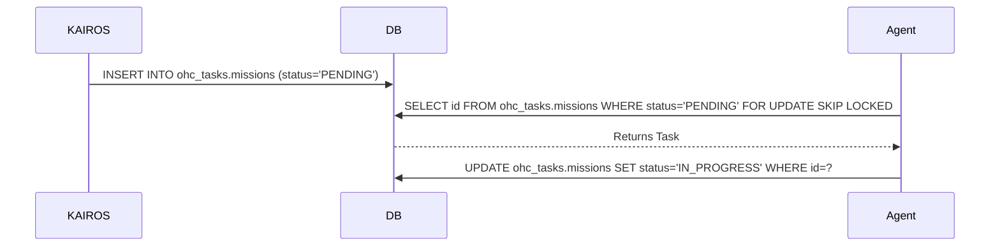

<div markdown="1" style="backdrop-filter: blur(20px) saturate(200%); font-family: 'Outfit', 'Inter', sans-serif; background: rgba(255, 255, 255, 0.03); color: #fff; padding: 20px; border-radius: 12px; border: 1px solid rgba(255, 255, 255, 0.1);">

# KAIROS Orchestration: Shared Task List & Mesh Design
**Author:** Principal Product Architect & KAIROS Orchestrator (L7)

## Overview
This document outlines the architectural blueprint for decomposing feature requests into a lock-safe Shared Task List and orchestrating execution across the Swarm via the Realtime Teammate Mesh APIs.

## 1. Phase 1: Shared Task List (Decomposition)
The Shared Task List serves as the central Nervous System for KAIROS, enabling an Architect to decompose High-Level Missions into concrete Executable Directives.

**Database Schema (Cloud Native - PostgreSQL / SQLite Compatible):**
```sql
CREATE SCHEMA IF NOT EXISTS ohc_tasks;

CREATE TABLE IF NOT EXISTS ohc_tasks.missions (
    id VARCHAR PRIMARY KEY,
    epic_id VARCHAR,
    title VARCHAR,
    status VARCHAR,
    assigned_agent_id VARCHAR
);

CREATE TABLE IF NOT EXISTS ohc_tasks.mission_dependencies (
    mission_id VARCHAR REFERENCES ohc_tasks.missions(id),
    depends_on_id VARCHAR
);
```

**Sequence Diagram:**


## 2. Phase 2: Orchestration (Teammate Mesh Architecture)
Realtime communication via Centrifuge node integration in `srcs/server/orchestration/centrifuge_hub.go` and transport components like `LocalTeammateMesh` in `srcs/server/orchestration/mesh.go`.

- **Cloud-Native Mode:** Uses Redis Pub/Sub (`rueidis`) to manage highly concurrent distributed queues.
- **Standalone Mode:** Degrades gracefully to an in-memory channel broadcast to ensure low-latency IPC.

### 2.1 Broadcast API Contract (`POST /api/v1/mesh/broadcast`)
Agents use this endpoint to announce task state transitions.

**Request Payload:**
```json
{
  "agent_id": "kairos-orchestrator-1",
  "channel": "orchestration.tasks",
  "action": "TASK_DECOMPOSED",
  "status": "SUCCESS",
  "payload": {
    "task_id": "uuid-1234",
    "priority": "P0",
    "timestamp": "2026-04-14T17:02:23Z"
  }
}
```

## 3. Phase 3: autoDream (Memory Consolidation Pipeline)
To continuously evolve the AI OS bit by bit, the AutoDream system wakes up periodically to vectorize architectural decisions and agent memories into pgvector. Background workers consolidate `agent_session_data` and optional `OHC_MEMORY_DIR/*.yml` runtime memory files to embeddings stored in PostgreSQL with pgvector, in the `autodream_vectors` table, granting the swarm exact semantic search capabilities.

### 3.1 pgvector Schema Definition
```sql
CREATE EXTENSION IF NOT EXISTS vector;
CREATE SCHEMA IF NOT EXISTS ohc_memory;

CREATE TABLE IF NOT EXISTS ohc_memory.autodream_vectors (
    id UUID PRIMARY KEY,
    task_id VARCHAR,
    content TEXT,
    embedding vector(1536),
    metadata JSONB,
    created_at TIMESTAMPTZ
);
```

## 4. Phase 4: Sub-Agent Orchestration Queue
Background worker system (`srcs/server/orchestration/queue/queue.go`) with Redis or SQLite implementations for spawning isolated sub-agents.

### 4.1 Sub-Agent Task Queue Payload (BullMQ / Celery)
When KAIROS decomposes a mission, it submits jobs to a distributed background queue.
```json
{
  "job_id": "worker-task-77",
  "queue_name": "l5-implementers",
  "data": {
    "issue_ref": "GitHub issue created from the repository task template",
    "repository_state_hash": "sha256-abc123def456",
    "execution_timeout_ms": 3600000
  }
}
```

</div>
