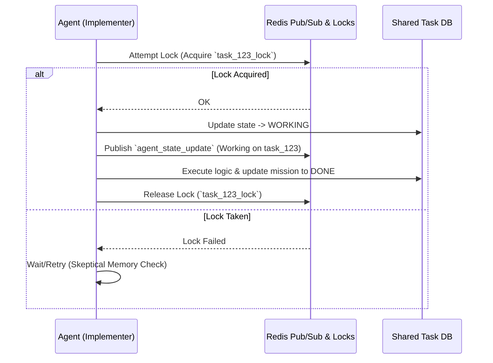

# KAIROS Shared Task Mesh & Orchestration Design

## 1. Overview
The **KAIROS Shared Task Mesh** orchestrates deep-deliberation cycles and mission delegation within the OHC "Hybrid Agentic OS." This component enables a single human to orchestrate a vast swarm of AI agents seamlessly. It handles Task Decomposition, Realtime Agent Coordination, Sub-Agent Queuing, and Durable Memory Consolidation across Cloud, Standalone, and Thin Client modes.

## 2. Shared Task List & Distributed State Machine Schema

### 2.1 Database Schema (PostgreSQL + SQLite Fallback)
The following tables manage the Shared Task List and Distributed State Machine logic.

```sql
-- Table: missions
-- Stores tasks decomposed by KAIROS orchestrators for implementer execution
CREATE TABLE missions (
    id UUID PRIMARY KEY,
    title VARCHAR(255) NOT NULL,
    description TEXT,
    priority VARCHAR(50) CHECK (priority IN ('P0', 'P1', 'P2', 'P3')),
    status VARCHAR(50) CHECK (status IN ('PENDING', 'IN_PROGRESS', 'BLOCKED', 'DONE')),
    agent_assigned VARCHAR(255),
    created_at TIMESTAMP WITH TIME ZONE DEFAULT CURRENT_TIMESTAMP,
    updated_at TIMESTAMP WITH TIME ZONE DEFAULT CURRENT_TIMESTAMP
);

-- Table: agent_state
-- Tracks the teammate mesh distributed state machine using lock IDs
CREATE TABLE agent_state (
    agent_id VARCHAR(255) PRIMARY KEY,
    current_mission_id UUID REFERENCES missions(id),
    status VARCHAR(50) CHECK (status IN ('IDLE', 'WORKING', 'ERROR')),
    lock_id VARCHAR(255),
    lock_expires_at TIMESTAMP WITH TIME ZONE,
    last_heartbeat TIMESTAMP WITH TIME ZONE DEFAULT CURRENT_TIMESTAMP
);

-- SQLite Fallback Notes:
-- Replace UUID with TEXT for UUID representation.
-- Replace TIMESTAMP WITH TIME ZONE with TEXT containing ISO-8601 UTC timestamps.
```

### 2.2 Teammate Mesh Sequence Diagram
The Teammate Mesh coordinates state transitions across agents via Git-Lock Coordination and Redis Pub/Sub.



## 3. Teammate Mesh API Contracts (gRPC / Redis Pub/Sub)

To support Hybrid Consistency, coordination degradation must gracefully fall back to DB polls or local events if Redis is unavailable.

### 3.1 gRPC Contract (Agent Coordination)

```protobuf
syntax = "proto3";
package ohc.teammate.mesh;

service CoordinationService {
  rpc AcquireLock (LockRequest) returns (LockResponse);
  rpc ReleaseLock (ReleaseRequest) returns (ReleaseResponse);
  rpc StreamAgentState (StateStreamRequest) returns (stream StateUpdate);
}

message LockRequest {
  string agent_id = 1;
  string target_resource = 2;
  int32 ttl_seconds = 3;
}

message LockResponse {
  bool acquired = 1;
  string error_message = 2;
}

message ReleaseRequest {
  string agent_id = 1;
  string target_resource = 2;
}

message ReleaseResponse {
  bool success = 1;
}

message StateStreamRequest {
  string domain_filter = 1;
}

message StateUpdate {
  string agent_id = 1;
  string new_status = 2;
  string current_mission = 3;
}
```

### 3.2 Redis Pub/Sub Channels
- `ohc.mesh.agent.status`: Streams agent status changes (e.g. `{"agent": "Implementer1", "status": "WORKING"}`).
- `ohc.mesh.mission.updates`: Broadcasts task decomposition and state changes.

## 4. AutoDream Memory Consolidation Pipeline (pgvector)

AutoDream synthesizes raw `.agent-task/memory/` and `.agent-task/status/` YAML logs into searchable architectural consolidations.

```sql
-- Table: autodream_memories
-- Stores embedded insights for long-term agent context retrieval.
CREATE EXTENSION IF NOT EXISTS vector;

CREATE TABLE autodream_memories (
    id UUID PRIMARY KEY,
    content TEXT NOT NULL,
    embedding vector(1536), -- e.g., OpenAI text-embedding-3-small
    domain_tags TEXT[],
    created_at TIMESTAMP WITH TIME ZONE DEFAULT CURRENT_TIMESTAMP
);
```
**Pipeline Workflow:**
1. **Cron/Schedule:** Nightly AutoDream pipeline runs.
2. **Synthesis:** LLM extracts insights from day's missions.
3. **Embed:** Generates 1536-dim embeddings.
4. **Store:** Persists to `autodream_memories` for retrieval via pgvector similarity search.

## 5. Sub-Agent Queue Orchestration

To avoid main thread blocking, KAIROS delegates intensive sub-tasks (e.g., executing Python scripts, heavy builds) to background queue workers (BullMQ/Celery equivalents).

### 5.1 Sub-Agent Queue Data Flow
1. **Producer:** KAIROS Orchestrator pushes a `SubAgentTask` to the queue (backed by Redis Lists or DB table in Standalone Mode).
2. **Queue Protocol:**
   - Tasks contain serialized context: `{"type": "BUILD_WEB", "args": ["--verbose"]}`
   - Priority queues allow P0 tasks to preempt.
3. **Consumer (Worker Pods/Threads):** Sub-agent workers pull tasks, execute hermetically, and write results to `.agent-task/status/` or update the Database.

## 6. Premium UI Excellence Mandate

All user-facing OHC dashboards displaying the KAIROS Teammate Mesh and Shared Task List must adhere to the **Aesthetic Excellence Mandate**:
- **Typography:** Strictly use `font-family: 'Outfit', 'Inter', sans-serif !important`.
- **Glassmorphism Elements:** Dashboard cards, active mission modals, and status panes must feature:
  ```css
  .ohc-premium-card {
      backdrop-filter: blur(20px) saturate(200%);
      background: rgba(255, 255, 255, 0.03) !important;
      border: 1px solid rgba(255, 255, 255, 0.1);
      border-radius: 16px;
      box-shadow: 0 4px 30px rgba(0, 0, 0, 0.1);
  }
  ```
- **Experience:** Ensure "Zero Friction" animations and low-latency interaction via WebSockets reflecting the Teammate Mesh updates in real-time.
