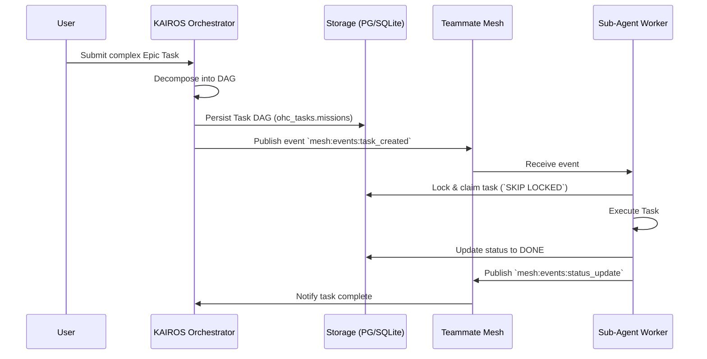

  <h1 style="color: #FFFFFF; font-weight: 700; letter-spacing: -0.02em;">KAIROS: Shared Task List & Teammate Mesh Orchestration</h1>

  

    This architectural document defines the structural blueprint for the OHC Hybrid Agentic OS's Teammate Mesh and Shared Task List. It establishes the central orchestrator (KAIROS) mechanisms required to decompose complex user requests, coordinate sub-agents via distributed state tracking, and consolidate agentic memory for continuous swarm evolution.
  

  <h2 style="color: #4ade80; border-bottom: 1px solid rgba(74,222,128,0.2); padding-bottom: 0.5rem; margin-top: 2rem;">1. Problem Statement & Research Context</h2>
  

    Currently, OHC agents operate with high autonomy but limited multi-agent collaboration primitives. A single orchestrator cannot efficiently execute highly complex, multi-domain epic tasks without delegating and synchronizing with specialized sub-agents. The core gap is the absence of a durable state machine for task decomposition and a real-time mesh for asynchronous teammate communication.
  

  

    <strong>Market Reality:</strong> Leading multi-agent frameworks either rely on brittle synchronous chains or highly unconstrained message passing that loses deterministic state. The "OHC Way" requires a robust hybrid approach: durable database-backed task lists combined with real-time Redis Pub/Sub coordination and long-term vector memory consolidation.
  

  <h2 style="color: #4ade80; border-bottom: 1px solid rgba(74,222,128,0.2); padding-bottom: 0.5rem; margin-top: 2rem;">2. Task Decomposition & Hybrid Storage</h2>
  

    KAIROS operates as the L7 Orchestrator. When a complex prompt arrives, KAIROS decomposes it into a Directed Acyclic Graph (DAG) of sub-tasks. Crucially, the system must <strong>degrade gracefully</strong>: operating on PostgreSQL in Cloud-Native Mode, and seamlessly falling back to local SQLite in Standalone Mode.
  

  <h3 style="color: #B0B0B0;">Sequence Diagram: Shared Task Execution</h3>
  <pre style="background: rgba(0,0,0,0.5); padding: 1rem; border-radius: 8px;"><code>

  </code></pre>
  <pre style="background: rgba(0,0,0,0.4); padding: 1rem; border-radius: 8px; border: 1px solid rgba(255,255,255,0.05); color: #e5e7eb; overflow-x: auto;"><code>
-- PostgreSQL Schema
CREATE SCHEMA IF NOT EXISTS ohc_tasks;

CREATE TABLE ohc_tasks.missions (
    id UUID PRIMARY KEY DEFAULT gen_random_uuid(),
    epic_id UUID REFERENCES ohc_tasks.missions(id) ON DELETE CASCADE,
    title VARCHAR(255) NOT NULL,
    description TEXT,
    priority VARCHAR(20) NOT NULL CHECK (priority IN ('P0', 'P1', 'P2', 'P3')),
    status VARCHAR(50) NOT NULL DEFAULT 'QUEUED', -- QUEUED, IN_PROGRESS, BLOCKED, REVIEW, DONE
    assigned_agent_id VARCHAR(100),
    payload JSONB NOT NULL DEFAULT '{}'::jsonb,
    created_at TIMESTAMPTZ DEFAULT NOW(),
    updated_at TIMESTAMPTZ DEFAULT NOW()
);

CREATE TABLE ohc_tasks.mission_dependencies (
    mission_id UUID REFERENCES ohc_tasks.missions(id) ON DELETE CASCADE,
    depends_on_mission_id UUID REFERENCES ohc_tasks.missions(id) ON DELETE CASCADE,
    PRIMARY KEY (mission_id, depends_on_mission_id)
);
  </code></pre>

  <h2 style="color: #4ade80; border-bottom: 1px solid rgba(74,222,128,0.2); padding-bottom: 0.5rem; margin-top: 2rem;">3. Teammate Mesh Architecture & Distributed Locking</h2>
  

    To prevent split-brain conditions and race states across the swarm, KAIROS relies on a distributed state machine over Redis (Cloud Mode) or local Go channels/file locks (Standalone Mode).
  

  <h3 style="color: #B0B0B0;">API Contract</h3>
  <pre style="background: rgba(0,0,0,0.4); padding: 1rem; border-radius: 8px; border: 1px solid rgba(255,255,255,0.05); color: #e5e7eb; overflow-x: auto;"><code>
type TeammateMesh interface {
    // Publishes a message to a specific topic
    Publish(ctx context.Context, topic string, payload []byte) error

    // Subscribes to a topic, returning a channel of messages
    Subscribe(ctx context.Context, topic string) (<-chan []byte, error)

    // Acquires a distributed lock for a resource
    AcquireLock(ctx context.Context, resourceID string, ttl time.Duration) (Lock, error)
}
  </code></pre>

  

    <strong>Pub/Sub Channels & Payloads:</strong>
  

  <ul>
    <li><code>mesh:events:task_created</code>: Payload <code>{"mission_id": "uuid", "priority": "P0"}</code></li>
    <li><code>mesh:events:status_update</code>: Payload <code>{"mission_id": "uuid", "new_status": "DONE"}</code></li>
    <li><code>mesh:mail:agent_&lt;id&gt;</code>: Payload <code>{"from": "agent_uuid", "content": "direct message"}</code></li>
  </ul>

  

    <strong>Distributed Locking:</strong> Implemented via Redlock (Cloud) or SQLite/file locks (Standalone) to ensure only one agent modifies a shared resource at a time.
  

  <h2 style="color: #4ade80; border-bottom: 1px solid rgba(74,222,128,0.2); padding-bottom: 0.5rem; margin-top: 2rem;">4. Sub-Agent Orchestration Engine</h2>
  

    Background workers scale horizontally, polling the PostgreSQL <code>ohc_tasks.missions</code> table where <code>status = 'QUEUED'</code> and all dependencies in <code>ohc_tasks.mission_dependencies</code> resolve to <code>DONE</code>. Go routines leverage <code>SKIP LOCKED</code> queries to efficiently acquire tasks without thrashing.
  

  <h2 style="color: #4ade80; border-bottom: 1px solid rgba(74,222,128,0.2); padding-bottom: 0.5rem; margin-top: 2rem;">5. AutoDream Consolidation Pipeline (pgvector)</h2>
  

    Completed missions trigger the AutoDream phase. The orchestrator synthesizes the final outcome, creates an embedding, and stores it in the vector database to build institutional swarm memory.
  

  <pre style="background: rgba(0,0,0,0.4); padding: 1rem; border-radius: 8px; border: 1px solid rgba(255,255,255,0.05); color: #e5e7eb; overflow-x: auto;"><code>
CREATE SCHEMA IF NOT EXISTS ohc_memory;

CREATE TABLE ohc_memory.autodream_vectors (
    id UUID PRIMARY KEY DEFAULT gen_random_uuid(),
    mission_id UUID REFERENCES ohc_tasks.missions(id),
    content TEXT NOT NULL,
    embedding vector(1536),
    metadata JSONB,
    created_at TIMESTAMPTZ DEFAULT NOW()
);
  </code></pre>

