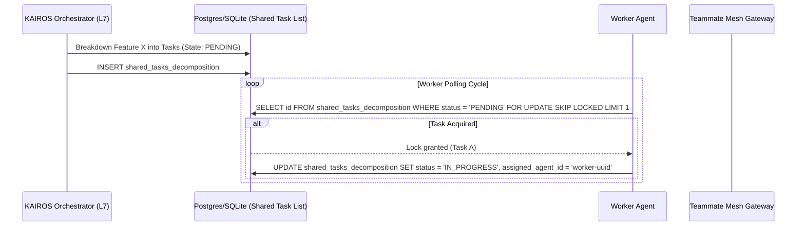

<div markdown="1" style="backdrop-filter: blur(20px) saturate(200%); font-family: 'Outfit', 'Inter', sans-serif; background: rgba(255, 255, 255, 0.03); color: #fff; padding: 20px; border-radius: 12px; border: 1px solid rgba(255, 255, 255, 0.1);">

# OHC KAIROS Orchestration Master Architecture

This document outlines the architectural blueprints for KAIROS Orchestrator to decompose complex features across the Swarm and manage long-term state effectively.

## 1. Phase 1: Shared Task List Decomposition
The Shared Task List handles task decomposition into a DAG (Directed Acyclic Graph) and avoids worker collisions via distributed locking mechanisms depending on the environment context.

In Cloud-Native environments, we leverage `FOR UPDATE SKIP LOCKED` on PostgreSQL, degrading gracefully to explicit transaction mutexes in SQLite for local Standalone modes.

```sql
CREATE TABLE IF NOT EXISTS shared_tasks_decomposition (
    id UUID PRIMARY KEY DEFAULT gen_random_uuid(),
    organization_id VARCHAR NOT NULL,
    title VARCHAR NOT NULL,
    description TEXT,
    status VARCHAR NOT NULL DEFAULT 'PENDING',
    assigned_agent_id VARCHAR,
    priority VARCHAR NOT NULL DEFAULT 'P2',
    payload JSONB,
    parent_plan_id TEXT,
    dependencies JSONB NOT NULL DEFAULT '[]',
    locked_until TIMESTAMP,
    created_at TIMESTAMP WITH TIME ZONE DEFAULT CURRENT_TIMESTAMP,
    updated_at TIMESTAMP WITH TIME ZONE DEFAULT CURRENT_TIMESTAMP
);
```

### 1.1 Shared Task Claiming Sequence


## 2. Phase 2: Teammate Mesh APIs (Orchestration)
The Teammate Mesh ensures agents coordinate without delays. It acts as the Nervous System of the OHC Swarm.

Cloud-Native implementations leverage Redis Pub/Sub connected to Centrifuge WebSocket hubs for realtime synchronization.

### 2.1 Broadcast API Contract
Agents broadcast state transitions and orchestrator events using a structured HTTP endpoint (`POST /api/mesh/broadcast`).

```json
{
    "agent_id": "kairos-orchestrator-1",
    "channel": "mesh:tasks",
    "event_type": "TASK_TRANSITION",
    "data": {
        "task_id": "uuid-1234",
        "previous_state": "PENDING",
        "new_state": "IN_PROGRESS"
    }
}
```

## 3. Phase 3: autoDream Vector Memory Architecture
The Swarm Intelligence Protocol (OHC-SIP) dictates that temporary agent scratchpads and completed task results be consolidated into long-term durable state. autoDream serves as the omni-context memory layer for continuous learning.

Worker agents process completed tasks via the background pipeline, generating Minimax/OpenAI embeddings for semantic recall. The system relies heavily on PostgreSQL's `pgvector` extension.

### 3.1 pgvector Schema
```sql
CREATE EXTENSION IF NOT EXISTS vector;

CREATE TABLE IF NOT EXISTS autodream_memories (
    id TEXT PRIMARY KEY,
    organization_id VARCHAR NOT NULL,
    task_id TEXT REFERENCES shared_tasks_decomposition(id),
    content TEXT NOT NULL,
    embedding vector(1536),
    metadata JSONB,
    created_at TIMESTAMP WITH TIME ZONE DEFAULT CURRENT_TIMESTAMP
);
```

## 4. Phase 4: Sub-Agent Orchestration Queue
KAIROS missions regularly spawn asynchronous sub-agents for executing isolated tasks, retries, and scoped execution paths. This logic is managed by the Sub-Agent Orchestration Queue.

### 4.1 Queue Architecture
A background worker system polls the internal state machine queue. Cloud implementations degrade from high-throughput distributed tools (e.g. `rueidis` Redis sets) to host-bound SQLite tables (`sub_agent_queue`).

```sql
CREATE TABLE IF NOT EXISTS sub_agent_queue (
    id TEXT PRIMARY KEY,
    organization_id TEXT NOT NULL,
    parent_task_id TEXT NOT NULL,
    payload JSONB,
    status TEXT NOT NULL DEFAULT 'QUEUED',
    worker_id TEXT,
    created_at TIMESTAMPTZ DEFAULT CURRENT_TIMESTAMP,
    updated_at TIMESTAMPTZ DEFAULT CURRENT_TIMESTAMP
);
```

Sub-agents are dispatched and transitioned from `QUEUED` -> `RUNNING` -> `COMPLETED`/`FAILED`.

</div>
