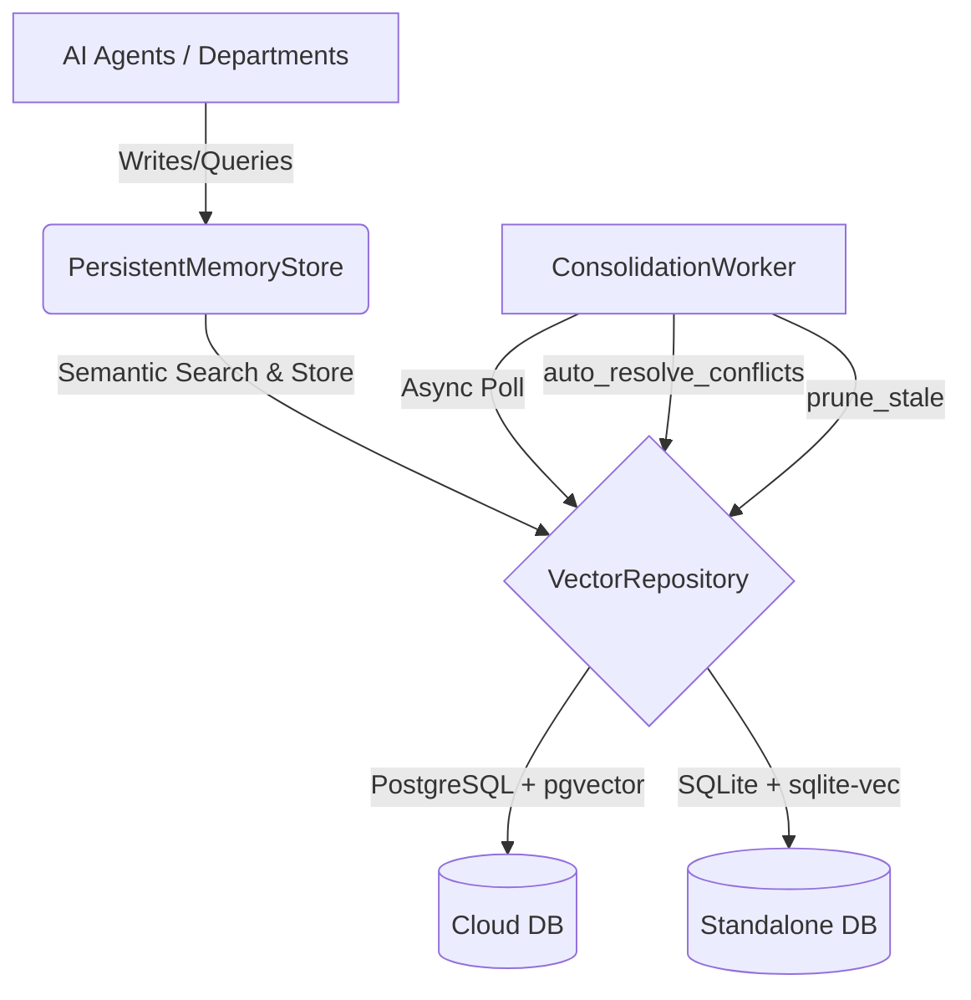

# AI Agent Context Consolidation System Architecture

## Overview
The AI Agent Context Consolidation System is the long-term memory layer for the OHC AI agents. It ensures that context generated or gathered by an AI agent persists across multiple sessions, departments, and interactions. It prevents siloed memory by implementing cross-department sharing, automatically resolves conflicts when overlapping facts are stored, and conservatively prunes stale context to keep the memory layer highly optimized.

The memory layer works identically across:
- **Cloud Mode:** Supported via PostgreSQL with the `pgvector` extension.
- **Standalone Mode:** Supported via SQLite with the `sqlite-vec` extension.

## 1. Persistent Memory Layer
The Persistent Memory Layer securely and efficiently stores high-dimensional vector embeddings, text content, and metadata for facts gathered by the agents.

### Implementation Details
- **Storage Strategy:** Uses a `consolidated_memory` table in both Postgres and SQLite. The primary data structure is the `EmbeddingRecord`, containing ID, `tenant_id`, `agent_id`, `content`, `embedding` (1536-dimensional float vector for similarity search), `source_type`, `created_at`, `last_referenced_at`, `reference_count`, `reliability_score`, `owner_override`, and `metadata`.
- **Tenant Isolation:** All CRUD operations and semantic search queries are strictly bounded by `tenant_id`. An agent can only view and update memory within its organizational context.
- **Semantic Search:** Uses the `pgvector` operators (e.g. `<=>` for cosine distance) in PostgreSQL and `vec_distance_cosine` in SQLite to match a query's embedding with the historical contexts stored.

## 2. Conflict Resolution
Because different sessions or departments may write overlapping or directly contradicting facts (e.g., "Maya's cake price is $50" vs. "Maya's cake price is $55"), the system autonomously resolves these conflicts to maintain a single source of truth.

### Resolution Logic
The system searches for pairs of embeddings that are highly similar (cosine distance < 0.05). When conflicts are detected, they are resolved deterministically using a hierarchical strategy:
1. **Owner Override:** A record with `owner_override = TRUE` unconditionally wins over one with `FALSE`.
2. **Reliability Score:** If overrides are equal, the record with the higher `reliability_score` (e.g., explicitly verified fact vs. inferred fact) wins.
3. **Recency:** If scores are identical, the more recently created record (`created_at`) wins.

The losing record is deleted, and its `reference_count` is merged into the winner. The winner's `last_referenced_at` is updated to current time.

## 3. Stale Context Pruning
To prevent unbound memory growth, a background `ConsolidationWorker` periodically cleans up less relevant and non-critical memories.

### Pruning Strategy
- **Conservatism:** Pruning only targets `TASK_SUMMARY` records that have been referenced less than 5 times (`reference_count < 5`), have not been referenced recently (`last_referenced_at < threshold`), and have no `owner_override`. Alternatively, extremely low-reliability records (`reliability_score < 20`) without overrides are purged.
- **Background Worker:** The worker executes asynchronously without blocking the main request paths. The worker wakes up at a configured interval to run `auto_resolve_conflicts` and `prune_stale`.

## 4. Cross-Department Context Sharing
All departments share the same underlying `consolidated_memory` table for a given `tenant_id`.

When an agent performs a semantic search, the search queries the entire organization's memory pool—not just records stamped with its own `agent_id`. This allows the Business Advisory agent to retrieve customer sentiment records originally stored by the Customer Success agent, creating a cohesive, cross-department AI experience without data siloing.

## Architecture Diagram (Mermaid)

