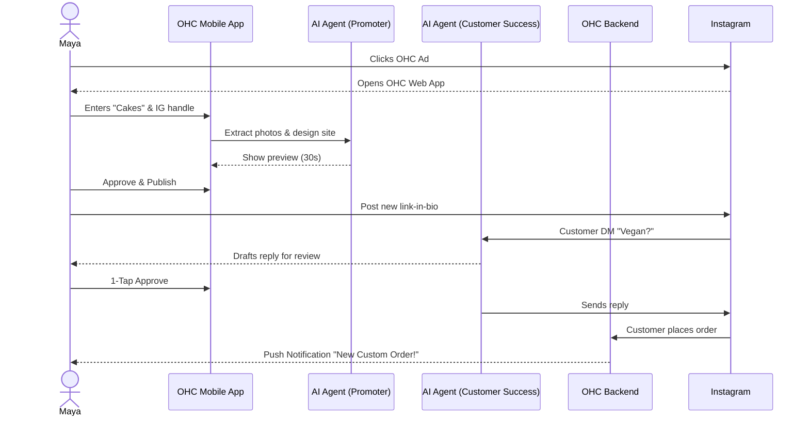
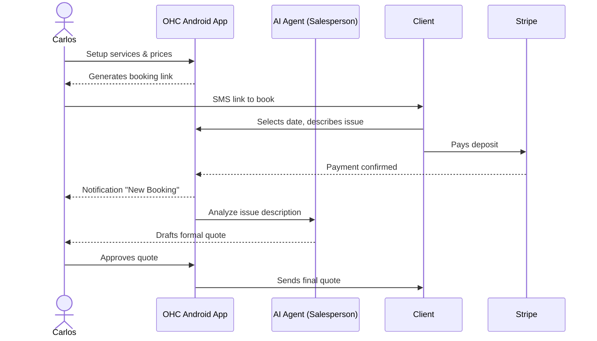
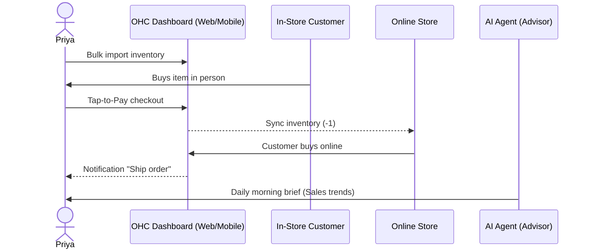
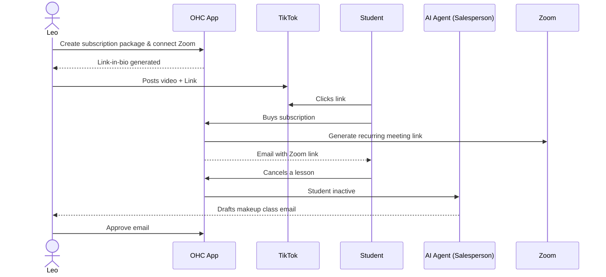
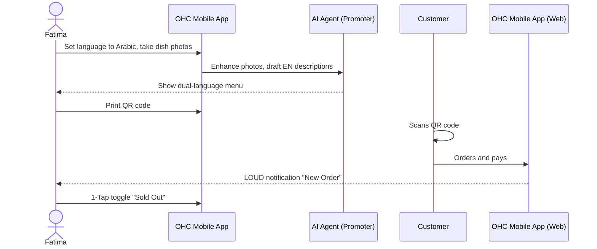

# Business Journey Architecture Design Doc

This document details the complete end-to-end user journey for each of the core personas in the OneHumanCorp (OHC) platform. It covers their acquisition, onboarding, activation, retention, revenue upgrade triggers, and referral mechanisms, aiming to identify and mitigate friction points.

## 1. Persona Journeys

### 1.1 Maya — The Home Baker
Maya (28, non-technical) needs a mobile-only storefront to sell custom cakes and field Instagram DMs.

- **Acquisition:** Maya sees a TikTok ad showing a baker taking a customized cake order with a single tap. She clicks the "Launch in 3 minutes" link in bio.
- **Onboarding:** Maya opens the OHC mobile app. The wizard asks: "What do you sell?" (Cakes). "What's your Instagram?" (@mayascakes). OHC imports 5 recent cake photos, creates a Glassmorphism-style catalog, and generates her site.
- **Activation:** Maya shares her new OHC storefront link on her Instagram bio. She receives her first custom order with a Stripe-powered deposit within the first day.
- **Retention:** Maya comes back daily to check her "Orders" feed. Push notifications alert her when a new custom request comes in or when the "Customer Success" agent successfully answers a "do you do vegan cakes?" DM.
- **Revenue:** Maya hits the 10-product limit on the Free tier. The app shows a friendly CTA: "Add unlimited cakes and unlock a custom domain (mayascakes.com) for $9/mo." She upgrades.
- **Referral:** Maya adds a "Powered by OHC - Get your own site" badge to her site footer. Another baker clicks it.

#### Maya's Customer Journey

**Friction Point:** Importing images from Instagram might fail if the profile is private or the connection times out.
**Mitigation:** Provide a quick manual upload fallback, using native mobile photo pickers.

---

### 1.2 Carlos — The Freelance Handyman
Carlos (42, non-technical) needs a service listing, booking calendar, and quoting tool on his Android phone.

- **Acquisition:** Carlos hears about OHC from another tradesperson at Home Depot. He searches Google for "easy booking app for handymen" and finds OHC.
- **Onboarding:** Carlos enters "Handyman Services". The wizard asks for his base hourly rate and 3 common jobs (Plumbing, Painting, Repairs). OHC generates a service menu and calendar view.
- **Activation:** Carlos sends a link via SMS to his next client: "Book your repair slot here." The client books and pays a $50 deposit.
- **Retention:** Carlos uses the OHC calendar as his primary daily schedule. The AI "Salesperson" agent drafts quotes based on customer problem descriptions, waiting in his inbox for approval.
- **Revenue:** Carlos wants to add SMS reminders for his clients so they don't forget appointments. This is a Pro tier feature ($29/mo). He upgrades.
- **Referral:** Carlos recommends OHC to his plumber friend when discussing how he eliminated no-shows.

#### Carlos's Customer Journey

**Friction Point:** Setting up availability can be tedious.
**Mitigation:** Integrate 1-click Google Calendar sync to automatically block out busy times, rather than manual entry.

---

### 1.3 Priya — The Boutique Owner
Priya (35, semi-technical) needs omni-channel sales (in-store POS + online) with inventory sync.

- **Acquisition:** Priya is frustrated with Shopify's POS pricing. She reads a blog comparing Shopify vs OHC.
- **Onboarding:** Priya signs up on her MacBook. The wizard helps her bulk import a CSV of her current inventory (with variants). She orders the Stripe Terminal.
- **Activation:** Priya completes her first in-store sale using her phone's Tap-to-Pay. The inventory instantly drops by 1 online.
- **Retention:** Priya checks her daily "Advisory" report every morning: "Yesterday's revenue: $450. Red dresses are selling fast."
- **Revenue:** Priya's catalog grows beyond 100 items, and she wants advanced automated email marketing (The Promoter Agent). She upgrades to Pro ($29/mo).
- **Referral:** Priya hosts a local business meetup and demonstrates her unified dashboard.

#### Priya's Customer Journey

**Friction Point:** Bulk importing variants (size/color) via CSV can easily fail due to formatting.
**Mitigation:** The AI agent should proactively parse the messy CSV, map columns intelligently, and present a preview before confirming.

---

### 1.4 Leo — The Music Tutor
Leo (22, non-technical) needs subscription-based lesson bookings, Zoom integration, and a TikTok link-in-bio.

- **Acquisition:** Leo searches for "how to sell guitar lessons online" and finds an OHC landing page targeted at educators.
- **Onboarding:** Leo connects his Zoom account and sets up a recurring subscription package ($100/mo for 4 lessons). He chooses a vibrant, youth-focused design template for his link-in-bio.
- **Activation:** Leo posts a guitar cover on TikTok with his OHC link. A student signs up for a trial lesson.
- **Retention:** Leo manages all his student links, payments, and schedules from the app. The "Salesperson" agent notifies him if a student cancels and drafts an email offering a makeup class.
- **Revenue:** To access unlimited AI follow-ups for inactive students, he upgrades to Starter ($9/mo).
- **Referral:** A student of his becomes a tutor and uses Leo's referral link to start.

#### Leo's Customer Journey

**Friction Point:** Connecting external apps (Zoom, Google Calendar) involves OAuth flows that can drop users.
**Mitigation:** Native integration where OHC just handles the video link directly, or providing clear, step-by-step guidance within the app without kicking them out to a browser.

---

### 1.5 Fatima — The Food Cart Operator
Fatima (50, non-technical, limited English) needs a simple, multi-lingual pre-order menu for pickup.

- **Acquisition:** Fatima's daughter sets it up for her, looking for "free restaurant menu maker app".
- **Onboarding:** The app language is set to Arabic. Fatima's daughter takes photos of the dishes; the AI automatically removes the background and suggests English descriptions.
- **Activation:** Fatima puts a QR code on her cart. A customer scans it, orders Falafel, and pays via Apple Pay. Fatima's phone rings with a distinct "New Order" chime.
- **Retention:** Fatima uses the daily printable summary (or views it on her large-text Android phone) to prep meals. She uses the 1-tap "Sold Out" toggle when she runs out of ingredients.
- **Revenue:** Fatima stays on the Free tier initially, but upgrades to Starter ($9/mo) when she wants a custom domain to put on business cards.
- **Referral:** Other food cart owners in the same plaza ask how she is taking digital orders so fast.

#### Fatima's Customer Journey

**Friction Point:** Slow data connections can cause the app to hang when uploading photos or receiving orders.
**Mitigation:** Aggressive offline-first caching. Ensure the app works smoothly to toggle state, syncing when connectivity is restored. Use lightweight WebSockets/Push for orders.

---

## 2. Key Architectural Takeaways

1.  **Mobile-First is Mandatory:** Complex tasks (CSV uploads, template generation, approving AI drafts) must be seamlessly integrated into the 375px viewport.
2.  **AI as a Buffer:** The AI agents act as shock absorbers for complexity. They handle messy data (Priya's CSV), draft copy (Leo's emails, Fatima's menu), and simplify scheduling (Carlos).
3.  **The "Ah-Ha" Moment (Activation):** The platform's success hinges on the speed between *Onboarding* and *First Transaction*. Any friction here (OAuth, DNS setup, complex layout builders) must be eliminated or deferred until later.
4.  **Actionable Push Notifications:** Retention relies on bringing the user back via push notifications that require only a 1-tap approval, turning tedious management into an engaging, low-effort habit.

## 3. Platform Architecture Mapping

This section maps the user journeys to the core components of the OHC backend platform.

### 3.1 Multi-Tenant Rust Backend (Data Isolation)
*   **Maya & Priya:** Product catalogs, inventory counts, and customer interactions are stored in isolated tenant boundaries. Data queries must always derive the tenant ID from the authenticated session (never from client request parameters).
*   **Carlos:** Booking schedules and quotes are stored within his tenant context, ensuring no cross-contamination of client PII with other tradespeople on the platform.

### 3.2 AI Department Orchestration
*   **Maya:** The **Promoter Agent** designs her storefront. The **Customer Success Agent** handles IG DMs.
*   **Carlos:** The **Salesperson Agent** reads client requests and drafts structured quotes for approval.
*   **Fatima:** The **Promoter Agent** removes image backgrounds and handles Arabic-to-English translation.
*   *Platform Role:* The centralized AI Dispatcher queues these jobs, manages retries, scores confidence, and presents low-confidence actions to the business owner for 1-tap approval.

### 3.3 Payment & Checkout Layer
*   **Priya:** Uses Tap-to-Pay (Stripe Terminal) for point-of-sale in-store checkout.
*   **Carlos & Maya:** Uses deposit links (Stripe Checkout) to secure bookings and orders online.
*   **Leo:** Uses recurring billing (Stripe Billing) for monthly student lesson packages.
*   *Platform Role:* The Rust backend must ensure idempotency on all mutations, strictly handle webhooks (with signature verification), and log audits to guarantee zero double-charging.

### 3.4 Plan Enforcement & Billing
*   **Maya:** Blocked at a 10-product limit on the Free tier. The API responds with a plan enforcement error that the frontend translates into an upsell CTA.
*   **Carlos:** Attempts to use SMS reminders (Pro feature) and is guided to upgrade.
*   *Platform Role:* Tier limits are tracked in real-time on the server. The backend actively denies actions outside the plan limits and guides clients to self-serve billing.

[PR: #9774]
