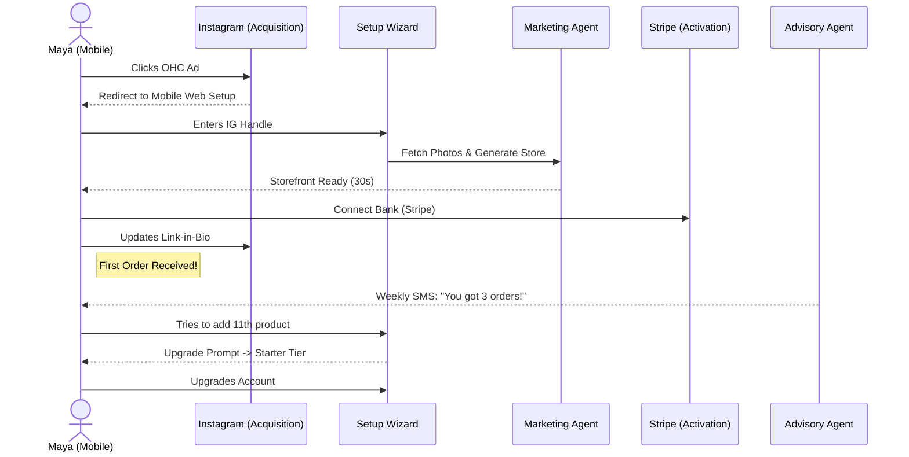
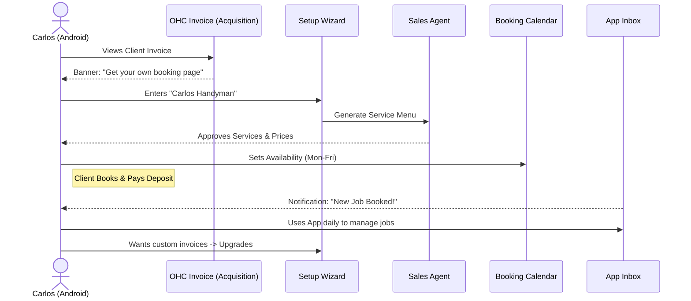
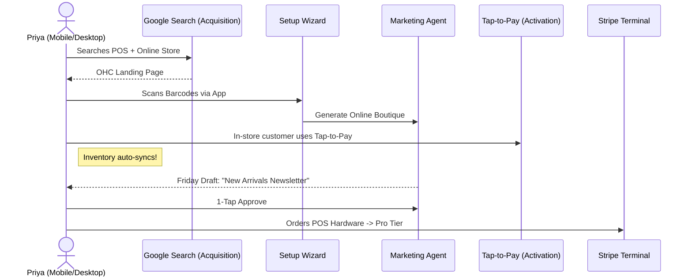
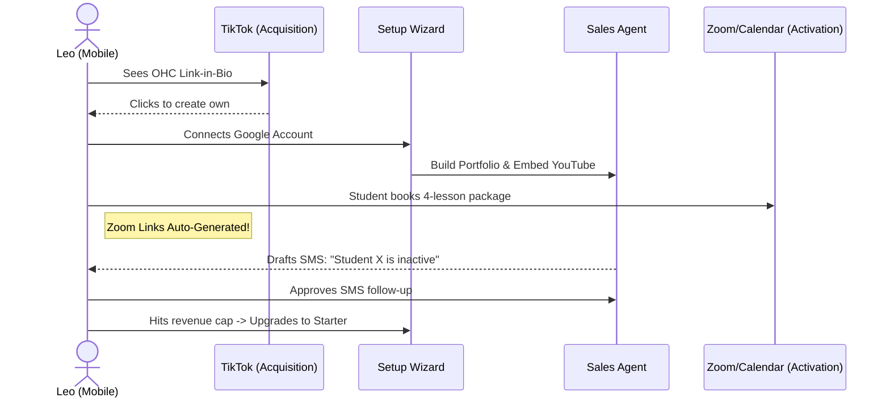
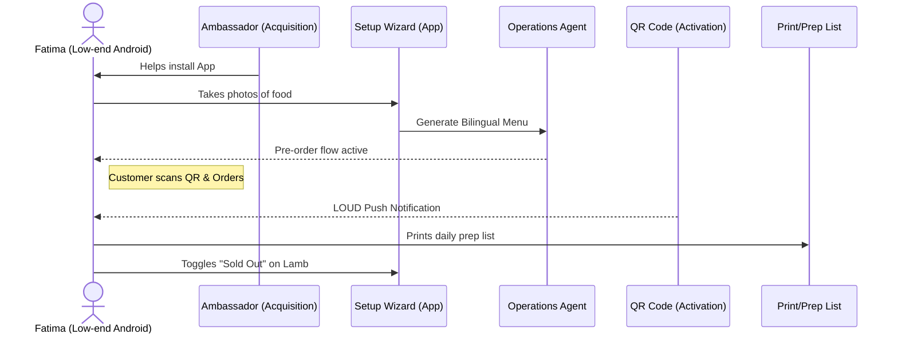

# Business Journey Architecture

## 1. Overview
This document defines the complete end-to-end user journey architecture for OneHumanCorp's key user personas: Maya (The Home Baker), Carlos (The Freelance Handyman), Priya (The Boutique Owner), Leo (The Music Tutor), and Fatima (The Food Cart Operator). Each journey covers Acquisition, Onboarding, Activation, Retention, Revenue, and Referral, with a specific focus on identifying potential friction points that could cause a non-technical user to abandon the flow.

---

## 2. Persona Journeys & Friction Points

### 2.1 Maya — The Home Baker
**Profile:** 28, non-technical. Sells custom cakes via Instagram DMs. Runs everything from her iPhone.
**Needs:** Storefront with photo catalog, deposit-based custom orders, AI agent for Instagram DMs.

#### Journey Map
- **Acquisition:** Maya sees a TikTok ad highlighting how another baker automated their DMs and stopped missing custom orders while they slept. She clicks the "Start Free" link on her iPhone.
- **Onboarding:** Maya completes the Setup Wizard. The AI asks for her Instagram handle, analyzes her cake photos, and generates a storefront with a "Custom Cake Deposit" product.
- **Activation:** Maya connects her Stripe account and publishes her link-in-bio on Instagram. She receives her first custom order with a pre-payment deposit.
- **Retention:** The Business Advisory agent sends her a weekly text: "You got 3 cake orders this week. Your top request is 'vegan options'."
- **Revenue:** Maya hits the 10-product limit on the Free tier as she adds more cake variations and upgrades to the Starter tier ($9/mo) when prompted by the app.
- **Referral:** Maya posts a reel about how OHC saves her 2 hours a day. Her followers use her referral link, earning her a free month of the Starter tier.

#### Sequence Diagram

**Key Friction Points:**
- **Connecting Stripe:** Requires business details Maya might not have handy (EIN/SSN). The flow must allow deferred connection or use a "receive money later" model.
- **Connecting Instagram:** OAuth flows on mobile web can sometimes drop context or fail to redirect back to the app smoothly.

---

### 2.2 Carlos — The Freelance Handyman
**Profile:** 42, non-technical. Relies on word-of-mouth. Android phone only.
**Needs:** Service listings with prices, booking calendar with deposits, AI quote generator.

#### Journey Map
- **Acquisition:** A client sends Carlos an OHC link to pay an invoice. He sees a banner: "Create an invoicing and booking page for free."
- **Onboarding:** Carlos inputs his name and "Handyman Services". The AI suggests a service menu (Plumbing Fixes, Painting, General Repairs) with placeholder prices. He sets his available hours.
- **Activation:** A new client books a "Plumbing Fix" slot for next Tuesday and pays a $50 deposit.
- **Retention:** Carlos uses the OHC app daily as his primary inbox to view quotes, jobs, and messages.
- **Revenue:** Carlos wants to remove the OHC branding from his invoices to look more professional and upgrades to the Starter tier ($9/mo).
- **Referral:** Carlos tells another contractor at Home Depot about OHC and sends a referral text.

#### Sequence Diagram

**Key Friction Points:**
- **Calendar Sync:** Syncing with personal Google/Outlook calendars can be confusing. If OHC double-books him with a personal event, trust is lost.
- **Pricing Estimation:** Handyman jobs are often variable. Carlos might abandon onboarding if forced to set fixed prices. The system must support "Starting at" or "Request Quote" options.

---

### 2.3 Priya — The Boutique Owner
**Profile:** 35, semi-technical. Sells in-store, wants online expansion. Uses MacBook and iPhone.
**Needs:** Storefront + inventory sync, product variants, in-person POS, analytics.

#### Journey Map
- **Acquisition:** Priya searches Google for "easy POS and online store integration" and lands on an OHC landing page.
- **Onboarding:** She uploads a CSV of her current inventory or scans barcodes using the OHC app. The AI auto-categorizes items and generates a styled online boutique.
- **Activation:** A customer walks into her physical store, and Priya uses Tap-to-Pay on her iPhone to complete the sale, which automatically decrements the synced inventory.
- **Retention:** The Marketing Agent auto-drafts an email newsletter every Friday featuring new arrivals, which Priya approves with one tap.
- **Revenue:** Priya needs an actual POS card reader hardware (Stripe Terminal) for her counter. She purchases the hardware, which requires upgrading to the Pro tier ($29/mo).
- **Referral:** Priya features OHC in a local small business owner Facebook group.

#### Sequence Diagram

**Key Friction Points:**
- **Inventory Ingestion:** If barcode scanning or CSV upload fails or requires strict formatting, Priya will give up. The AI must handle messy data gracefully.
- **Hardware Provisioning:** Ordering and pairing physical POS hardware (Terminal) is traditionally a high-friction process requiring network configuration.

---

### 2.4 Leo — The Music Tutor
**Profile:** 22, non-technical. Teaches online and in-person. Needs TikTok link-in-bio.
**Needs:** Lesson booking, auto-Zoom links, subscription packages, AI follow-ups.

#### Journey Map
- **Acquisition:** Leo sees another creator using an OHC link-in-bio on TikTok that looks much better than Linktree.
- **Onboarding:** Leo connects his Google account. OHC automatically generates a portfolio page, embeds his YouTube covers, and sets up a booking widget synced to his calendar.
- **Activation:** A student books a 4-lesson monthly subscription package. OHC auto-generates the Zoom links and sends calendar invites to both.
- **Retention:** The Sales Agent notices a student hasn't booked in 3 weeks and drafts a text: "Hey! Ready for your next guitar lesson?"
- **Revenue:** Leo's student base grows, and he exceeds the $500/mo revenue limit on the Free tier, prompting an upgrade to Starter.
- **Referral:** Leo adds a "Built with OHC" badge to his site for an affiliate kickback.

#### Sequence Diagram

**Key Friction Points:**
- **Zoom/Meet Integration:** Requiring complex OAuth for Zoom generation might block onboarding. OHC should offer built-in video links or a seamless Google Meet integration.
- **Subscription Setup:** Explaining how recurring billing works (failed payments, cancellations) without confusing jargon is critical.

---

### 2.5 Fatima — The Food Cart Operator
**Profile:** 50, non-technical, limited English. Takes halal food pre-orders. Low-end Android.
**Needs:** Photo menu, pre-order/pickup, phone notifications, printable daily order list.

#### Journey Map
- **Acquisition:** An OHC community ambassador visits her cart and sets up the app for her on the spot.
- **Onboarding:** Fatima takes photos of her food using the app. The Operations Agent suggests Arabic and English descriptions and sets up a "Pre-Order for Pickup" flow.
- **Activation:** A customer scans the QR code taped to her cart, orders the Chicken Over Rice online, and pays via Apple Pay. Fatima gets a loud push notification.
- **Retention:** Fatima uses the app every morning to print the daily prep list. She uses the "Sold Out" toggle when she runs out of lamb.
- **Revenue:** Fatima remains on the Free tier as it supports all her basic needs, but OHC monetizes slightly via transaction fee markup.
- **Referral:** Other cart owners in her commissary kitchen ask about the QR code system.

#### Sequence Diagram

**Key Friction Points:**
- **App Performance & Connectivity:** Her low-end Android on a 3G network might struggle with heavy app payloads. The app must work offline/optimistically and be ultra-lightweight.
- **Notification Reliability:** If the app gets killed in the background by Android battery management and she misses a pre-order notification, the service is useless to her.
- **Language Barrier:** The UI must rely heavily on universally understood icons rather than text.

[PR: #9781]
