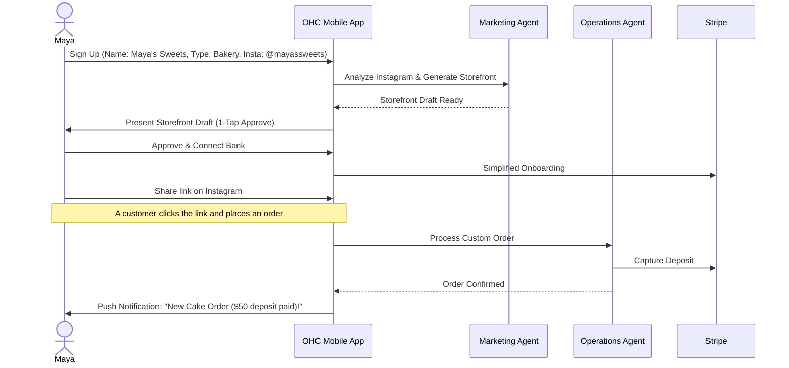
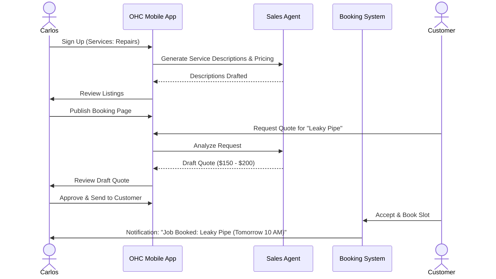
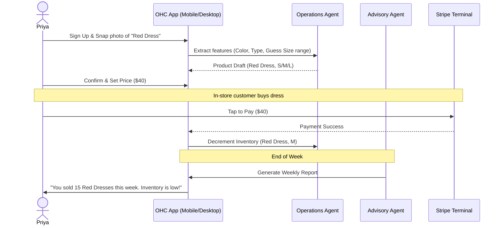
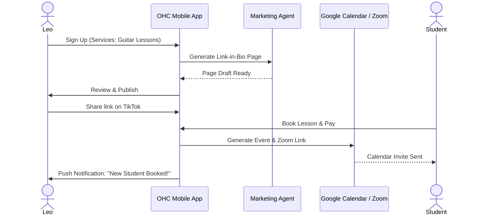
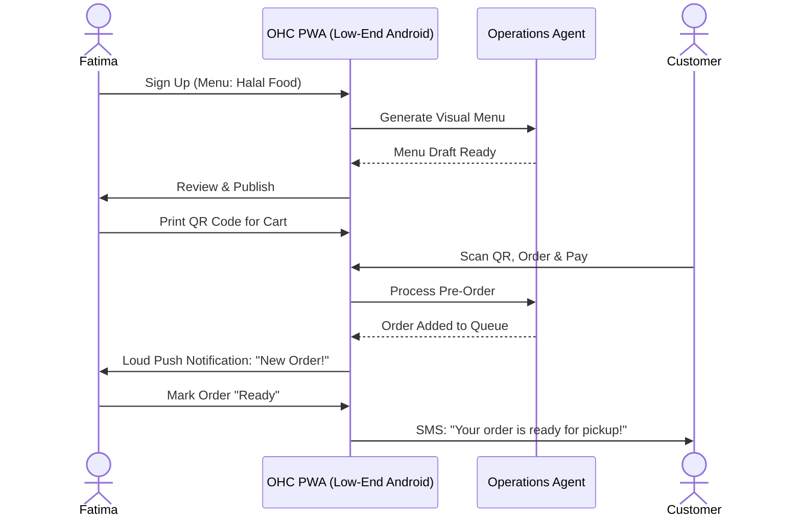

# Business Journey Architecture Design Document

## 1. Executive Summary
This design document maps out the end-to-end user journeys for key personas on the OneHumanCorp (OHC) platform. It identifies critical touchpoints from acquisition to referral, highlighting friction points where non-technical small business owners might abandon the process. The overarching goal is to ensure a seamless "idea → live business in under 10 minutes" experience, primarily on mobile, with AI handling the complex heavy lifting invisibly.

## 2. Key Personas & Their Journeys

### 2.1 Maya: The Home Baker (Physical Products / Custom Orders)
**Context:** Maya bakes custom cakes, currently using Instagram DMs. Overwhelmed by Shopify. Mobile only.

#### Journey Map
1. **Acquisition:**
   - **Trigger:** Instagram Ad highlighting "Turn your DMs into a real business in 10 mins. No website needed."
   - **Action:** Maya clicks the link in the ad.
   - **Landing Page CTA:** "Create Your Bakery Profile" (Opens directly into OHC app download/PWA onboarding).
2. **Onboarding (Wizard Flow):**
   - *Minimum Inputs:* Business Name ("Maya's Sweets"), Type ("Bakery / Custom Orders"), Instagram Handle (for AI agent to analyze style/photos).
   - *Deferred:* Bank account linking, advanced pricing rules, domain name setup.
   - *AI Action (Marketing Dept):* Automatically generates a beautiful storefront (Glassmorphism style) using pulled Instagram photos and suggested copy.
3. **Activation:**
   - **Success (Day 1):** Maya reviews her AI-generated storefront on her iPhone and publishes it. She connects Stripe via a simplified flow to accept deposits.
   - **Friction Point:** The Stripe connection can be daunting. We must abstract this into a simple "Where should we send your money?" prompt.
4. **Retention:**
   - **Daily Habit:** Checking the "Customer Inbox" where the *Customer Success* AI agent has drafted replies to incoming DMs ("Do you do vegan cakes?").
   - **Notifications:** Push notifications for new custom order requests (with deposit paid).
5. **Revenue (Upgrade Path):**
   - **Trigger:** Maya hits her 100th AI action (e.g., auto-replies) or needs to list more than 10 products.
   - **CTA:** "Maya, your business is booming! Upgrade to Starter for unlimited custom orders and your own custom domain (mayassweets.com)."
6. **Referral:**
   - **Loop:** A fellow baker asks how she built her site so fast. Maya shares her unique referral link from the "Grow" tab in the app, offering her friend 1 free month of Starter.

#### Sequence Diagram (Mermaid)

### 2.2 Carlos: The Freelance Handyman (Services & Bookings)
**Context:** Relies on word-of-mouth. Needs a booking system, quotes, and a customer inbox. Android phone only.

#### Journey Map
1. **Acquisition:**
   - **Trigger:** Word-of-mouth or a targeted Google Search Ad ("Get a booking page for your handyman business in 5 mins").
   - **Landing Page CTA:** "Start Booking Jobs Now."
2. **Onboarding (Wizard Flow):**
   - *Minimum Inputs:* Name ("Carlos Repairs"), Services Offered ("Plumbing, Painting"), General Location/Service Area.
   - *AI Action (Sales Dept):* Generates standard service descriptions and estimated price ranges based on typical handyman rates in his area.
3. **Activation:**
   - **Success (Day 1):** Carlos has a live booking page with a calendar interface. A customer books a "General Repair" slot.
   - **Friction Point:** Calendar syncing. We must provide a seamless 1-click Google Calendar integration or a robust built-in calendar if he doesn't use one.
4. **Retention:**
   - **Daily Habit:** Reviewing daily schedule and incoming quote requests.
   - **AI Action (Sales Dept):* Auto-generating quotes based on customer problem descriptions submitted via the site.
5. **Revenue (Upgrade Path):**
   - **Trigger:** Carlos wants to send professional PDF invoices with his logo and require larger deposits.
   - **CTA:** "Upgrade to Pro to send branded invoices and unlock advanced deposit rules."

#### Sequence Diagram (Mermaid)

### 2.3 Priya: The Boutique Owner (Physical Products / Omnichannel)
**Context:** Sells in-store, wants online. Needs inventory sync, POS, variants. Mobile & Desktop.

#### Journey Map
1. **Acquisition:**
   - **Trigger:** Frustration with Square/Shopify complexity. Sees an article: "OHC: The Easiest Way to Sell Both In-Store and Online."
   - **Landing Page CTA:** "Sync Your Store Today."
2. **Onboarding (Wizard Flow):**
   - *Minimum Inputs:* Store Name ("Priya's Boutique"), Business Type ("Retail/Clothing").
   - *AI Action (Operations Dept):* Provides a simple bulk-upload template or guides her through snapping photos of her inventory with her phone to auto-create products with variants (size/color).
3. **Activation:**
   - **Success (Day 1):** Priya scans her first in-store item using the OHC app (Tap-to-Pay via Stripe Terminal) and sees the online inventory decrement automatically.
   - **Friction Point:** Adding many products manually. The AI camera-to-product feature is critical here.
4. **Retention:**
   - **Daily Habit:** Checking daily sales analytics (mobile or desktop).
   - **AI Action (Business Advisory Dept):* Sending weekly reports ("Red dresses sold out fast. Reorder soon!").
5. **Revenue (Upgrade Path):**
   - **Trigger:** Priya needs advanced inventory reporting and multiple staff accounts.
   - **CTA:** "Upgrade to Business for advanced analytics and staff access."

#### Sequence Diagram (Mermaid)

### 2.4 Leo: The Music Tutor (Digital Products / Services & Bookings)
**Context:** Teaches guitar online and in person. Needs calendar sync, zoom generation, subscriptions, and a link-in-bio page.

#### Journey Map
1. **Acquisition:**
   - **Trigger:** Seeking a better alternative to managing Google Calendar and Zoom links manually.
   - **Landing Page CTA:** "Automate Your Teaching Business."
2. **Onboarding (Wizard Flow):**
   - *Minimum Inputs:* Name ("Leo's Guitar Lessons"), Services ("1-on-1 Lessons", "Monthly Package").
   - *AI Action (Marketing Dept):* Generates a sleek, mobile-optimized link-in-bio page to share on TikTok.
3. **Activation:**
   - **Success (Day 1):** Leo shares his link-in-bio on TikTok. A student books a lesson, pays via Stripe, and automatically receives a Google Calendar invite with a Zoom link.
   - **Friction Point:** Zoom/Google integration. The setup must be a 1-click OAuth flow.
4. **Retention:**
   - **Daily Habit:** Reviewing upcoming lessons and managing student communications.
   - **AI Action (Customer Success Dept):* Auto-sending follow-up emails to students who haven't booked in a while.
5. **Revenue (Upgrade Path):**
   - **Trigger:** Leo wants to sell recurring monthly lesson packages.
   - **CTA:** "Upgrade to Pro to unlock subscription billing."

#### Sequence Diagram (Mermaid)

### 2.5 Fatima: The Food Cart Operator (Food & Beverage)
**Context:** Runs a halal food cart. Needs pre-order/pickup flow, simple menu management, multi-language support (Arabic/English), works on low-end Android.

#### Journey Map
1. **Acquisition:**
   - **Trigger:** Wants to reduce wait times and manage peak hour orders better.
   - **Landing Page CTA:** "Take Pre-Orders Today."
2. **Onboarding (Wizard Flow):**
   - *Minimum Inputs:* Cart Name ("Fatima's Halal"), Menu Items ("Chicken Over Rice").
   - *AI Action (Operations Dept):* Generates a simple, visual menu with clear pricing and sold-out toggles.
3. **Activation:**
   - **Success (Day 1):** A customer scans a QR code at the cart, places a pre-order on their phone, and Fatima receives a notification on her device.
   - **Friction Point:** App performance on low-end devices. The PWA must be ultra-lightweight and support offline/low-data modes.
4. **Retention:**
   - **Daily Habit:** Toggling sold-out items and reviewing daily order summaries.
   - **AI Action (Operations Dept):* Organizing incoming orders into a simple, printable list or clear digital queue.
5. **Revenue (Upgrade Path):**
   - **Trigger:** Fatima wants to offer loyalty rewards or SMS notifications for order readiness.
   - **CTA:** "Upgrade to Starter for SMS order alerts."

#### Sequence Diagram (Mermaid)

## 3. General Architecture Recommendations

1. **Progressive Disclosure:** Do not overwhelm the user during onboarding. Gather the absolute minimum to create the "Aha!" moment (the generated storefront/booking page). Advanced settings (taxes, complex shipping) should be deferred until necessary or handled by the Legal/Finance AI.
2. **AI as a Co-Pilot:** AI agents should draft actions (Draft-for-Review) for critical external communications or significant changes, requiring a 1-tap approval. This builds trust.
3. **Mobile-First Invariants:** All onboarding flows, including photo uploads and calendar syncing, must be seamless on a 375px screen. Native device integrations (camera, contacts, calendar) should be leveraged over manual entry whenever possible.
4. **Seamless Stripe Integration:** The payment setup is the biggest drop-off point. OHC must provide a guided, heavily abstracted Stripe Connect onboarding experience.

## 4. Summary
These journey maps highlight that the success of OHC relies on the AI agents abstracting the configuration complexity of traditional platforms (Shopify, Wix). The core engineering challenge is ensuring the orchestration between user input, AI generation, and underlying business logic (Stripe, scheduling, inventory) feels instantaneous and completely natural on a mobile device.

[PR: #8832]
