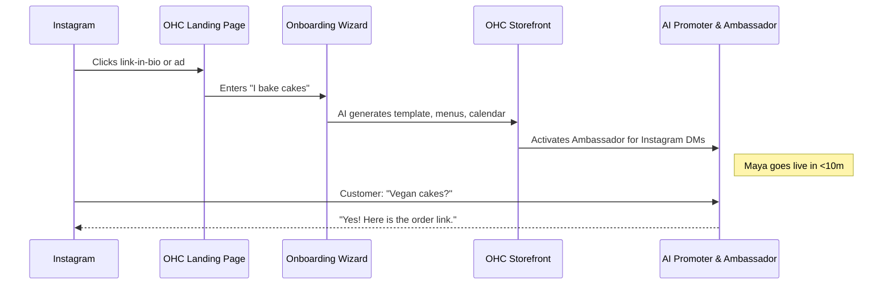
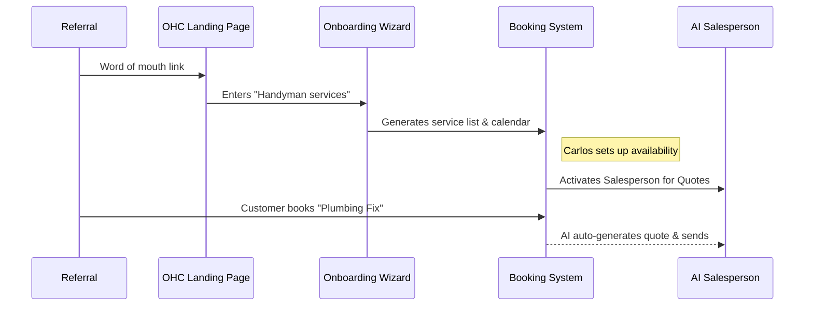
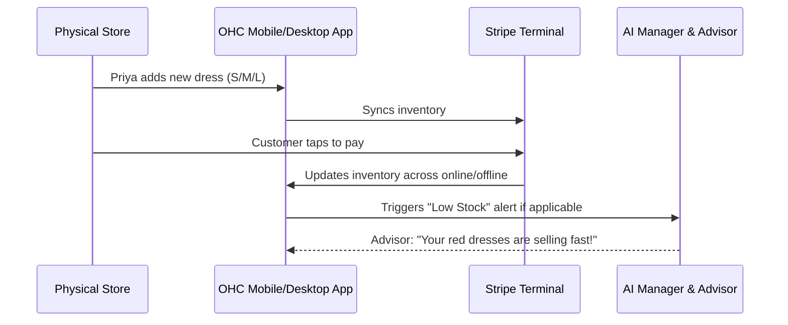
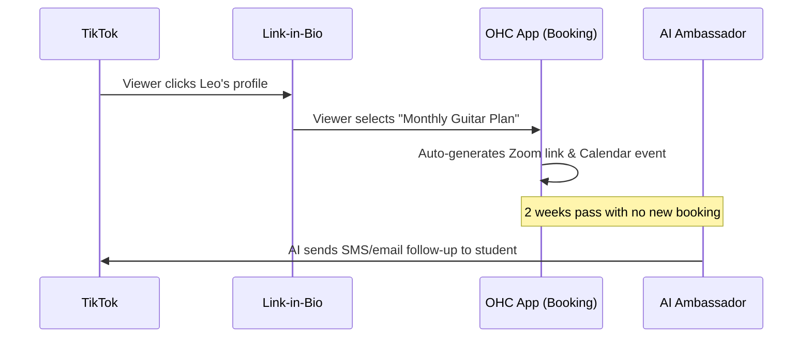

# OHC Business Journey Architecture

## 1. Overview
This document defines the complete end-to-end user journey architecture for the OneHumanCorp (OHC) platform. It examines the entire lifecycle—Acquisition, Onboarding, Activation, Retention, Revenue, and Referral—for five distinct non-technical business owner personas. The goal is to identify and eliminate architectural friction points to ensure a "zero to live in under 10 minutes" experience entirely from a mobile device.

## 2. Personas & Core Journeys

### 2.1 Maya (28) – The Home Baker
- **Context:** Sells custom cakes via Instagram DMs. Overwhelmed by Shopify. Mobile-only (iPhone).
- **Needs:** Storefront with catalog, custom orders with Stripe deposits, AI agent for DM replies ("do you do vegan cakes?"), delivery calendar.



### 2.2 Carlos (42) – The Freelance Handyman
- **Context:** No website, relies on word-of-mouth. Android user.
- **Needs:** Service listings, booking system with deposits, customer inbox, AI quote generator, review system.



### 2.3 Priya (35) – The Boutique Owner
- **Context:** Sells in-store, wants online expansion. iPhone & MacBook.
- **Needs:** Storefront synced with POS inventory, variants, Tap-to-Pay, automated emails, daily analytics.



### 2.4 Leo (22) – The Music Tutor
- **Context:** Online and in-person teaching. TikTok user.
- **Needs:** Booking calendar, Zoom sync, subscription packages, AI follow-ups, link-in-bio portfolio.



### 2.5 Fatima (50) – The Food Cart Operator
- **Context:** Pre-orders for pickup. Limited English, low-end Android.
- **Needs:** Photo menu, sold-out toggles, prepay pre-orders, push notifications, printable daily list, Arabic/English support.

```mermaid
sequenceDiagram
    participant Street
    participant App as OHC Menu Link
    participant Cart as Fatima's Android App
    participant Print as Daily Printable List

    Street->>App: Customer scans QR code on cart
    App->>App: Pre-orders Halal Platter, prepays
    App->>Cart: Loud Push Notification "New Order!"
    Cart->>Print: Auto-adds to daily pickup list
    Note right of Cart: UI in Arabic; simple toggles
```

## 3. End-to-End AARRR Funnel Architecture

### 3.1 Acquisition
- **Friction Point:** Blank page paralysis.
- **Solution:** AI-driven generative onboarding. A single prompt ("What do you do?") triggers the Marketing/Operations agents to pre-fill the catalog, design, and settings. No manual typing of boilerplate text.
- **Trigger:** Organic social link-in-bio, word of mouth, or direct URL.

### 3.2 Onboarding
- **Friction Point:** Complex settings (Stripe API keys, DNS settings).
- **Solution:** Abstracted integration. Stripe Connect onboarding is simplified to "Link Bank Account". Custom domains use auto-provisioned Let's Encrypt via Cloudflare, completely invisible to the user.
- **Trigger:** Account creation.

### 3.3 Activation
- **Friction Point:** Getting the first dollar.
- **Solution:** The platform pushes a "Share your store" checklist. AI Ambassador pre-drafts the Instagram/WhatsApp announcement post. First payment instantly triggers a "Ka-Ching" notification to reinforce the behavior.
- **Success Metric:** First transaction completed within 24 hours of sign-up.

### 3.4 Retention
- **Friction Point:** Forgetting to manage the store.
- **Solution:** Proactive AI Advisory. The Advisor agent sends a push notification daily/weekly with plain-text insights (e.g., "Tuesday is your busiest day. Prepare extra inventory").
- **Trigger:** Scheduled cron jobs analyzing Stripe and order data.

### 3.5 Revenue
- **Friction Point:** Hitting usage limits abruptly.
- **Solution:** Graceful degradation and clear, ROI-based upgrade paths. E.g., "You've reached your free AI replies limit. Upgrading to Starter saves you 5 hours a week."
- **Trigger:** Approaching tenant tier limits.

### 3.6 Referral
- **Friction Point:** Asking for referrals is awkward.
- **Solution:** AI Ambassador automatically emails happy customers post-purchase requesting reviews and offering a referral discount code.
- **Trigger:** Order marked as "Fulfilled" or "Completed".

## 4. Architectural Gaps & Friction Points
- **Network Resilience:** Fatima's low-end Android on slow data requires robust offline-first caching for the `OHCApp`. Writes (like toggling 'sold out') must be optimistically applied and queued via a local SQLite/Room database before syncing to the backend.
- **Spike Traffic Handling:** A viral TikTok for Leo or Maya can cause sudden traffic spikes. The Teammate Mesh and Redis Pub/Sub must aggressively rate-limit and queue background AI tasks to prevent synchronous blocking on checkout flows.
- **Draft-for-Review Approvals:** The mobile application needs a dedicated, unified "Inbox/Action Center" to handle the `Draft-for-Review` approval workflow across all AI departments.
- **Multi-language Support:** Structural components need strict i18n support at the gRPC boundary, ensuring that an English-speaking AI agent can properly populate an Arabic UI layout (RTL text handling is critical for Fatima).

## 5. Next Steps
1. Prototype the single-prompt generative onboarding flow (Phase 1).
2. Implement the offline-first sync engine for the mobile client.
3. Design the unified AI "Action Center" UI for the mobile dashboard.