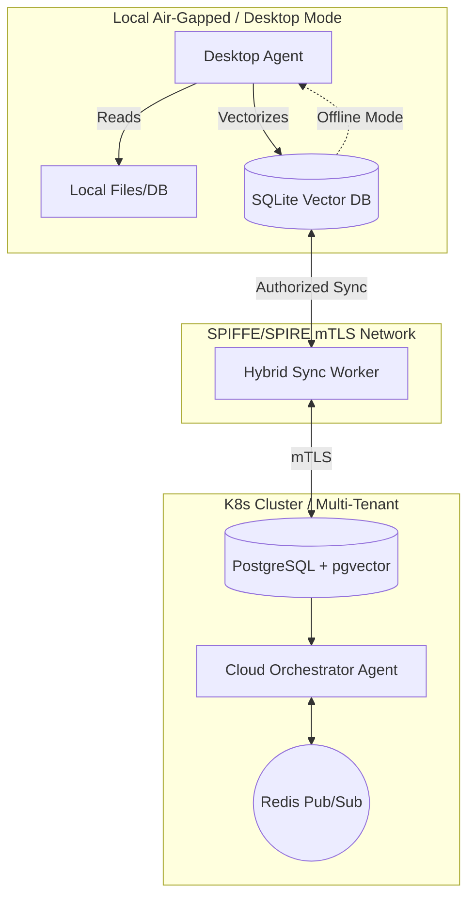

# 🔬 OHC Hybrid Agentic OS: Competitive Analysis & Disruptive Strategy
**Author**: Principal Product Researcher & Oracle (L7)
**Date**: 2026-04-14T05:37:17Z
**Classification**: CONFIDENTIAL - INTERNAL USE ONLY

## 1. Executive Summary

This report provides a definitive competitive audit of the current Agentic platform landscape, specifically analyzing **Claude Code**, **OpenClaw**, and **Replit Agent** against the **OHC Hybrid Architecture (OHC-HA)**. The analysis identifies a critical "Blue Ocean" opportunity: the seamless, secure transition between air-gapped local execution (Standalone Desktop Mode) and highly scalable cloud coordination (Cloud-Native Mode).

Competitors fundamentally rely on massive cloud infrastructures or pure local CLI wrappers. They lack a zero-friction, bidirectional sync capability powered by a single cohesive identity layer (SPIFFE/SPIRE).

## 2. Competitive Market Audit

### 2.1 Claude Code
- **Model**: Cloud-first CLI. Heavy reliance on Anthropic backend API.
- **Strengths**: Extremely powerful LLM intelligence, deep context window.
- **Weaknesses**: No standalone execution. High latency due to network roundtrips. Complete failure in air-gapped environments. Lacks a unified multi-agent mesh.

### 2.2 OpenClaw
- **Model**: Open-source, local-first agent framework.
- **Strengths**: High privacy, customizable, runs locally.
- **Weaknesses**: No built-in scalable cloud synchronization. Multi-tenant orchestration requires building bespoke infrastructure. Lacks native aesthetic UI layer.

### 2.3 Replit Agent
- **Model**: Pure Cloud IDE + Agent integration.
- **Strengths**: Instant zero-setup environment, seamless web deployment.
- **Weaknesses**: Completely locks users into the Replit ecosystem. No local resource utilization. Extremely high cost at scale for compute-heavy agent swarms.

### 2.4 One Human Corp (OHC) - Hybrid Architecture
- **Model**: Triple-Mode (Cloud-Native, Standalone Desktop, Thin Client).
- **Strengths**: Unmatched flexibility. Degrades gracefully to SQLite. Utilizes local compute for privacy-sensitive tasks, scales to K8s/Redis for heavy orchestration. Zero-trust SPIFFE/SPIRE identity mesh across all modes.

## 3. Comparative Feature Matrix

| Feature / Platform | OHC (Hybrid) | Claude Code | OpenClaw | Replit Agent |
| :--- | :---: | :---: | :---: | :---: |
| **Air-Gapped Standalone Mode** | 🟢 Native (SQLite) | 🔴 No | 🟢 Yes | 🔴 No |
| **K8s Cloud Scaling** | 🟢 Native (Postgres/Redis) | 🟡 API-based | 🔴 Manual | 🟢 Yes |
| **Zero-Trust Agent Identity** | 🟢 SPIFFE / SPIRE | 🔴 Opaque | 🔴 None | 🟡 Replit Auth |
| **Teammate Mesh (Pub/Sub)** | 🟢 Native (Redis/Centrifuge) | 🔴 No | 🟡 Bespoke | 🔴 No |
| **Glassmorphism Premium UI** | 🟢 Required | 🔴 CLI | 🔴 CLI/Basic | 🟡 Web IDE |

## 4. Architectural Disruption: Hybrid Local-Private RAG

The core disruption vector identified is **Hybrid Local-Private RAG with MCP & SPIRE Cloud Sync**. This feature leverages the OHC-HA to allow:

1. **Local Ingestion & Indexing**: Sensitive documents are vectorized locally on the user's host machine using SQLite and local embedding models.
2. **Cloud Vector Sync (Opt-in)**: Authorized vectors are synchronized via mTLS to the Cloud-Native Postgres/pgvector instance for swarm-wide intelligence.
3. **Model Context Protocol (MCP)**: Universal context sharing between local Desktop Mode agents and Cloud-Native agents.

## 5. Strategic Roadmap

To capitalize on this Blue Ocean, OHC must immediately prioritize the following mission:
*   **Mission**: Implement the "Hybrid Local-Private RAG Worker".
*   **Action**: A mission file will be deployed to the `.agent-task/missions/` queue for immediate implementation by the Engineering Swarm.

