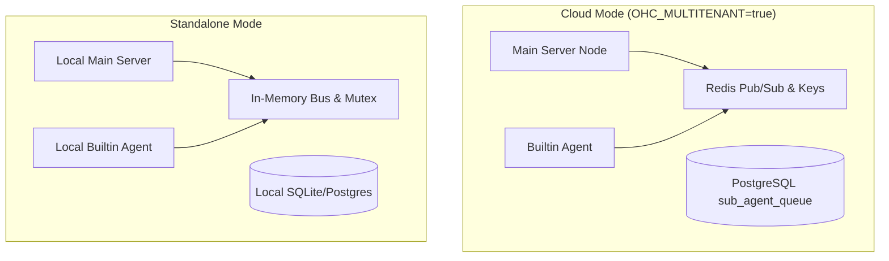

# Universal Transport Bridge

## Overview

The Universal Transport Bridge is the interoperability layer ensuring zero-latency, highly reliable communication between the main OHC server, the builtin agent microservice, and external components. It abstracts away the deployment differences between the **Cloud** (multi-tenant, horizontally scaled) and **Standalone** (single-node, local-first) environments.

By unifying the transport and coordination protocols, the system allows identical task execution, job queuing, state handoffs, and resource locking logic in both operational modes.

## Architecture

The bridge is composed of two primary sub-systems:
1. **Hybrid Pub/Sub Transport** (`MeshTransport`)
2. **Distributed Cross-Agent Coordination** (`MeshLock`)

### Deployment Modes

## Hybrid Pub/Sub Transport (`MeshTransport`)

The `MeshTransport` interface defines asynchronous, topic-based message exchange using a serialized Protobuf payload (wrapped in standard `Message` structs with a `topic` and `payload`).

- **Cloud Backend:** Uses `RedisTransport`. Built on `redis::aio::MultiplexedConnection` and Redis PUB/SUB channels. Topics are prefixed with the `tenant_id` to enforce strict cross-tenant data isolation.
- **Standalone Backend:** Uses `MemoryTransport`. An in-process `tokio::sync::broadcast::channel` implementation that runs strictly within the local memory space of the deployed node, requiring zero external dependencies.

This layer handles streaming ReAct iterations, agent lifecycle events (`SubagentLifecycleEvent`), tool interactions, and progress updates efficiently across the wire, regardless of the underlying backend.

## Distributed Cross-Agent Coordination (`MeshLock`)

The Universal Transport Bridge enforces pessimistic distributed locking to guarantee single-writer consistency when multiple components or agent instances try to modify the same resource simultaneously (e.g., job claiming, state transitions, wallet deduplications).

The locking API (`MeshLockManager` and `MeshLock`) abstracts the backend constraints:

- **Key Construction:** `ohc:lock:{tenant_id}:{resource_type}:{resource_id}`
- **Cloud Implementer:** `RedisLockManager` uses Redlock semantics, employing `SET NX PX` on Redis and Lua scripts for atomic releases.
- **Standalone Implementer:** `MemoryLockManager` maintains an internal `HashMap` wrapped in a `tokio::sync::Mutex` to simulate lease expirations and lock ownership checks.

## State Handoff Between Modes

OHC's design ensures state durability and seamless handoff for business owners who transition between Cloud and Standalone modes:

1. **Protocol Stability:** All wire communications between the main server and builtin agent utilize strictly typed Protocol Buffers (e.g., `RunTaskEvent`, `TaskNotification`). Ad-hoc JSON is prohibited.
2. **Queue Deduplication:** The `sub_agent_queue` leverages database-level locking (`FOR UPDATE SKIP LOCKED` on PostgreSQL, application-level mutex on SQLite) so that job dequeuing remains resilient to race conditions.
3. **Idempotency:** State transition handoffs between environments (such as resynchronizing local SIPDB state to the cloud) are executed idempotently, guaranteeing that interrupted sync operations can be retried without duplicate writes.
