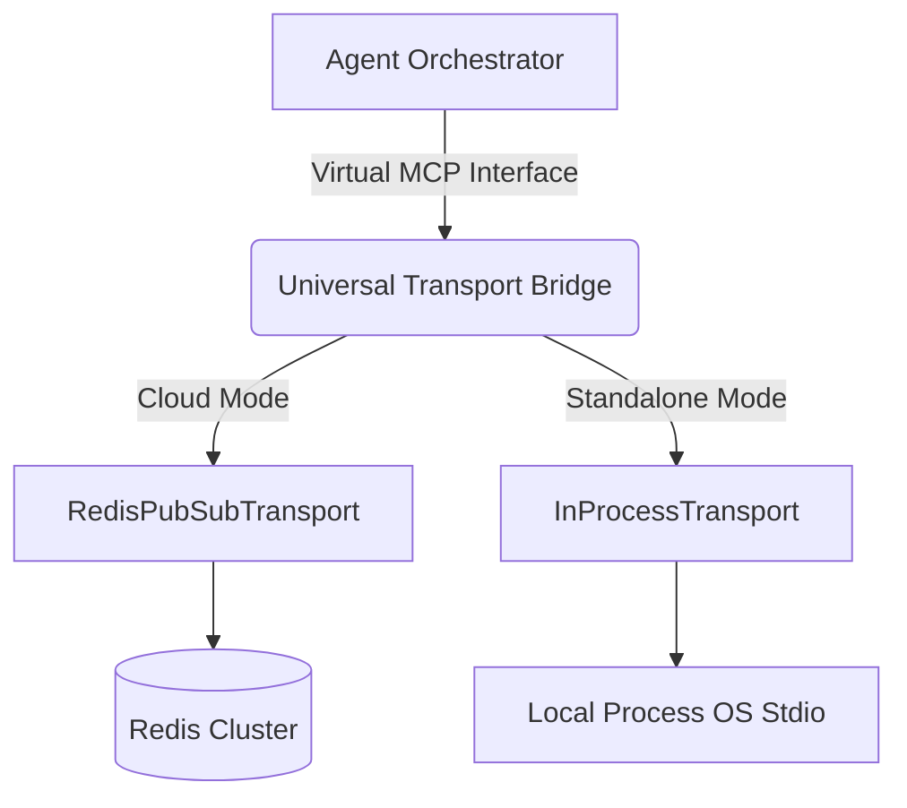

# Universal Agent Harness Transport Bridge

<h2 class="premium-title">Overview</h2>
The Universal Agent Harness Transport Bridge is a core architectural component of the OHC-HA (Hybrid Architecture). It solves the rigid environment lock-in problem observed in competing systems (like Claude Code's SdkControlTransport) by dynamically wiring the transport layer based on the execution mode (Cloud vs. Standalone).

<h2 class="premium-title">Architecture</h2>
The orchestrator interacts with sub-agents via a virtual MCP (Model Context Protocol) interface. The bridge abstracts the underlying communication medium:

- <strong>Standalone Mode:</strong> Uses `InProcessTransport` (wrapping OS-level stdio) for zero-latency local execution.
- <strong>Cloud Mode:</strong> Uses `RedisPubSubTransport` for horizontally scalable, multi-tenant execution across Kubernetes pods.

