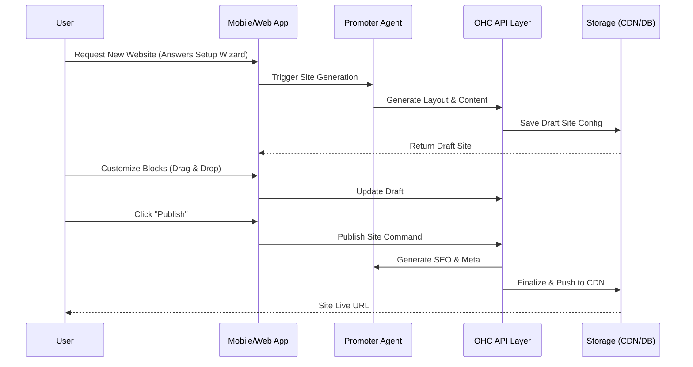

# Architecture Findings: OHC Website & Storefront Builder

This document contains the required architecture findings and issue brief for the OHC Website & Storefront Builder as requested in GitHub Issue #8439.

## 1. Overview
This design document outlines the architecture for the OneHumanCorp (OHC) Website & Storefront Builder. The builder empowers non-technical small business owners (e.g., bakers, handymen, boutique owners) to create, customize, and publish professional, mobile-first storefronts and websites without any coding knowledge. AI agents assist in the background to handle design, layout, content generation, and SEO, abstracting away all complexity.

## 2. Goals & Non-Goals
### 2.1 Goals
- Define the core content blocks and how they function.
- Detail the templating system and customization mechanisms.
- Describe the publishing workflow, including drafting, publishing, and automatic SEO.
- Explain the provisioning process for custom domains and SSL.
- Ensure the builder interface and the resulting websites adhere to the Mobile-First and Visual Excellence mandates (Glassmorphism, 375px baseline).

### 2.2 Non-Goals
- Specify exact JSONB structures for storing website configuration.
- Prescribe specific CDN providers or SSL generation tools (e.g., Let's Encrypt APIs).
- Detail the database schema for page and content block storage.

## 3. Detailed Design

### 3.1 Content Blocks
The builder is composed of modular, pre-designed content blocks that users can drag, drop, and configure.
- **Hero Block:** High-impact image/video background, primary CTA (e.g., "Book Now", "Order Custom Cake").
- **Product Grid/Catalog:** Dynamically fetches active inventory. Supports filtering by category, variants (size/color), and "Sold Out" toggles.
- **Service & Pricing List:** Clean text/list view for services (e.g., Carlos' handyman services) with integrated booking.
- **Testimonials/Reviews:** Displays verified customer reviews. Can be auto-populated by the Customer Success Agent.
- **Booking Calendar:** Interactive calendar widget linked to the Operations Agent for scheduling and deposit collection.
- **Contact/Inquiry Form:** Standard forms for custom requests, routing directly to the Customer Success Inbox.
- **Link-in-Bio / Link Tree:** Simplified mobile-centric layout for TikTok/Instagram sharing.

### 3.2 AI Agent Integration (The Promoter)
The Marketing & Advertising Agent ("The Promoter") plays a crucial role in the builder experience:
- **Initial Setup Wizard:** Users answer 3-4 natural language questions ("What do you sell?", "What's your vibe?"). The Promoter generates a complete, functional website draft with appropriate color palettes, typography, and placeholder copy.
- **Auto-Copywriting:** Recommends headlines and product descriptions based on user prompts.
- **Automatic SEO:** Invisibly generates meta tags, image alt text (using AI image analysis), and structured data (Schema.org) based on the business type and content blocks.

### 3.3 Architecture Diagram


### 3.4 Publishing & Domain Provisioning Workflow
- **Drafting:** Changes are saved instantly to a draft state. Users can preview the mobile and desktop views.
- **Publishing:** A 1-tap action that takes the draft live.
- **Domain Assignment:**
  - **Free Tier:** Assigned a subdomain (e.g., `mayascakes.ohc.store`).
  - **Paid Tiers:** Users can connect a custom domain or purchase one directly through the app.
- **SSL & Routing:** The platform automatically provisions an SSL certificate and configures routing rules upon domain assignment.

### 3.5 Mobile UX Flow (375px Baseline)
The builder UI on mobile is optimized for touch:
1. **Dashboard:** "Edit Website" button prominently displayed.
2. **Editor View:** The live preview takes up 80% of the screen. A floating action button (FAB) or bottom sheet allows adding new blocks.
3. **Block Editing:** Tapping a block opens a full-screen or large bottom-sheet modal focused purely on configuring that specific block (e.g., editing text, replacing an image via camera roll).
4. **Publishing:** A sticky header bar contains the "Preview" and "Publish" buttons.

## 4. Implementation Prompt

```yaml
issue_title: "[architecture] Implement Website & Storefront Builder Core"
issue_priority: "P1"
issue_description: "Implement the backend and frontend components for the Website Builder. The user must be able to initialize a site via the AI Promoter Agent, customize predefined content blocks (Hero, Product Grid, Booking Calendar), and publish the site to an OHC subdomain."
issue_todo_list:
  - [ ] Develop the TypeScript mobile-first drag-and-drop editor interface.
  - [ ] Implement the backend endpoints in Rust to store and retrieve draft and live site configurations.
  - [ ] Integrate the Promoter Agent to generate initial site layouts and copy.
  - [ ] Implement the publishing pipeline to render the site configuration for public access.
issue_label: ["architecture", "high-impact", "core-feature"]
```
